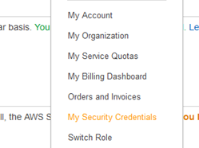
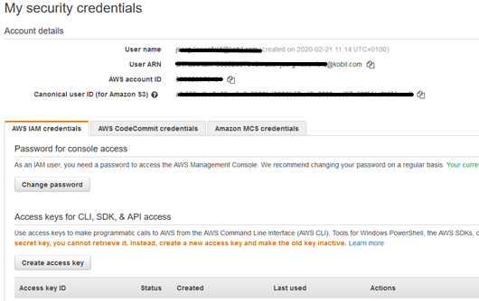
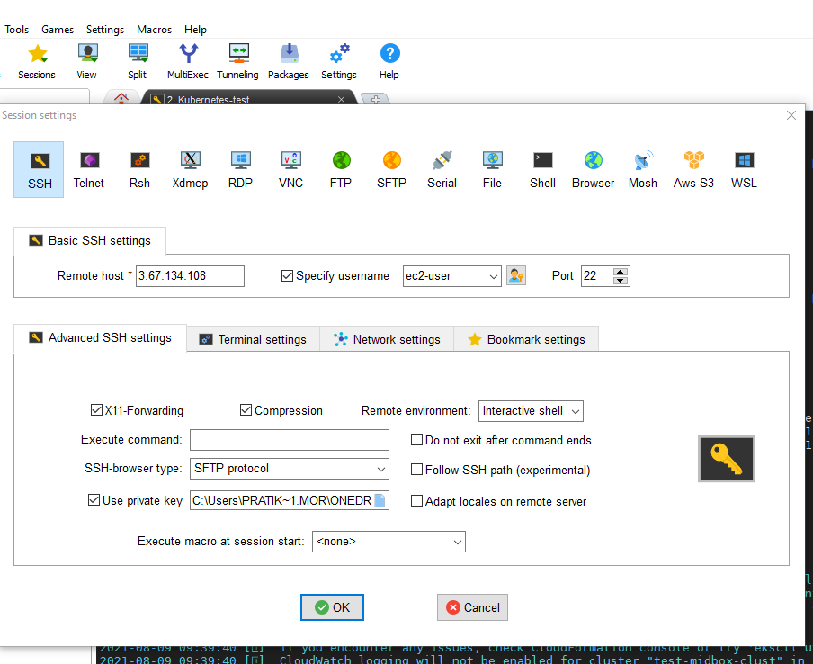
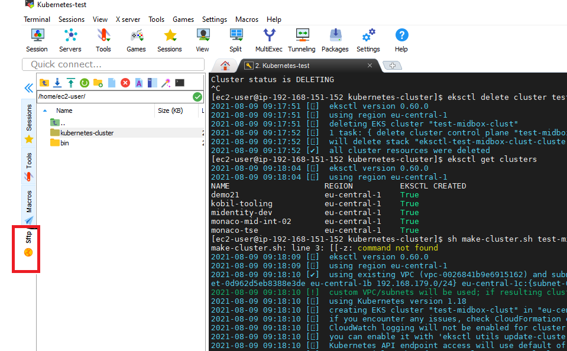
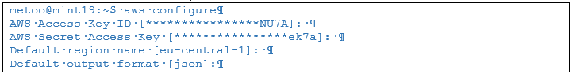
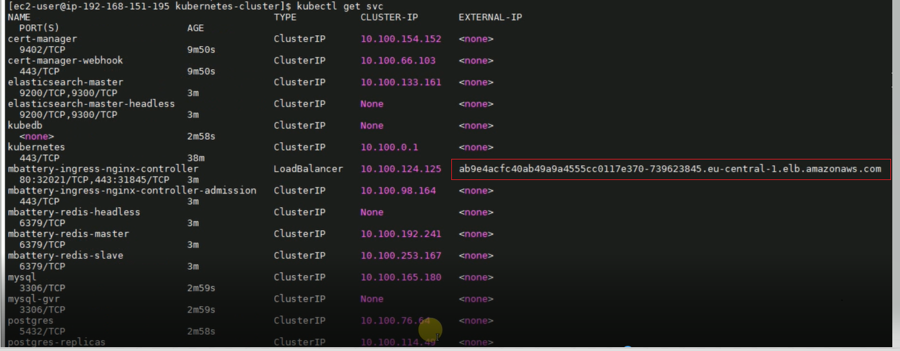
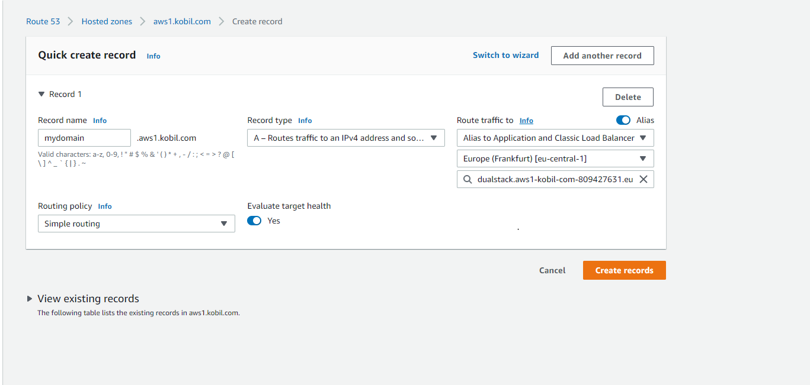

# Deployment With IDP

## 1. On AWS

### Create an EC2 Instance On AWS

- Login to AWS console.

- Prepare for AWS account credentials / tokens - you need them later for "aws configure" run (this is required for any platform / windows / linux / mac):



 and under Security Credentials - use "Create Access Key" service/button:



- Once created the access key - which also shows you the "Access key ID" and the "Secret Access key" - save these both for later usage (ensure to have them copied/saved locally).

- Now lets proceed further with creating EC2 instance on AWS which will serve as a jump server or host to run the commands and manage the cluster.

- Search for EC2 instances in your region E.g. Eu-Central-1(Frankfurt region)
Select Launch Instances -> select t2.micro (We will use free tier one) -> Configure Instance Details

- In Network select your vpc E.g. vpc-0026841b9e6915162 | Monaco  then in Subnet select your subnet E.g. subnet-0583f610916cfec15a | monaco-csclust-151-24 | eu-central-1a

- In IAM role select your IAM role that you have defined, E.g. EC2_Role_Kubernetes_Test. Click Next -> Next

- Now in Configure Security Group, Select an existing security group which satisfies your network requirements of Incoming and Outgoing traffic. E.g. sg-079b4bcc2b47dce36 kubernetes-test-sg-1

- Now Click Next and in Key-pair, Choose an existing key-pair if you have one, if not create new key-pair and dont forget to download and save it as we would need this private key to do ssh to the instance.

- Select checkbox and click on Launch Instances. 

### Login To The EC2 & Import The Files In The EC2 

- Now search for your instance ID in EC2 instances list. We need to do ssh to this instance, you need to download SSH client from google such as Putty or MobaXterm (I use MobaXterm as it offers support for many protocols, such as SSH, VNC, FTP, SFTP).

- Copy the public ip of that instance from AWS EC2 instances list and go to MobaXterm -> click on edit session, paste the public IP of instance, in specify username enter ec2-user.

- Now go to advanced SSH settings: select the private key of the instance which you downloaded before, select Ok. You will see the session created in the list on left side. Just double click on it. Select SFTP.

- Now copy the folder(kubernetes-cluster) which I have attached, to the instance. (just drag and drop it inside the instance on left side) in the path home/ec2-user.

 

### Install The Pre-requisites Needed

**You need to install docker, aws cli, eksctl, kubectl, helm before proceeding further.**

- To install docker, run below commands

      sudo yum update -y

      sudo yum install -y docker

      sudo service docker start

      sudo usermod -a -G docker ec2-user

- To install aws cli, run below commands

      curl "https://awscli.amazonaws.com/awscli-exe-linux-x86_64.zip" -o "awscliv2.zip"

      unzip awscliv2.zip

      sudo ./aws/install

- To install eksctl, run below commands

      curl --silent --location "https://github.com/weaveworks/eksctl/releases/latest/download/eksctl_$(uname -s)_amd64.tar.gz" | tar xz -C /tmp

      sudo mv /tmp/eksctl /usr/local/bin

      eksctl version

- To install kubectl, run below commands

      curl -o kubectl https://amazon-eks.s3.us-west-2.amazonaws.com/1.18.9/2020-11-02/bin/linux/amd64/kubectl

      chmod +x ./kubectl

      mkdir -p $HOME/bin && cp ./kubectl $HOME/bin/kubectl && export PATH=$PATH:$HOME/bin

      echo 'export PATH=$PATH:$HOME/bin' >> ~/.bashrc

      kubectl version --short --client

- To install helm, run below commands

      curl -fsSL -o get_helm.sh https://raw.githubusercontent.com/helm/helm/master/scripts/get-helm-3

      chmod 700 get_helm.sh

      ./get_helm.sh

**Now, run below command and when prompted enter your aws Access key ID", the "Secret Access key" , Region as Eu-central-1 and default output format as json**

Refer step [1](#create-an-ec2-instance-on-aws) where you have downloaded AWS access key file locally in your machine.

    aws configure

Output will look like this:



Now run below command to check if all looks good.

    aws sts get-caller-identity

We need to create a key-pair to securely access the nodes - so we will create a **your_key.pem** E.g. test-midbox-kp.pem file on aws console and then import the file inside your EC2 instance (once downloaded, just drag and drop from your local machine to EC2 using Mobaxterm-SFTP) to .ssh/ folder under /home/ec2-user/ directory
once you create a pem file on aws, import that file on your jump host
To retrieve pub key from key file and save it in .ssh folder, run:

    sudo ssh-keygen -y -f test-midbox-kp.pem > ../.ssh/test-midbox-kp.pub

to check if .ssh folder exist or not, run:

    cd /home/ec2-user/

    ls -la

if .ssh folder is not present in /home/ec2-user/ just create it using,

    mkdir .ssh

### Set Up The Cluster Using EKSCTL

Now we need to run makeclust.sh script file. This file consists of commands to create a cluster, managed nodegroups on AWS using eksctl.

makeclust.sh looks like this:

```shell
####!/usr/bin/env bash
cluster="${1}"
if [[-z ${cluster}]]
then
        echo -e "Please pass cluster name as first parameter e.g.: QaaTse03"
        exit 1
fi

eksctl create cluster \
--version 1.18 \
--without-nodegroup \
--name ${cluster} \
--region eu-central-1 \
--vpc-public-subnets=subnet-019eb6dcb9a1bf138,subnet-0d962d5eb8388e3de,subnet-09305db9411f9fcff \
--write-kubeconfig=false

eksctl create nodegroup \
--ssh-access=true \
--ssh-public-key=~/.ssh/test-midbox-kp.pub \
--cluster ${cluster} \
--name test-midboxclust1 \
--region eu-central-1 \
--node-type t3a.large \
--nodes-min 1 \
--nodes-max 3 \
--node-zones eu-central-1a \
--asg-access \
--managed

eksctl create nodegroup \
--ssh-access=true \
--ssh-public-key=~/.ssh/test-midbox-kp.pub \
--cluster ${cluster} \
--name test-midboxclust2 \
--region eu-central-1 \
--node-type t3a.large \
--nodes-min 1 \
--nodes-max 3 \
--node-zones eu-central-1b \
--asg-access \
--managed

eksctl create nodegroup \
--ssh-access=true \
--ssh-public-key=~/.ssh/test-midbox-kp.pub \
--cluster ${cluster} \
--name test-midboxclust3 \
--region eu-central-1 \
--node-type t3a.large \
--nodes-min 1 \
--nodes-max 3 \
--node-zones eu-central-1c \
--asg-access \
--managed

#### very important to update the ~/.kube/config context to have proper access to created cluster for following actions
aws eks --region eu-central-1 update-kubeconfig --name ${cluster} --alias ${cluster}

kubectl apply --context=${cluster} -f cluster-autoscaler-autodiscover.yaml
kubectl apply --context=${cluster} -f cluster-autoscaler-deployment.yaml

```

You would also need to have cluster-autoscaler-autodiscover.yaml and cluster-autoscaler-deployment.yaml in the same path where you have **makeclust.sh**

####  cluster-autoscaler-autodiscover.yaml

```yaml
---
apiVersion: v1
kind: ServiceAccount
metadata:
  labels:
    k8s-addon: cluster-autoscaler.addons.k8s.io
    k8s-app: cluster-autoscaler
  name: cluster-autoscaler
  namespace: kube-system
---
apiVersion: rbac.authorization.k8s.io/v1
kind: ClusterRole
metadata:
  name: cluster-autoscaler
  labels:
    k8s-addon: cluster-autoscaler.addons.k8s.io
    k8s-app: cluster-autoscaler
rules:
  - apiGroups: [""]
    resources: ["events", "endpoints"]
    verbs: ["create", "patch"]
  - apiGroups: [""]
    resources: ["pods/eviction"]
    verbs: ["create"]
  - apiGroups: [""]
    resources: ["pods/status"]
    verbs: ["update"]
  - apiGroups: [""]
    resources: ["endpoints"]
    resourceNames: ["cluster-autoscaler"]
    verbs: ["get", "update"]
  - apiGroups: [""]
    resources: ["nodes"]
    verbs: ["watch", "list", "get", "update"]
  - apiGroups: [""]
    resources:
      - "pods"
      - "services"
      - "replicationcontrollers"
      - "persistentvolumeclaims"
      - "persistentvolumes"
    verbs: ["watch", "list", "get"]
  - apiGroups: ["extensions"]
    resources: ["replicasets", "daemonsets"]
    verbs: ["watch", "list", "get"]
  - apiGroups: ["policy"]
    resources: ["poddisruptionbudgets"]
    verbs: ["watch", "list"]
  - apiGroups: ["apps"]
    resources: ["statefulsets", "replicasets", "daemonsets"]
    verbs: ["watch", "list", "get"]
  - apiGroups: ["storage.k8s.io"]
    resources: ["storageclasses", "csinodes"]
    verbs: ["watch", "list", "get"]
  - apiGroups: ["batch", "extensions"]
    resources: ["jobs"]
    verbs: ["get", "list", "watch", "patch"]

---
apiVersion: rbac.authorization.k8s.io/v1
kind: Role
metadata:
  name: cluster-autoscaler
  namespace: kube-system
  labels:
    k8s-addon: cluster-autoscaler.addons.k8s.io
    k8s-app: cluster-autoscaler
rules:
  - apiGroups: [""]
    resources: ["configmaps"]
    verbs: ["create","list","watch"]
  - apiGroups: [""]
    resources: ["configmaps"]
    resourceNames: ["cluster-autoscaler-status", "cluster-autoscaler-priority-expander"]
    verbs: ["delete", "get", "update", "watch"]

---
apiVersion: rbac.authorization.k8s.io/v1
kind: ClusterRoleBinding
metadata:
  name: cluster-autoscaler
  labels:
    k8s-addon: cluster-autoscaler.addons.k8s.io
    k8s-app: cluster-autoscaler
roleRef:
  apiGroup: rbac.authorization.k8s.io
  kind: ClusterRole
  name: cluster-autoscaler
subjects:
  - kind: ServiceAccount
    name: cluster-autoscaler
    namespace: kube-system

---
apiVersion: rbac.authorization.k8s.io/v1
kind: RoleBinding
metadata:
  name: cluster-autoscaler
  namespace: kube-system
  labels:
    k8s-addon: cluster-autoscaler.addons.k8s.io
    k8s-app: cluster-autoscaler
roleRef:
  apiGroup: rbac.authorization.k8s.io
  kind: Role
  name: cluster-autoscaler
subjects:
  - kind: ServiceAccount
    name: cluster-autoscaler
    namespace: kube-system

```

#### cluster-autoscaler-deployment.yaml

```yaml
---
apiVersion: apps/v1
kind: Deployment
metadata:
  annotations:
    cluster-autoscaler.kubernetes.io/safe-to-evict: "false"
  name: cluster-autoscaler
  namespace: kube-system
  labels:
    app: cluster-autoscaler
spec:
  replicas: 3
  selector:
    matchLabels:
      app: cluster-autoscaler
  template:
    metadata:
      labels:
        app: cluster-autoscaler
      annotations:
        prometheus.io/scrape: 'true'
        prometheus.io/port: '8085'
    spec:
      serviceAccountName: cluster-autoscaler
      containers:
        - image: k8s.gcr.io/cluster-autoscaler
          name: cluster-autoscaler
          resources:
            limits:
              cpu: 100m
              memory: 200Mi
            requests:
              cpu: 100m
              memory: 200Mi
          command:
            - ./cluster-autoscaler
            - --v=4
            - --stderrthreshold=info
            - --cloud-provider=aws
            - --skip-nodes-with-local-storage=false
            - --expander=least-waste
            - --node-group-auto-discovery=asg:tag=k8s.io/cluster-autoscaler/enabled,k8s.io/cluster-autoscaler/${cluster}
            - --balance-similar-node-groups
            - --skip-nodes-with-system-pods=false
          volumeMounts:
            - name: ssl-certs
              mountPath: /etc/ssl/certs/ca-certificates.crt
              readOnly: true
          imagePullPolicy: "Always"
      volumes:
        - name: ssl-certs
          hostPath:
            path: "/etc/ssl/certs/ca-bundle.crt"

```
Run the script by using following command.

    sh makeclust.sh yourclustername

Provide your cluster name instead of **yourclustername** in the command.


### DEPENDENCIES FOR MBATTERY & MPOWER

Now we need to run following commands after the cluster is set-up and nodes are ready.

     kubectl apply -f kubestorage.yaml

kubestorage.yaml looks like this:
```yaml
kind: StorageClass
apiVersion: storage.k8s.io/v1
metadata:
  name: storage-class
  annotations:
    storageclass.kubernetes.io/is-default-class: "false"
provisioner: kubernetes.io/aws-ebs
parameters:
  type: gp2
  fsType: ext4
allowVolumeExpansion: true
volumeBindingMode: WaitForFirstConsumer
reclaimPolicy: Delete
```
Please enter your azure username and password. If you dont have one contact us

    kubectl create secret docker-registry registry-azure --docker-server=kobilsystems.azurecr.io --docker-username=your-azure-user --docker-password=your-azure-password           

To pull from Kobil repo, you would need access. If you dont have access to it please contact us.

    helm repo add kobil https://charts.kobil.com --username helm-username --password helm-password

    helm repo add appscode https://charts.appscode.com/stable/

    helm repo add jetstack https://charts.jetstack.io

    helm repo update

    helm install releasename appscode/kubedb --version v0.13.0-rc.0

    helm install cert-manager jetstack/cert-manager --version v1.3.1 --set installCRDs=true

    helm pull kobil/mbattery --version 7.1.2

    helm pull kobil/mpower --version 7.15.1

### INSTALL MBATTERY & MPOWER

Now last step is to edit mbattery and mpower values files and deploy mbattery and mpower.

In case if you want to install just basic midentity without monitoring, dashboard, frontend refer to midtest-mbattery-values.yaml and mpower730demo21.values-1.yaml values file provided below.

#### midtest-mbattery-values.yaml

```yaml
nameOverride: ""
fullnameOverride: ""

global:
  storageClass: storage-class

  ingress:
    class: nginx
    domain: midtest.aws.kobil.com

ingress:
  enabled: true
  ingress-nginx:
    controller:
      ingressClass: nginx

certs:
  managed: true
  tlsSecret: mbattery-ingress-tls
  issuer:
    enabled: true

    # Supported options for Let's encrpt are `DST Root CA X3` and  `ISRG Root X1`.
    preferredChain: "DST Root CA X3"

    # supported types: selfsigned, dns, ca
    type: dns

    # When using 'type: dns', provide credentials of an AWS IAM
    # user with permissions to create Route53 DNS entries.
    # Change acmeurl to https://acme-v02.api.letsencrypt.org/directoryUncomment
    # to use the Let's Encrypt production environment
    dns:
      zone: midboxtest.aws1.kobil.com
      accessKeyID: AKIA4MBqawfAPNTERSW
      secretAccessKey: ZR9YJN1q11uLZrtGvZvUCVu4pD7SdQG9NGKJ278PC
    acmeurl: https://acme-v02.api.letsencrypt.org/directory
    ca:
      key: LS0tLS1CRUdJTiBSU0EgUFJJVkFURSBLRVktLS0tLQpNSUlFb3dJQkFBS0NBUUVBcHE5RE4zd3hoU1gyQTdtdDA0aXhzSm1BVThXV0lOWDN1MUZkOTI4VU0wbTRZbjBCClN0Z0c5ZGJHVTNhRHNsT3NBTHdPaCs2ZVR5ckFxaGFEMmxObWIrSlVKeGFQNU9IQmY1SVZXSUVpN2RZamRCaysKSXdTeDFmYU1LSzk5RFY2Sjk2T21jb25iY1hNQ2c0NTgzYnZRcWFKUjNPMjJyZ2I4SzJSOW5HOHZBOWRaaGwzNwpQcVN6SFcxUlFWTVpkemRSYk5kNkxZQXFIcjVzK1JnTWFkSUJDTmZ6Q1o0dkk3UkppcUZyalVMSFU0RjdieWRkCnVFRHV0YzZZZGFhVk5RdG1lMjhMblJDU0J0VVhjTk9NRHVoV2lJSGJRL3B4b3A0cTMwWkhJL0dwMm1raGlQOHIKTXJveXRaNGFPMGVDQjV3dWRKSTBvWjRPYmV4VlcwbWN2RWQ4andJREFRQUJBb0lCQVFDRGh4VGhPWXpSNWl5RQpzQVhzUDVjSEpYbFBvVUJmMUxkUkJsbkJuOU11eldORHhDUTY3TkJCT1NMeVJUaVNoTmZiRkluYTFYM3lObWdsClR2TG9XcHNnZWxXeEttcU5UMThpelNFdTMyZXlpU0Vjd2JaNFo0SDB0a0hPOFBzYWk1a080Z0c3cS9DUFN4T1cKdjk3a0VRb01jVnRybStCazNub3B1M2dxOHNrRW02bTFiUGY5QkJ2U2I5Rlo5VlhtVHc5c0NScXJDaVgyZDkxTApMT1VBRmxZRzF0amRGRzhNdHdmcitZWVhzZ3VPSVJ6ZkhKNEoxQmJIMm1rMkFhTVV0UHNRT002ZWg2b3NQbjV4CkJrK0RTNVNNaUVHLytEK3JzcGVyK3pKUmZiZHBYQkQwZWpnNW84UzhDTlV4NlpOTXI2cSs4Q011bnM1Yk01Um8KYlRhaHp4R2hBb0dCQU03QUdwMDVpaDBIZlhtbGtCNjdJalpYYnRaVjJVVEM3RGh5VmFDWkVnYlFuaXNXNXZOUQo4eitzRUNuSVUwVklRczdkT25ocjBzSDFtNEtUbERCMGFJc1I0cFBodUZmbkpMa1BxM3ozY2RjbWZLWk13amlFCk03aWx1K3gwdnhobUNnWkRvbVFjZStMOHdadkdjaWRVM2Flb2sxa1F6WkhnT0YxdXhONDhRbnRIQW9HQkFNNWoKNWJOVll5eGlWTzJ3R3A3TXByd3pZQktQWnpYVDZBd090ckt0Mm9LdkRHaDFCV2lDU0JIZE5ybTFoNUN5S202cgptYVZNZjhGWmFscjFJdDlvenJ6YVl2WFBOcmhNTGREYzFNVzY2QmFJNzRYdWh1S2VFcXVueFA1NkF1UnRIZkJ0CnB1NEVTeXVpcUFqUzFmdGZ0b1VQcm41dFNvUS9Dd0d5SGVHcGR3aDVBb0dBS2lwM3d4VVhHL0NKSUtRcGpucnYKOFZGSG82TUNtc2wrVDh6UnRkMUNGZTI2TkdPSldwcHA0ZFIvdjJYQnhlR0U3cGVqOHlkYVpvQm01T3lnVG5tUApVTDJuRGkzODRNQ2RkcmpCYXMwMGhJS3U3V08rUUxTRnIrVHRQTDVhc3Vrc3BqWnBDaTNjL21BNlJFRG15eXE5CndoSFphMUxIK2paV2lJZXMwdjVMT01VQ2dZQlJ2Qm9obFRVN1JJM2h1NVl2UVZqZXUzSFdwOWYxNXovRVZxZGYKeDUzN2x4dFEydGNUZGxUWVRrVDM4cjRIUGFlMFFGME9xMmNFeVVablV5RkdYSmxURFNHWHUwSXVabXpXaEQzMwpPSGZsUk1HbXhybkFVVjJQZ1Zkd2VCMWhIUjE0TTlTaCtpMVMwSTIvUU0vaFJ4eGZRY0NXN08xUHhpK3pzamhIClAvZVY4UUtCZ0ZVLzFva3h6blZwTVlVeTFxTHBmdDQ2V2t5eXF2dHgyemlpNkovMVNReWFQK1BndmhtMmpIcFoKT05lcFBJYm5POWMrdy8vQzdrWDNPaVNnNVEydzFtMFkzV2l6b0xMcVdsw1qQjFsT0JYc05CblplSHpkTXZuaQoyMDFHZFVzaTkra3VzVWVIU0ZVaGM0bEFGaGdDcHhhcWxsT0o0SmJadE5ZN0VwWEY1WmtqCi0tLS0tRU5EIFJTQSBQUklWQVRFIEtFWS0tLS0t
      cert: LS0tLS1CRUdJTiBDRVJUSUZJQ0FURS0tLS0tCk1JSURYRENDQWtTZ0F3SUJBZ0lJUHIvay9na2VKSFF3RFFZSktvWklodmNOQVFFTEJRQXdOREVMTUFrR0ExVUUKQmhNQ1JFVXhKVEFqQmdOVkJBTVRIRXRQUWtsTUlGUmxjM1FnUTJWeWRDMU5ZVzVoWjJWeUlGSnZiM1F3SGhjTgpNakF3T1RFME1UQXhPREF3V2hjTk16QXdPVEUwTVRBeE9EQXdXakEwTVFzd0NRWURWUVFHRXdKRVJURWxNQ01HCkExVUVBeE1jUzA5Q1NVd2dWR1Z6ZENCRFpYSjBMVTFoYm1GblpYSWdVbTl2ZERDQ0FTSXdEUVlKS29aSWh2Y04KQVFFQkJRQURnZ0VQQURDQ0FRb0NnZ0VCQUthdlF6ZDhNWVVsOWdPNXJkT0lzYkNaZ0ZQRmxpRFY5N3RSWGZkdgpGRE5KdUdKOUFVcllCdlhXeGxOMmc3SlRyQUM4RG9mdW5rOHF3S29XZzlwVFptL2lWQ2NXaitUaHdYK1NGVmlCCkl1M1dJM1FaUGlNRXNkWDJqQ2l2ZlExZWlmZWpwbktKMjNGekFvT09mTjI3MEttaVVkenR0cTRHL0N0a2ZaeHYKTHdQWFdZWmQrejZrc3gxdFVVRlRHWGMzVVd6WGVpMkFLaDYrYlBrWURHblNBUWpYOHdtZUx5TzBTWXFoYTQxQwp4MU9CZTI4blhiaEE3clhPbUhXbWxUVUxabnR2QzUwUWtnYlZGM0RUakE3b1ZvaUIyMFA2Y2FLZUt0OUdSeVB4CnFkcHBJWWovS3pLNk1yV2VHanRIZ2dlY0xuU1NOS0dlRG0zc1ZWdEpuTHhIZkk4Q0F3RUFBYU55TUhBd0R3WUQKVlIwVEFRSC9CQVV3QXdFQi96QWRCZ05WSFE0RUZnUVU0VXZ5VWZmTmtDT01sMHJpdGQ0cmQ4WUg5V2t3Q3dZRApWUjBQQkFRREFnRUdNQkVHQ1dDR1NBR0crRUlCQVFRRUF3SUFCekFlQmdsZ2hrZ0JodmhDQVEwRUVSWVBlR05oCklHTmxjblJwWm1sallYUmxNQTBHQ1NxR1NJYjNEUUVCQ3dVQUE0SUJBUUFSWFk2SDZNQUsyYlZxbHZlM0JmblQKTUUxMDVkWlVLdzdBU0dHbkxOUUY4bC93aDhOSFpybks0a08xdDc1L014YzgrNzQ1RnFKUi90eDR1blBzTnNlRgp1LzBIYjFPSHJ5bnhaSmM2a0hxbTRCNU8yU3hMVUpwcDkydUhya1c5RnRMZHNjRkhDWk9NZ1Z2NXJzVWFLcXB0ClhjZUpSM3NoSHczb3g0aUYzb0RCVmlpVDkyNk9HU3BSWjRpNGp2akpGMUNVY0ZBY3QrdmNnKzdmSStOYytlckUKYjhNdDN5UHpPYzdXL0x2WVhEOHZCYVhrZy9NQjJYcnNFL0pwTWJjTTZNRzVYSkk3Tm15QXNyam1xYmREbGRpbApCSUw5akx0eHNHT1hpQmlERzc5c2pNMnlULzJSV3FPZmFzTk16N014MUZ2cFg4c3hCWjd1N1hzYnVFWjJwWTBaCi0tLS0tRU5EIENFUlRJRklDQVasLS0tLS0K

store:
  enabled: true

  mysql:
    enabled: true
    size: 20Gi
    password: 8BPaEcMcPhwEtJKI2YZ0TaVsahMSL11N

  elasticsearch:
    enabled: true
    replicas: 1
    volumeClaimTemplate:
      storageClassName: storage-class
      resources:
        requests:
          storage: 15G
    extraEnvs:
      - name: ELASTIC_PASSWORD
        value: "MROtRGwsadE2X1j9HTbGFQnwQaeOoRLT"
      - name: ELASTIC_USERNAME
        value: admin

  postgres:
    enabled: true
    size: 20Gi
    password: 3mmQaglOssdeFyhtdfzJH9jVpUhmCn9HX

  redis:
    enabled: true
    password: "1Z8X7dcdcuf36y7i9ShiQ8t0GuFlQl9l"

```


#### mpower730demo21.values-1.yaml

```yaml
nameOverride: ""
fullnameOverride: ""

global:
  createRegistryPullSecret: false
  imagePullSecrets:
    - registry-azure

  imageCredentials:
    registry: kobilsystems.azurecr.io
    username:
    password:

  logging:
    level: INFO

  ingress:
    # using Ingres-Controller
    enabled: true
    class: nginx
    domain: midtest.aws.kobil.com
    sslRedirect: true

  scp:
    # disable SCP components
    enabled: false
    service:
      auth:
        username: scp-services
        password: "IeOIGpEhFcLuTkoiRqZD9AX0anGVK5lo"
    enableP2PChat: true

  idp:
    enabled: true
    adminUser:
      username: "admin"
      password: "abc4334"

  ssms:
    enabled: true
    superadmin:
      username: superadmin
      password: "abc4334"
    portalServices:
      idp:
        username: idp
        password: "oEKMjiel6trFDhY"
      tis:
        username: tis
        password: "nKcLBuAQ1rdsY"

  dashboard:
    enabled: false

  certs:
    managed: true
    issuerName: mbattery-ca-issuer
    tlsSecret: mpower-ingress-tls

scp:
  ingress:
    tlsSecret: mpower-ingress-tls
  auth:
    passwordHash: "W1391NUAgkkoUwlrSdsrp5amwLLmpSo0l3hgq2627q4uG8mx"

  mongoDb:
    # host: internal-box-mongodb-clb-1338118338.eu-central-1.elb.amazonaws.com
    host: mbattery-mongodb-headless
    ensureDBs: false
    username: root
    password: mongopass

  tis:
    auth:
      publicKey: "-----BEGIN PUBLIC KEY-----\\nMIIBIjANBuhhkiG9w0BAQEFAAOCAQ8AMIIBCgKCAQEAszZEuGl1asPirHJfgUbH\\n5ruiidfbsqYgjyDJzbSdqccBZeuw7PrK6/D5/YwvY6xqVN9ewk6trB+NazfUJwGH\\nmtc0RhNTrjo08ltLw5rWYtn1dFcxfPnPJQ3ghmKaDne8p7vzkLKVd2ElFx7wm+ug\\n4JKYzK7RqSvcSdzUcLmVezJwT/F8c6jEuEVSFKAtf8vkYrCnCXS2fi+5uzlfpbt0\\ndQnioOyX3j88Ch1/xbu8GaOShxSDLVSRgmBa1p7+o/GA7LAHl6ozhDwCSWKxTw8\\nsUqtVUASvLXijLjfV39XSTVyxpIrfrihKO1rTAusDf6gcxw50F1oeOZedKIJyJyI\\n/wIDAQAB\\n-----END PUBLIC KEY-----"

  services:
    addressbook:
      # jlie az acr image
      image: kobilsystems.azurecr.io/scp/addressbook:3.26.2
      replicas: 1
      db:
        name: addressbook
        username: addressbook
        password: "qIKniK8uGi2pZ"
    messenger:
      # jlie az acr image
      image: kobilsystems.azurecr.io/scp/messenger:3.30.1
      replicas: 1
      db:
        name: messenger
        username: messenger
        password: "jvYGozZBzunmhD"
    media:
      # jlie az acr image
      image: kobilsystems.azurecr.io/scp/media:3.9.1
      replicas: 1
      db:
        name: media
        username: media
        password: "XuDnfujb5WZhMj"
    gateway:
      # jlie az acr image
      image: kobilsystems.azurecr.io/scp/gateway:3.31.0
      replicas: 1
      db:
        name: gateway
        username: gateway
        password: "9t6juqSnjhsxAy"
    presence:
      # jlie az acr image
      image: kobilsystems.azurecr.io/scp/presence:3.20.2
      replicas: 1
      db:
        name: presence
        username: presence
        password: "vj3CABUxDjjkbWv"

tis:
  # jlie az acr image
  image: kobilsystems.azurecr.io/tis:2.0.2
  ingress:
    tlsSecret: mpower-ingress-tls
  service:
    replicas: 1
    auth:
      keyStore:
        # file: "MIII8QIBAzCCCLcGCSqGSIb3DQEHAaCCCKgEggikMIIIoDCCA1cGCSqGSIb3DQEHBqCCA0gwggNEAgEAMIIDPQYJKoZIhvcNAQcBMBwGCiqGSIb3DQEMAQYwDgQIERZsctYeXwoCAggAgIIDEEwM7S+j6aVSUE3+QpUku9LU1nVSCW1ve7e1VR7B7f1zQ67PJEox/yjgsqMZ6o+tOwPk/RL0wlNVIp1qdE7arGZwjh/YoXhU4beR384jji5+EnzuiuBT0y17bve6K+yGbiQsA4MyH7U4ACNXIGCM2uF0wMh9AcQxnhIvYbgORHV7U1ot1c+byYClFV4Ha2N/8A4RUQJb7LSy5WxiVd7e7ZlteQyVnFwLHLVatLzQSQiRXcNh5EK8gDYpks735qTpkLM7PcAEmpd3cg2PkTMeD71uVzMgQknisCvAxnMP7vBIrStuOuNRG8WUcIDxXlyIUQlKGgSLsMfoDVQH++lYOM07K1YADVZ5eFvWiyyXDejljZuCWYWVBo0ohldI1TCE6i3pfzszB6pTKvtv4TzzKIami9uUzCvD5Xmst6EeoaY++usDZyV2XGlNVigp288QdxkkF+5rY2H0XUc3WoJHfBYrSO8VrWH1u+JtiWFn1GheTjJhQE0WSAtjAUDGEgNx4j/WQIrz2asibiingQwriXRIOUa4vaFH5qgcAlQEJNG4a4vF9WTE6z4mVXWcfIdogmLl9uRd2s90Y+iTQhwP7b1ep+4Ra23bGvF/OGm64PmDRxr+rfhJCZrCI2UqOhlTXxsYcewK/16CGisQ7rICjRlg4S1AcKEbghbvbLUP7BeXgfxiQslhyF8Orus9o0ShNPA2EK3/7a7Dg7rpFA47gpy91qIMuJrpbnbMOnb2mRN4B70ZaXgK77SgLe+iqJwDOiBYpvUVnSARwjbEIEXSIHZD2dJ8o82X0L36MZETjQCQniA87Pe64KM4wNikOBL597szEVFjriVRNA9w+DIOyzIOv3cfVLhi2S/zUy0dNtR2gYp4sEk3F8/DmWQVekNx2xYCYM+mle3qpC/Lrl1xV1S8v6ANSzA2U+w69Ioitxp1rQGhsMzz13OXz1i4DgCJFCrT736/q/wdK1elaQUxHVQMjSElZwmHEqXsEWPLK2GIThxQMrT0gY5vU6XJA6y8jj8w+svk9pplN5p7TSqjR1kfzEwggVBBgkqhkiG9w0BBwGgggUyBIIFLjCCBSowggUmBgsqhkiG9w0BDAoBAqCCBO4wggTqMBwGCiqGSIb3DQEMAQMwDgQIQ3TwwDBIji8CAggABIIEyBLUoU/q+QqtLDZPUIV8QlBz/982RzfnVzvDVp8/wirkGqK2PjIPMtaHN+t4ts/ubz45ecq5yR1eaxYbwrXIELj7/YxDgMuI8OmrvxDsS9/ze9kjeOiiV9qz7B9N7VRAiIzMNBO/pkWL4T9oiIVkzq60aDGty1qdG/XLNnhxbo0x6tgUAUMHYSaYsKWf/crICKKA7Rk8VMgYN+ejin948iaxbVebtlrJH5gfzJTWkyEgDwsi2bn/jYQbLp46vFMwOb06MZwtAZ6CwO0sBeB5DoKJMHgVS+hvAOHdMnKsnzYzG3FqGqIpWLUkGe+0+44dulp6JYA599sDFi8DVtayv+/Pb+GuD931bn2w4JgcKC+8tprxjX9zNXxc+/aMDNItpnL1la+3dXryQU9tKA/so2un7zAKGgrBe7IGMUxyTFbcywNahL0OrqqJVSnJn+Wc0EF5yXGplaBmsUSwiBUcn1PLsBfwW49CaXULV5C9AjjFQq1sPIUYtYMNl2cZOiMqkI8GFLJx0ocT82rYjjz/U/IIhQoESosSeXDT2dineMixyv67xgbpUXqaooyb4g2kl/AbIGS6ZsQE2W1F3jRgACq3S9lognx2c9crhaGjJGkajeb7RYjWkiDkpJBq5yQCK9DgtNou+8TJ8DvgSLoI8rp+62LxNB2m7YiIFf8qTgx5fHG4hckt+yyCAj7FMaRfqncwWliKg5iOdqms4eK48VivBhC1cZ9/it24GVEMGRQ0foRSmVKF1jwu2lvpMc7dJBPd6vgwIRUKJ+AXGUzYLQcEYGBQRvOjekiTHmONd2V6YNzjxduJTIzlgpgYs//7w2a29jJ9xNVk0PBUmXFbJ97L045iiY7/0+It3p8z07CuMnuHzZ+IQMA8Ft0ZwotXamL76YnSEVKvA7v4yE4rEv3ZmgN87W2qLj4VAKTcThUgcAxTeAY18/ZQ/TLqvW677x3jEluR6jFyFNQTqMA1m5bj60AaPAgtBuNMkjfvX474NuGpwfquPvTolUTcn6HBDgVSnRgNQElcz9KBN8GYT91MljyODOwn9cdf25vflNYMRs4B00pRDq1tnC91tOVoymBXuE4GOPmxgJyeDSbagjd6wpzILkeqSA5MSLaM8b4iwiYsvoC1dVqOMwb+xWLAwqh7WbwcwADQjuFHPA/mhCAWbLf6Sp0Ip9BPKVVHgnh9Gdlat550mv+lz8AN9e9mQbZz8AytBOzS7LwPyqsIiZJEHz3Skojt+8K/zti4fH0YAOeK21ZVmy8OGwQeNAPQ12oikVcZ14wWZCCyjtQPqXPoFKZ4T1wpVRUWSUsgAVu7Nk2t4F+g9uRr65C0vb1i2UX2AuOrP5meOrpAf9N/Jn/5Wk7uhvQnlLKqQb+blbxaLIbdVVVi3PsyM3EDow4Gmt0q8WnvlZH1A7nCoNBGSTkKfgwkdwUnYA3usOM+Ij2QWURu4EHg4wqCgCBK7jhlLzM2c3i//HFw0jWRpqUJGeJXF9LCftcbuGPaN/2kKH30rRbwjyEEYYG1HZaFblRMPJ6y3sLG+n2zYq+qANHilRPqiEXhkg7rwAUWXXI5XJ+I/N9XSg9ORu3tHdnz9bDo04J/bCtxBllY+K1woJqVhSlYwnpxByvgqjElMCMGCSqGSIb3DQEJFTEWBBQ9ZkyMAkswuk93peH30X+dblGXYzAxMCEwCQYFKw4DAhoFAAQU+/3dujBw9Bwj+tApbwBYNZVgRs0ECOWdNXWveMZFAgIIAA=="
        file: "MIII8QIBAzCCCLcGCSqGSIb3DQEHAaCCCKgEggikMIIIoDCCA1cGCSqGSIb3DQEHBqCCA0gwggNEAgEAMIIDPQYJKoZIhvcNAQcBMBwGCiqGSIb3DQEMAQYwDgQIbj9BEjmpSQACAggAgIIDEFiom6MMD18D2B8ciX6PRNa0SIPfdB/dIPfb4kKSC0CyAnUbffjsDPrDHPEPY5uWdydqgCXmUvv04WMBU2og1kOvPZhk89LTXcETQbyySRFaJ31LSD5crZVOcivRa5UFZCXrRkA54PnEKH1tf14MrLlbujgekr9QaK/+Phw7VefCLHiFrCJ9qV+QSZw+bUIDLk9Jsy8h2Ax0z/mYk0O3shQ0duUqjchAAOvNT0OiwijfJOdloLl35qY/OOHBk/DAyDNxvKNS3/GOM8q8fg7hm/qI1ueNVzBSFlNp0bdo7pauhqSo7ihz6a4asJBfvQVcHorC422M9HzQGWFaUh1UiOZSirSKOdVfuld1quur6iqyEy4FUqo7mhHfDEqbGJPEleASX/jUt8jNrnJhiwqzAf9W9t4WbI6c+uWm2pd/YkXpyKzgGPsbgU5y5zBpyh/t8Qtp2mj5APg2OaV38qrotQoCXqojTFUVJxUwvG+ydYWFfzrg82PAKi1e8L2DY5WBJVQueigHmShbQHAhisT52QJhzunfm+wIc66iKIaO724a9WTl4ljsnSRUklflLEbQYITs51NmdwU1tFgUMtSHrI8X7eoN/VyPi1MTwhnBtYPIQ7vISVTmyxZTWwD2MAl44jbhlxPEyHoJh9MxVTM4DAcjX653FeLNBQJicAuCWTQWFV1/iXLz6w49TXCwulJxSxvn9QOspfva0rEbdvKKklxfc8OfSbbE+MeNKVQaGZ6UQ+y+Uli52ivZwOFZP7FpEOPsyfIjNee1IICdJKR6GYPb8s/42fby5IDQcy9jz3J/61Uh941EhwI5zjOVM2nM0ytrYBqZnzqBTFD+1dynLVKB07/5LuBTHDdf5/nTcZiJWubuAIgZxmSddJSFbn72eRdn00kYRG0HZSjT1rX1qhx0/koOa1aExMqMOG01WSbBRVJ5OA8Sbi4yEaiFQN/4Ox+Y15WFshu9v9Vc2nWZP54QaMDIPqS+FsITDkPSOIazgXEGuu3CkIeLn53QLJNvUoxkVOKdefpQknsfSa18zRgIwggVBBgkqhkiG9w0BBwGgggUyBIIFLjCCBSowggUmBgsqhkiG9w0BDAoBAqCCBO4wggTqMBwGCiqGSIb3DQEMAQMwDgQI2ZA/GgHaBiACAggABIIEyIyroN9SgsMJHTvQyYD7VTdZXfEcRM2do5Xc/GD9Q4d5OpOsSdvRbqG78zzowuMbVMNEl9BlttTri6WRTfCUqxPTMElUCg6zj74QRt409BcNFT/Fej6HYi+9wy//I2XPZJ0o42WW/p7Hnb2cdBJ1xqAvt4lMSpi3r8FzhKy1rIDgv/jXoJbfmoGk1s0DTqYNAf5SdkXqBBZA3ZkU0CcnmUjwCMv5ZMjUQdkxE8t27wyrqJQVSL0Rj/OX/z1knA2Ddg7GVROSWjnxoDocnoQ0wbdhlf0kQU09UY7bEQV6GrRKsFUvR8FsQe9MgiazBv2db/lenAIv8y2dJ/K01LOWWV8yOmDBF9QQHkZ6drRnBU91Kwnx5+AmGtBY5Tm4bBJNFPXKE4Q6RNpilerG6dGHpaiSuhd4qTEO0oubdINQS9xTz2BWJkZ2QlAWqOiA2YkrvCuhEF1stD2ENd1z0tpPyUHd/jcuhBCNyaoZ5LXFjCiGeKNa95Fn8x9S1ed5WXbWkNgwung8A4OM1vL2VK9FQFyvwH6mfus8WDI+o8uWiSENDIw1lXXeLICPct6QRWnUMIGlY1cUtZYOsaLvt+SCrOzB917kv5G1+fAYYEaDXCrvSJBH1mmFL0K9jXslQ/VT2xMIjbD3lo3enH1mFej4cu1AUWDTRoJtg3HCzA0v8KbUxDkRBVgYmce/Uqktlzn2n1Yxv0MlYd1GD0t4GoQwRI6yKA7BydnntT0pwq/Qz+swIqmtZmZMBPP/zdqUylvztyZ5qX46r3SUZnSJr9Qy2ZYohK1bfQqnFh3EY4KT0zvLIrGK8wsHe/BWcfSimlPDHc0uYYdTQXNmYHI5x7/Vc8ItNNXmpGEAWAyjBrudyPf/45i8lswhNOmdqBoqefcTbMksl8K1/Cy5dYiZ58A9zicNtHd32+lnxdNw5WMrz/jN7g5wVUTLhvVHmicSVS6rO62N1ZO7VxvCykrglEGH/6v41WuUpdhvNkUnkA5gXtXN8DM3zZxNN7rsJM/UVtxABiEzhi2BZWsOGUcBIEFCBivR6CTifeytQlQqdVBV0dNSpJVPz7nHafrqNqCRcbPkffMZOgDYSeWPVHYrlNGWWFkCRDuJ162SaD5MsQv66kEOWWWrVCHjD1JCRZi6kll33m1c42g2/k/9/TqGPOqvIvIgH3XmuGfV3JV3Fzb6QCBSeVITe6CR4DKzKocWEDLpsSecVHGOtw8NKzTNVNVmLkmguz6QOTTy72nDfHKaCfUoIyIM6ENQmpiGeKBuAyhRfMcyHHp/v/1BiB5T2gKqUXTOM2t2gbWSkpuG2dSjiwqWk3g8bXEd3BJd5FlLGm+NTurTpeg/M6D/GblVOQdV2WAPlYva6fYktX8aBb+TsWzE9CHbwBu0vSpKotVOi4lAb00DmT81Sa+H5D455dsejO7957P9ONeTdhkWGSlw2FejyHiFNXKQwQRKdEiYUX9ntrzs1xHhlo4zsmg4hQlU6HkTAdcLu9FtbBNHpembzsTNTHGThGOkpcGrTEI93pz1W23pNHjAjyUmIZvPsf8Huy0FC2RTw3Bm8ViXzIwKhG1MCBV84uBw+/spwYo7h0FWjUDK5s6AIEs2L70GUy5+Y5vSLS1rA6JKWDElMCMGCSqGSIb3DQEJFTEWBBRtUxFaIikKIOhA3+HyCHKFxd3OOjAxMCEwCQYFKw4DAhoFAAQUxdSwynBUR1QjUopXEjREUusPJqIECKZlFDl6kB8iAgIIAA=="

ssms:
  ingress:
    tlsSecret: mpower-ingress-tls
  # jlie az acr image section added
  image:
    mgt:
      repository: kobilsystems.azurecr.io/ssms/mgt
      tag: '3.4.1'
    svc:
      repository: kobilsystems.azurecr.io/ssms/svc
      tag: '3.4.1'
    cu:
      repository: kobilsystems.azurecr.io/ssms/cu
      tag: '3.4.2'

  database:
    type: MYSQL
    # host: local mysql service by mbattery run / service creation - using credentials from mbattery setup
    host: mysql
    port: 3306
    name: ssms_midtest
    driver: "https://www.kobil.com/download/presales/DevEx/mysql-connector-java-8.0.20.jar"
    mgtUser:
      name: root
      password: 8BPaEcMcPhwEtJKI2YZ0TbVxxhMSL11N
    adminUser:
      name: root
      password: 8BPaEcMcPhwkjJKI2YZ0TaVxxhMSL11N

  cluster:
    managementNodes:
      replicas: 1
      additionalSystemParameters: " -XX:MaxRAMPercentage=80.0"
      resources:
        limits:
          memory: "3Gi"
          cpu: "1"
        requests:
          cpu: "0.5"
    servicesNodes:
      replicas: 1
      additionalSystemParameters: " -XX:MaxRAMPercentage=80.0"
      resources:
        limits:
          memory: "3Gi"
          cpu: "1"
        requests:
          cpu: "0.5"
  certificate:
    # jlie - testInstallation true - does not require to run "license" procedure
    testInstallation: true
    superAdmin:
      # jlie -- adopt to local settings
      countryCode: DE
      organization: KOBIL
      email: admin@example.com
  gossipRouter:
    # jlie az acr image
    image: kobilsystems.azurecr.io/ssms/gossip:3.6.20.Final
    replicas: 1

idp:
  ingress:
    tlsSecret: mpower-ingress-tls
  ssms:
    cloudPooler:
      # jlie az acr image
      image: kobilsystems.azurecr.io/idp/ssms-pooler:2.0.0
      replicas: 1
    cloudConnector:
      # jlie az acr image
      image: kobilsystems.azurecr.io/idp/ssms-connector:2.0.3
      replicas: 1
    redis:
      host: mbattery-redis-master
      password: "1Z8X7GVSouf36y7i9ShuQ8t0GuFlQl9l"

  scp:
    mPowerRest:
      # jlie az acr image
      image: kobilsystems.azurecr.io/idp/scp-connector:1.8.5
#    pushNotification:
#      androidApiKey: ""
#      iosApnsCertificate: ""
#      iosApnsPrivateKey: ""
#      iosBundleId: ""
#      iosIsDevelopment: false

  gateway:
    replicas: 1

  appLoginFrontend:
    # jlie az acr image
    image: kobilsystems.azurecr.io/idp/preface:1.1.0
    enabled: false
    replicas: 1
    ingress:
      tlsSecret: mpower-ingress-tls

  keycloak:
    # jlie az acr image
    image: kobilsystems.azurecr.io/idp/core:1.21.0
    init:
      image: kobilsystems.azurecr.io/idp/themes:1.0.2
    replicas: 1
    env:
      # jlie --
      defaultTheme: "kobilv2"
      welcomeTheme: "kobil"
    db:
      ensurePostgresDB: true
      vendor: postgres
      # host: mbattery created postgres db service
      host: postgres
      port: 5432
      database: iam_midtest
      user: postgres
      password: 3mmQaglOkUwFyhtdffJH9jVpUhmCn9HX

dashboard:
  ingress:
    tlsSecret: mpower-ingress-tls
  # jlie az acr image
  containerConfig:
    nginx_proxy: kobilsystems.azurecr.io/dashboard/proxy:1.10.7
    kong: kobilsystems.azurecr.io/dashboard/kong:1.0.3-9
    konga: kobilsystems.azurecr.io/dashboard/konga:0.14.4-1
    konga_prepare: kobilsystems.azurecr.io/dashboard/konga:0.14.4-1


  postgres:
    ensureDB: true
    host: postgres
    dbName: dashboard_midtest
    dbPrefix: dashboard_midtest
    user: postgres
    password: jdwdjwjdqojsoqsqsmqksmqks
  dashboard:
    smtp:
      host: "mail2.kobil.com"
      port: "587"
      starttls: "true"
      ssl: "false"
      user: "support.midentitybox"
      password: ""
      from: "support@midentitybox.com"
      fromDisplayName: "mPower Dashboard"
      envelopeFrom: ""
      replyTo: "support@midentitybox.com"
      replyToDisplayName: "Support"

# jlie - manually added landing
    landingPage:
      enabled: false
      ingress:
        tlsSecret: mpower-ingress-tls
    midentityIamAdminPartnershipEmail: support@midentitybox.com
    contactUsEmail: support@midentitybox.com
    backendDeployments:
    - name: dashboard-backend
      nameSuffix: backend
      appKubernetesIoService: dashboard-backend
      pythonServiceEnv: SERVICE_WOPS_PYTHON_KOBIL_FRONT
      flaskApp: endpoints.py
      port: 5003
      # jlie az acr image
      image: kobilsystems.azurecr.io/dashboard/backend:1.4.18
      serviceName: dashboard-backend
      resources:
        limits:
          memory: 2Gi
          cpu: 1000m
        requests:
          memory: 200Mi
          cpu: 50m
    - name: dashboard-backend-landing
      nameSuffix: backend-landing
      appKubernetesIoService: dashboard-backend-landing
      pythonServiceEnv: SERVICE_WOPS_PYTHON_KOBIL_LANDING
      flaskApp: enrollment.py
      port: 6003
      # jlie az acr image
      image: kobilsystems.azurecr.io/dashboard/backend:1.4.18
      serviceName: dashboard-backend-landing
      resources:
        limits:
          memory: 2Gi
          cpu: 1000m
        requests:
          memory: 200Mi
          cpu: 50m
    frontendDeployments:
    - name: dashboard-frontend
      nameSuffix: frontend
      appKubernetesIoService: dashboard-frontend
      # jlie az acr image
      image: kobilsystems.azurecr.io/dashboard/frontend:3.0.6
      pythonServiceEnv: SERVICE_WOPS_KOBIL_REACT
      serviceName: dashboard-frontend
      resources:
        limits:
          memory: 2Gi
          cpu: 1000m
        requests:
          memory: 100Mi
          cpu: 50m
    - name: dashboard-frontend-landing
      nameSuffix: frontend-landing
      appKubernetesIoService: dashboard-frontend-landing
      pythonServiceEnv: SERVICE_WOPS_KOBIL_REACT_LANDING
      # jlie ac azr image
      image: kobilsystems.azurecr.io/midentitybox/landing-page:3.0.4
      serviceName: dashboard-frontend-landing
      resources:
        limits:
          memory: 2Gi
          cpu: 1000m
        requests:
          memory: 100Mi
          cpu: 50m
```

Once you edit the files and make changes accordingly, please run commands one by one: 

    helm install mbattery -f midtest-mbattery-values.yaml mbattery-7.1.2.tgz --debug

Once mbattery is deployed, run command to deploy mpower:

    helm install mpower -f mpower730demo21.values-1.yaml mpower-7.15.1.tgz --debug

### CONFIGURE ROUTE53 ON AWS

First run below command in your EC2 instance:

    kubectl get svc

and note the External-IP value of mbattery-nginx-controller service

   

Go to AWS- search for Route53, select Hosted zones → select aws1.kobil.com domain and check if the entries are created with your domain which you have mentioned in mbattery and mpower values file. If not, click on Create Records and do following steps:

  

Just paste the earlier selected External-IP value and paste it in box of Load-Balancer {just below Europe(Frankfurt)[eu-central-1]}
Once this step is complete, click on Add another record and do the same steps, just in Record name enter *.mydomain (here mydomain refers to domain which you have mentioned in mbattery and mpower values file)
Eg:  if your domain is midboxtest, so two records would be midboxtest and *.midboxtest


### Delete the Cluster

Once you are done with exploring and testing, please do not forget to delete the cluster in case no longer in use.
Run the following command to delete the cluster in the ec2:

     eksctl delete cluster yourclustername

Replace **yourclustername** with the name of your cluster.
