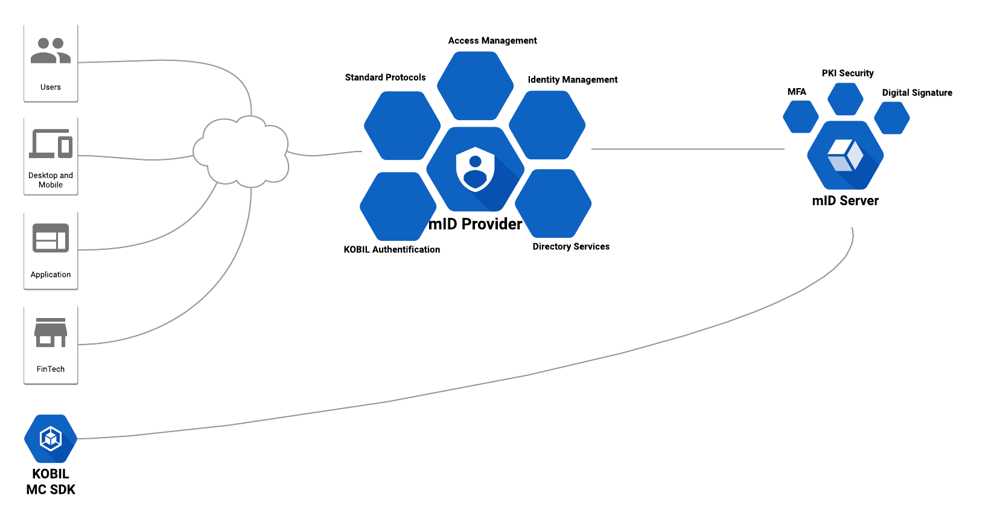

# Deployment With IDP
## Overview
The system offered consists of mAST/Digitanium based on containers orchestrated by Kubernetes or OpenShift. The solution enables the OIDC based SSO for browser and webview based apps based on the certified app security solution from KOBIL as well as the UMA based authorization granting.

The solution consists of three components:

   1. KOBIL mIDentity Provider
   1. KOBIL mIDentity Server
   1. App (MC) SDK

  

## Components
The mAST solution platform comes with these components:

  * KOBIL mIDentity Server (SSMS) is the security management system with device management system that enables a constant online connection and verification of the secure app. At each point in the authentication process, it is checked whether the device, the identity and the app are in a secure environment and whether the authentication or authorization of transactions can take place. In addition to the security functions, the SSMS ensures an audited security channel for end-to-end encrypted communication and the management of identities, apps and devices.
  * SDK for the operating systems iOS and Android to integrate the KOBIL technology with the ePA app with the features:
   * Trusted App , the app protection to protect the applications from malware
   * Trusted Login , the safe and BVA/BAS compliant way to identify yourself.
   * Trusted Verify for signing transactions
  * KOBIL IAM for ePA for the management of identities and devices as well as token generation and exchange.

###  KOBIL mIDentity Provider
mID Provider is a platform that enables Single Sign On (SSO) with Identity and Access Management (IDP) for modern applications and services. You will be able to add multi-factor authentication (MFA) solutions to applications and secure services that use standard SSO protocols. You don't have to worry about storing users or authenticating users. All of this is immediately available via the mID provider. You get advanced integration features like identity provisioning via industry standard protocols and intelligent authentication via KOBIL-specific authentication methods.

The most important functionalities are:

* user management
* Management of registration/deregistration processes
* 2FA device management
* Account Self-Service
* Authentication (1FA/2FA) via KOBIL mIDentity Server (SSMS)
* Authorization (2FA) via KOBIL mIDentity Server (SSMS)

### KOBIL mIDentity Server
The KOBIL Smart Security Management Server (SSMS) is the control and security server for all KOBIL authentication clients. The KOBIL product portfolio covers a wide range of security solutions, from one-time password (OTP) solutions to cutting-edge two-factor authentication (2FA) technology via Digitanium Technology. You will be able to manage all authentication tokens, whether they are app or hardware based, from one central management system without exposing your business logic and data to security risks.

It can be used with or without the KOBIL mIDentity Provider.

The main features of SSMS are:

* PSD2-certified security and control server for all KOBIL clients/tokens
* User management (can also be managed via the mIDentity Provider)
* Device management (can also be managed via mIDentity Provider)
* App management (can also be managed via mIDentity Provider)
* Certificate management with internal Public Key Infrastructure (PKI) and Certification Authority (CA)

### Mastercontroller (MC) SDK
The Software Development Kit is a software platform for mobile devices that provides a secure execution environment for Android and iOS mobile app developers. Various mechanisms are implemented in the SDK to ensure the integrity of the code to be executed. This includes a specially secured "Virtual Smart Card" (vSC) sub-environment that must be decrypted externally by the SSMS (see below) in order to access its contents. Before this decryption takes place, the SSMS evaluates the data from several security sensors provided by the SDK. This allows the SSMS to verify the integrity of the SDK, and only these verifications are positive. The key material for decrypting the vSC is provided. This means unwanted manipulation, e.g by malicious software can be detected and possibly prevented. The mechanisms mentioned are suitable for minimizing the risk of misuse through unauthorized changes to the software.
