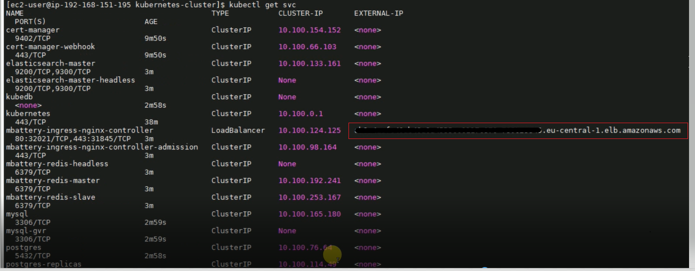

# Deployment With IDP

## Running mID Solutions on AWS

### CREATE AN EC2 INSTANCE ON AWS

- Login to AWS console.

- Prepare for AWS account credentials / tokens - you need them later for "aws configure" run (this is required for any platform / windows / linux / mac):

 and under Security Credentials - use "Create Access Key" service/button:

- Once created the access key - which also shows you the "Access key ID" and the "Secret Access key" - save these both for later usage (ensure to have them copied/saved locally).

- Now lets proceed further with creating EC2 instance on AWS which will serve as a jump server or host to run the commands and manage the cluster.

- Search for EC2 instances in your region E.g. Eu-Central-1(Frankfurt region)
Select Launch Instances -> select t2.micro (We will use free tier one) -> Configure Instance Details

- In Network select your vpc E.g. vpc-0026841b9e6915162 | Monaco  then in Subnet select your subnet E.g. subnet-0583f610916cfec15a | monaco-csclust-151-24 | eu-central-1a

- In IAM role select your IAM role that you have defined, E.g. EC2_Role_Kubernetes_Test. Click Next -> Next

- Now in Configure Security Group, Select an existing security group which satisfies your network requirements of Incoming and Outgoing traffic. E.g. sg-079b4bcc2b47dce36 kubernetes-test-sg-1

- Now Click Next and in Key-pair, Choose an existing key-pair if you have one, if not create new key-pair and dont forget to download and save it as we would need this private key to do ssh to the instance.

- Select checkbox and click on Launch Instances. 

### LOGIN TO THE EC2 & IMPORT THE FILES IN THE EC2 

- Now search for your instance ID in EC2 instances list. We need to do ssh to this instance, you need to download SSH client from google such as Putty or MobaXterm (I use MobaXterm as it offers support for many protocols, such as SSH, VNC, FTP, SFTP).

- Copy the public ip of that instance from AWS EC2 instances list and go to MobaXterm -> click on edit session, paste the public IP of instance, in specify username enter ec2-user.

- Now go to advanced SSH settings: select the private key of the instance which you downloaded before, select Ok. You will see the session created in the list on left side. Just double click on it. Select SFTP.

- Now copy the folder(kubernetes-cluster) which I have attached, to the instance. (just drag and drop it inside the instance on left side) in the path home/ec2-user.

 

### INSTALL THE PRE-REQUISITES NEEDED

**You need to install docker, aws cli, eksctl, kubectl, helm before proceeding further.**

- To install docker, run below commands

     sudo yum update -y

     sudo yum install -y docker

     sudo service docker start

     sudo usermod -a -G docker ec2-user

- To install aws cli, run below commands

     curl "https://awscli.amazonaws.com/awscli-exe-linux-x86_64.zip" -o "awscliv2.zip"

     unzip awscliv2.zip

     sudo ./aws/install

- To install eksctl, run below commands

     curl --silent --location "https://github.com/weaveworks/eksctl/releases/latest/download/eksctl_$(uname -s)_amd64.tar.gz" | tar xz -C /tmp

     sudo mv /tmp/eksctl /usr/local/bin

    eksctl version

- To install kubectl, run below commands

    curl -o kubectl https://amazon-eks.s3.us-west-2.amazonaws.com/1.18.9/2020-11-02/bin/linux/amd64/kubectl

    chmod +x ./kubectl

    mkdir -p $HOME/bin && cp ./kubectl $HOME/bin/kubectl && export PATH=$PATH:$HOME/bin

    echo 'export PATH=$PATH:$HOME/bin' >> ~/.bashrc

    kubectl version --short --client

- To install helm, run below commands

    curl -fsSL -o get_helm.sh https://raw.githubusercontent.com/helm/helm/master/scripts/get-helm-3

    chmod 700 get_helm.sh

    ./get_helm.sh

**Now, run below command and when prompted enter your aws Access key ID", the "Secret Access key" , Region as Eu-central-1 and default output format as json**

where you have downloaded AWS access key file locally in your machine.

    aws configure

Output will look like this:

Now run below command to check if all looks good.

    aws sts get-caller-identity

We need to create a key-pair to securely access the nodes - so we will create a **your_key.pem** E.g. test-midbox-kp.pem file on aws console and then import the file inside your EC2 instance (once downloaded, just drag and drop from your local machine to EC2 using Mobaxterm-SFTP) to .ssh/ folder under /home/ec2-user/ directory
once you create a pem file on aws, import that file on your jump host
To retrieve pub key from key file and save it in .ssh folder, run:

    sudo ssh-keygen -y -f test-midbox-kp.pem > ../.ssh/test-midbox-kp.pub

to check if .ssh folder exist or not, run:

    cd /home/ec2-user/

    ls -la

if .ssh folder is not present in /home/ec2-user/ just create it using,

    mkdir .ssh

### SET UP THE CLUSTER USING EKSCTL

Now we need to run makeclust.sh script file. This file consists of commands to create a cluster, managed nodegroups on AWS using eksctl.

'''shell
####!/usr/bin/env bash
cluster="${1}"
if [[-z ${cluster}]]
then
        echo -e "Please pass cluster name as first parameter e.g.: QaaTse03"
        exit 1
fi

eksctl create cluster \
--version 1.18 \
--without-nodegroup \
--name ${cluster} \
--region eu-central-1 \
--vpc-public-subnets=subnet-019eb6dcb9a1bf138,subnet-0d962d5eb8388e3de,subnet-09305db9411f9fcff \
--write-kubeconfig=false

eksctl create nodegroup \
--ssh-access=true \
--ssh-public-key=~/.ssh/test-midbox-kp.pub \
--cluster ${cluster} \
--name test-midboxclust1 \
--region eu-central-1 \
--node-type t3a.large \
--nodes-min 1 \
--nodes-max 3 \
--node-zones eu-central-1a \
--asg-access \
--managed

eksctl create nodegroup \
--ssh-access=true \
--ssh-public-key=~/.ssh/test-midbox-kp.pub \
--cluster ${cluster} \
--name test-midboxclust2 \
--region eu-central-1 \
--node-type t3a.large \
--nodes-min 1 \
--nodes-max 3 \
--node-zones eu-central-1b \
--asg-access \
--managed

eksctl create nodegroup \
--ssh-access=true \
--ssh-public-key=~/.ssh/test-midbox-kp.pub \
--cluster ${cluster} \
--name test-midboxclust3 \
--region eu-central-1 \
--node-type t3a.large \
--nodes-min 1 \
--nodes-max 3 \
--node-zones eu-central-1c \
--asg-access \
--managed

#### very important to update the ~/.kube/config context to have proper access to created cluster for following actions
aws eks --region eu-central-1 update-kubeconfig --name ${cluster} --alias ${cluster}

kubectl apply --context=${cluster} -f cluster-autoscaler-autodiscover.yaml
kubectl apply --context=${cluster} -f cluster-autoscaler-deployment.yaml
'''

Run the script by using following command.

    sh makeclust.sh yourclustername

Provide your cluster name instead of 'yourclustername' in the command.

### DEPENDENCIES FOR MBATTERY & MPOWER

Now we need to run following commands after the cluster is set-up and nodes are ready.

     kubectl apply -f kubestorage.yaml

Please enter your azure username and password. If you dont have one contact us

    kubectl create secret docker-registry registry-azure --docker-server=kobilsystems.azurecr.io --docker-username=your-azure-user --docker-password=your-azure-password           

    helm repo add kobil https://charts.kobil.com --username helm-username --password helm-password

    helm repo add appscode https://charts.appscode.com/stable/

    helm repo add jetstack https://charts.jetstack.io

    helm repo update

    helm install releasename appscode/kubedb --version v0.13.0-rc.0

    helm install cert-manager jetstack/cert-manager --version v1.3.1 --set installCRDs=true

    helm pull kobil/mbattery --version 7.1.2

    helm pull kobil/mpower --version 7.15.1

### INSTALL MBATTERY & MPOWER

Now last step is to edit mbattery and mpower values files and deploy mbattery and mpower.

In case if you want to install just basic midentity without monitoring, dashboard, frontend refer to mboxtest-mbattery-values.yaml and mpower730demo21.values-1.yaml values file inside midentity-basic-install folder else refer to these files in midentity-full-install.

Once you edit the files and make changes accordingly, please run commands one by one: 

    helm install mbattery -f midboxtest-mbattery-values.yaml mbattery-7.1.2.tgz --debug

Once mbattery is deployed, run command to deploy mpower:

    helm install mpower -f mpower730demo21.values-1.yaml mpower-7.15.1.tgz --debug

### CONFIGURE ROUTE53 ON AWS

First run below command in your EC2 instance:

   kubectl get svc

and note the External-IP value of mbattery-nginx-controller service

   

Go to AWS- search for Route53, select Hosted zones → select aws1.kobil.com domain and check if the entries are created with your domain which you have mentioned in mbattery and mpower values file. If not, click on Create Records and do following steps:

  

Just paste the earlier selected External-IP value and paste it in box of Load-Balancer {just below Europe(Frankfurt)[eu-central-1]}
Once this step is complete, click on Add another record and do the same steps, just in Record name enter *.mydomain (here mydomain refers to domain which you have mentioned in mbattery and mpower values file)
Eg:  if your domain is midboxtest, so two records would be midboxtest and *.midboxtest

### Delete the Cluster

Once you are done with exploring and testing, please do not forget to delete the cluster in case no longer in use.
Run the following command to delete the cluster in the ec2:

     eksctl delete cluster yourclustername

replace **yourclustername** with the name of your cluster.
