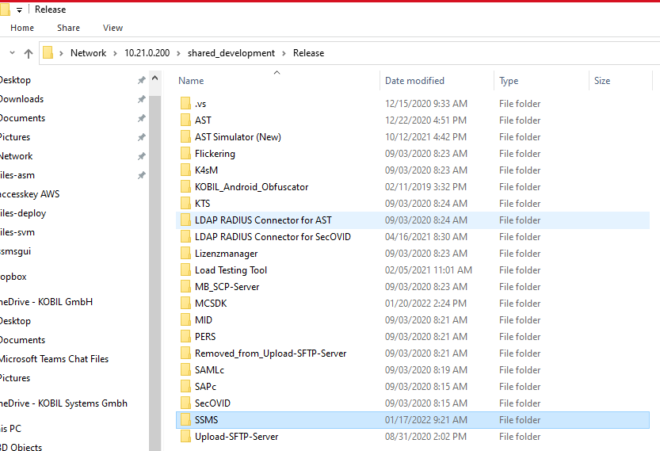
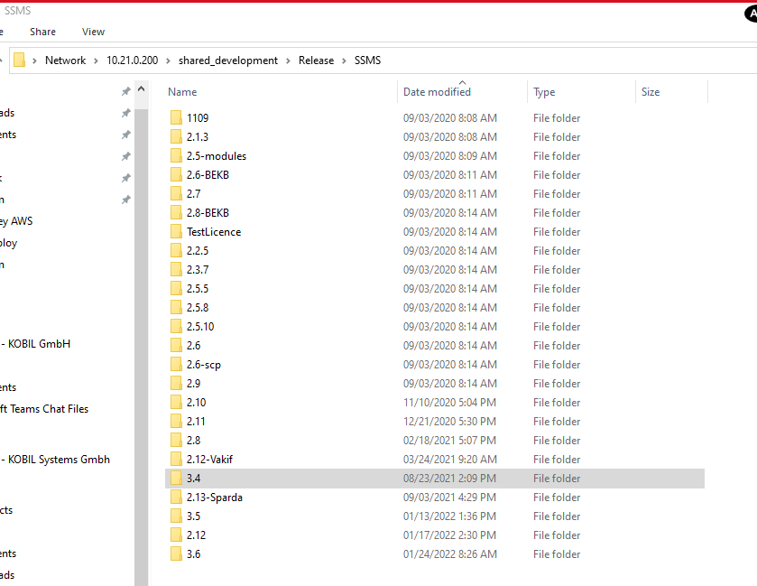
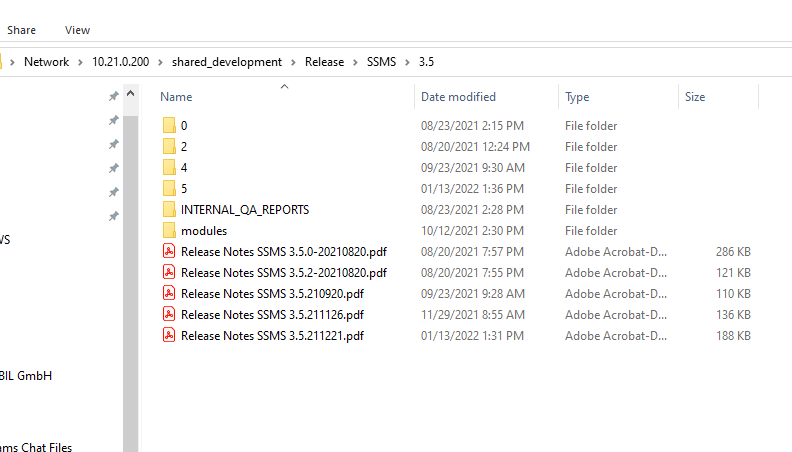
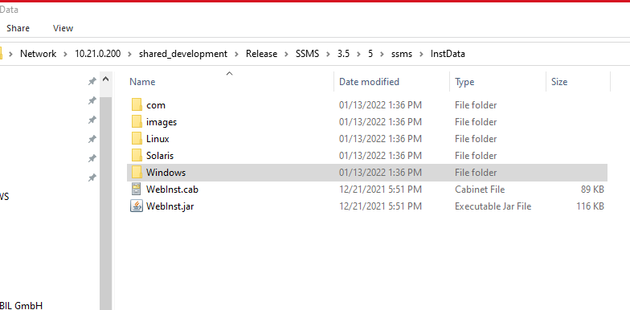

# Standalone (Without IDP)

Standalone way of deployment comes with the package of setup files for the respective OS systems (Windows, linux and others if supported).  

This Package is shared with a folder named "SSMS" as shown in the following figure below.  

  

"SSMS" folder typically consists of the version number of the following SSMS or different versions as shown in the figure below.  

  

After selecting the corresponding version, it comes with minor releases and its respective release notes.  

  

After choosing the desired version that is needed to be installed, it comes with a folder of installation data. It comes with various installation setups or files for different operating systems.  

  

The supported operating System comes with their own setup or files.

* **Windows**: setup.exe  

* **Linux**: setup.bin  

* **Solaris**: setup.bin  

## System Requirements:  

Requirements for the hardware and software as well as for the versions used can be found Precisely on the respective operating systems **release notes**.    

:warning: If SSMS shall be installed over an existing SSMS installation , the following modules must be uninstalled in the existing installation.  

# Database Requirements  

We need to have installed a database management system (DBMS) to set up and adjust all the required SSMS components with the configuration utility. The SSMS currently supports the MSSQL, MySQL and Oracle Database systems. Set up a user for the corresponding DBMS with the required permissions. The system supports the UTF-8 character set. No additional character rules are needed.  

:warning: If you have already created a database for the SSMS, it will be automatically detected by the configuration utility. If a database administrator has created the SSMS database manually, the database must contain no tables and must be empty, otherwise the configuration utility returns the error message “This is not an SSMS database”.  

**MYSQL**:  

According to the installation Operating system, choose the following version of Database verified from the respective release notes. In the figure below it shows a microsoft Operating system, similarly we can choose for our desired Operating system accordingly and install the database and its Workrbench in order to run the SQL commands.  

:warning: When installing MYSQL Workbench, make sure to install the same version as the MYSQL database.

**windows**:  
