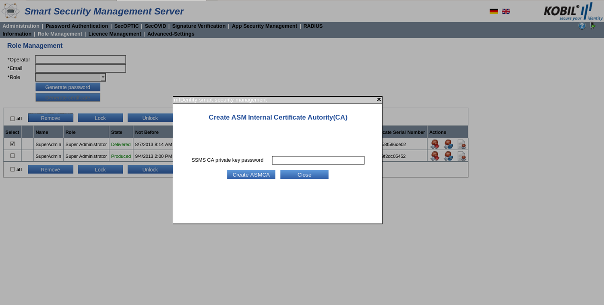

# ASM

##Introduction
This manual instructs you on how to manage the App Security Management Module (ASM) on the KOBIL Smart Security Management Server (SSMS). With the App Security Management module (ASM), you can manage the apps, their users and the corresponding devices (for example smartphone or mIDentity mini). Along with these management functions of the ASM, the SOAP functions provided by the service node can for example be integrated into a web portal to verify devices and users already registered on the system. In addition, note that you must install the SVM module to be able to use ASM. With SVM you can assign certificates to the user or to the device and enforce the authentication of signed data.

##General information
This manual is aimed at the administrators who install, configure and use the KOBIL Smart Security Management Server. The document is also intended for those who use the App Security Technology and manage the apps.
This manual only describes specifically how to use the App Security Management Module (ASM). Requirement for the use of this module is the installation of the main module (Kernel) and of the SVM module, which can be simultaneously installed via the “Configuration Utility”. Please find more information about the Configuration Utility in the installation manual of the KOBIL SSMS.
For information about the other modules and documents for the administration of the SSMS, contact KOBIL support.

**Version dependent validity of the manual**
As you can add the various modules to the KOBIL SSMS independently from each other, different versions of the single modules exist. To ensure compatibility of the versions, note the overview of the version compatibilities in the manual for the Kernel module.

##App Security Management Module
Please click the menu item “App Security Management” to reach the view and functions to manage devices and users. More precisely, find the following menus:
-	Devices
- Properties
- Groups
-	Users
-	Versions
-	Statistics
-	Tokens
-	Reporting
-	Advanced-Settings (with Settings and Text Resources)

To manage the users and the devices in the ASM, specific functions are provided via the GUI and the SOAP interface. The SOAP interfaces can be used to integrate the server into the existing IT infrastructure. The above-mentioned views are on the management node.

A sample application, “ASM Portal Demo“, is provided with this module. The Portal Demo and its use with an app is described in a separate manual and can be requested, if needed, from KOBIL. The Portal Demo demonstrates the App Security Management Module and, in particular, the applications Trusted Message Sign (TMS) and Trusted Web View (TWV). For your Portal website, you can of course develop and use your own web application.
The installation and configuration of the ASM Portal Demo is described in a separate manual, which can be found with the needed war file as well as the source code in the following directory:

        <SSMS_INSTALL>/modules/asm/samples/asm-portaldemo<version>/

### Role Management in the App Security Management module
A role must be assigned to each operator of the system. The division into different roles defines the authorizations of every single operator. Please find information on how to create roles and assign them permissions manual for the Kernel module. Please find the roles and authorizations to use the Management SOAP interface in the description of the single methods in chapter 10.4. The services SOAP interface is secured via SSL server authentication and does not require any other authentication of a user.

###	Create ASM CA certificates
Before you can access the views and functionalities of the App Security Management Module, you must create the required CA certificates (please find additional information on the CA certificate in the installation manual). Two types of ASM CA certificates are available, which are used for the creation of subordinate CA end-user/not sub-CA certificates for apps and devices.
The ASM CA is used to create app certificates (software)
The ASM CA HARDWARE is used to create personalized certificates for hardware devices
The certificates are created the first time you click on the tab “App Security Management”. For this purpose, you will be prompted by a pop-up window to enter the password of the SSMS CA certificate. The password of the SSMS CA certificate is identical to that of the certificate request of the SSMS and was defined by the administrator of the configuration tool.

After you have entered the password, it is verified, and you receive a notification of the successful certificate creation. Then, you have full access to all views and functions of this module.
If the certificate was created successfully, it is also shown in the Signature Verification module (SVM) Issuer Certificates view (please find additional information in the administrator manual for the SVM module).

##	Devices view
The App Security Management Devices view helps you manage the devices.
Go to this view via the menu option “App Security Management” → “Devices”. Here, all devices are listed in tabular form

The table of this view informs you about the status of all registered devices and their users as well as other attributes. The following is a detailed description:

| Select                                                                                  | Checkbox for selection                                                                                                                                                                                                                                                                                                       |
| --------------------------------------------------------------------------------------- | ---------------------------------------------------------------------------------------------------------------------------------------------------------------------------------------------------------------------------------------------------------------------------------------------------------------------------- |
| Device-ID                                                                               | The device identification number internally assigned by the SSMS                                                                                                                                                                                                                                                             |
| User-ID                                                                                 | The user assigned to the device                                                                                                                                                                                                                                                                                              |
| Device                                                                                  | The device type („VIRTUAL\_DEVICE“ for iOS, Android and Windows or „MIDENTITY\_MINI“, „MIDENTITY\_AIR“ and „MIDENTITY\_AIR\_PLUS“)                                                                                                                                                                                           |
|  | Virtual device:  iOS and Android (Smartphone Apps)                                                                                                                                                                                                                                                                           |
|  | Virtual device: Windows and Mac OS (PC Browser)                                                                                                                                                                                                                                                                              |
|  | Hardware: mIDentity mini                                                                                                                                                                                                                                                                                                     |
|  | Hardware: mIDentity Air (currently not supported), Air+, signPod and signDot                                                                                                                                                                                                                                                 |
| Serial Number                                                                           | The serial number of the certificate belonging to the device                                                                                                                                                                                                                                                                 |
| App Name                                                                                | The name assigned to the app                                                                                                                                                                                                                                                                                                 |
| App Version                                                                             | The version number of the app                                                                                                                                                                                                                                                                                                |
| Device Version                                                                          | The version number of the used device                                                                                                                                                                                                                                                                                        |
| Risks                                                                                   | The following risks are displayed in case the user changed his smartphone (for example jailbreaking on iOS) or his app. You will find more detailed information in the separated risk documentation.

*   JBreak
*   Manipulation
*   MaliciousApp
*   Uid
*   CodeInjection
*   RunAsRoot
*   MemoryProtection
*   Emulator |
| OS Type                                                                                 | Platform of the device where the app runs (for example ANDROID\_ARM, ANDROID\_x86, Android\_ARMv7a, Android\_ARMv8a, MAC\_OS, WINDOWS, WindowsPhone\_ARMV7, WindowsPhone\_Emu, iOS\_ARM64, iOS\_ARMv7, iOS\_ARMv7s, signDot, signPod).                                                                                       |
| OS Version                                                                              | The operating system version of the device where the app runs.

For example, Android 4.4 or iOS 8.0                                                                                                                                                                                                                          |
| Model                                                                                   | The device type (Samsung Galaxy, Apple, iPhone)                                                                                                                                                                                                                                                                              |
| Status                                                                                  | !5                                                                                                                                                                                                                                      | Active, a user is logged into the SSMS with his device |
|  | The device is not logged into the SSMS and is inactive                                                                                                                                                                                                                                                                       |
| Last Login                                                                              | Date when the user last logged into the SSMS                                                                                                                                                                                                                                                                                 |
| Node                                                                                    | The SSMS node (node name) to which the device is connected or was last connected                                                                                                                                                                                                                                             |
| Locked                                                                                  | No icon                                                                                                                                                                                                                                                                                                                      | The certificate assigned to the device is unlocked |
|  | The certificate assigned to the device is locked.

When you move the mouse over the icon, you receive additional information about the lock reason                                                                                                                                                                           |
|  | The user of the device is locked                                                                                                                                                                                                                                                                                             |
| Actions                                                                                 |                                                                                                                                                                                                                                       | Show user certificate details |
|  | Show device properties                                                                                                                                                                                                                                                                                                       |
