# ASM (App Security Management)

## Introduction

This section instructs you on how to manage the App Security Management Module (ASM) on the KOBIL Smart Security Management Server (SSMS). With the App Security Management module (ASM), you can manage the apps, their users and the corresponding devices (for example smartphone or mIDentity mini). Along with these management functions of the ASM, the SOAP functions provided by the service node can for example be integrated into a web portal to verify devices and users already registered on the system. In addition, note that you must install the SVM module to be able to use ASM. With SVM you can assign certificates to the user or to the device and enforce the authentication of signed data.

## General Information

This manual is aimed at the administrators who install, configure and use the KOBIL Smart Security Management Server. The document is also intended for those who use the App Security Technology and manage the apps.
This manual only describes specifically how to use the App Security Management Module (ASM). Requirement for the use of this module is the installation of the main module (Kernel) and of the SVM module, which can be simultaneously installed via the “Configuration Utility”. Please find more information about the Configuration Utility in the installation manual of the KOBIL SSMS.
For information about the other modules and documents for the administration of the SSMS, contact KOBIL support.

### Version dependent validity of the manual

As you can add the various modules to the KOBIL SSMS independently from each other, different versions of the single modules exist. To ensure compatibility of the versions, note the overview of the version compatibilities in the manual for the Kernel module.

## App Security Management Module

Please click the menu item **App Security Management** to reach the view and functions to manage devices and users. More precisely, find the following menus:
-	Devices
- Properties
- Groups
-	Users
-	Versions
-	Statistics
-	Tokens
-	Reporting
-	Advanced-Settings (with Settings and Text Resources)

To manage the users and the devices in the ASM, specific functions are provided via the GUI and the SOAP interface. The SOAP interfaces can be used to integrate the server into the existing IT infrastructure. The above-mentioned views are on the management node.

A sample application, **ASM Portal Demo**, is provided with this module. The Portal Demo and its use with an app is described in a separate manual and can be requested, if needed, from KOBIL. The Portal Demo demonstrates the App Security Management Module and, in particular, the applications Trusted Message Sign (TMS) and Trusted Web View (TWV). For your Portal website, you can of course develop and use your own web application.
The installation and configuration of the ASM Portal Demo is described in a separate manual, which can be found with the needed war file as well as the source code in the following directory:

        <SSMS_INSTALL>/modules/asm/samples/asm-portaldemo<version>/

### Role Management in the App Security Management module

A role must be assigned to each operator of the system. The division into different roles defines the authorizations of every single operator. Please find information on how to create roles and assign them permissions manual for the Kernel module. Please find the roles and authorizations to use the Management SOAP interface in the description of the single methods in chapter 10.4. The services SOAP interface is secured via SSL server authentication and does not require any other authentication of a user.

###	Create ASM CA certificates

Before you can access the views and functionalities of the App Security Management Module, you must create the required CA certificates (please find additional information on the CA certificate in the installation manual). Two types of ASM CA certificates are available, which are used for the creation of subordinate CA end-user/not sub-CA certificates for apps and devices.
The ASM CA is used to create app certificates (software)
The ASM CA HARDWARE is used to create personalized certificates for hardware devices
The certificates are created the first time you click on the tab “App Security Management”. For this purpose, you will be prompted by a pop-up window to enter the password of the SSMS CA certificate. The password of the SSMS CA certificate is identical to that of the certificate request of the SSMS and was defined by the administrator of the configuration tool.

After you have entered the password, it is verified, and you receive a notification of the successful certificate creation. Then, you have full access to all views and functions of this module.
If the certificate was created successfully, it is also shown in the Signature Verification module (SVM) Issuer Certificates view (please find additional information in the administrator manual for the SVM module).

##	Devices view

The App Security Management Devices view helps you manage the devices.
Go to this view via the menu option “App Security Management” → “Devices”. Here, all devices are listed in tabular form

The table of this view informs you about the status of all registered devices and their users as well as other attributes. The following is a detailed description:

|Select|Checkbox for selection|
|:----|:----|
|Device-ID|The device identification number internally assigned by the SSMS|
|User-ID|The user assigned to the device|
|Device|The device type (**VIRTUAL_DEVICE** or iOS, Android and Windows or **MIDENTITY_MIN**, **MIDENTITY_AIR** and **MIDENTITY_AIR_PLUS**)      **Virtual device** :  iOS and Android (Smartphone Apps)    **Virtual device**: Windows and Mac OS (PC Browser)    **Hardware**: mIDentity mini      **Hardware**: mIDentity Air (currently not supported), Air+, signPod and signDot|
|Serial Number|The serial number of the certificate belonging to the device|
|App Name|The name assigned to the app|
|App Version|The version number of the app|
|Device Version|The version number of the used device|
|Risks|The following risks are displayed in case the user changed his smartphone (for example jailbreaking on iOS) or his app. You will find more detailed information in the separated risk documentation.   - JBreak   - Manipulation   - MaliciousApp   - Uid   - CodeInjection   - RunAsRoot   - MemoryProtection   - Emulator|
|OS Type|Platform of the device where the app runs (for example ANDROID_ARM, ANDROID_x86, Android_ARMv7a, Android_ARMv8a, MAC_OS, WINDOWS, WindowsPhone_ARMV7, WindowsPhone_Emu, iOS_ARM64, iOS_ARMv7, iOS_ARMv7s, signDot, signPod).|
|OS Version|The operating system version of the device where the app runs.|
| |For example, Android 4.4 or iOS 8.0|
|Model|The device type (Samsung Galaxy, Apple, iPhone)|
|Status|  Active, a user is logged into the SSMS with his device   The device is not logged into the SSMS and is inactive|
|Last Login|Date when the user last logged into the SSMS|
|Node|The SSMS node (node name) to which the device is connected or was last connected|
|Locked|No icon The certificate assigned to the device is unlocked     The certificate assigned to the device is locked.    When you move the mouse over the icon, you receive additional information about the lock reason    The user of the device is locked|
|Actions|  Show user certificate details    Show device properties|

### Lock or unlock Devices

The App Security Management devices can be locked or unlocked via the two buttons above the table shown in Figure 2. To do this, select one or more entries via the checkboxes on the left and click the button of the action you want to carry out.
The following reasons are available:
-	Locked manually
-	Lost
-	Too many tries
-	Defect
-	Unknown
-	PIN was wrong
-	Stolen

###	Remove Device

You remove a device from the list by selecting one or more entries via the checkboxes on the left and by clicking the button “Remove device”. A window pops up which prompts you to confirm the deletion.
The deletion can also fail. The failure is indicated in the status column on the left of the user ID. In addition, an error message appears above the table.

###	Search devices

With this function, you can search for devices and users. More precisely, you can search for or filter specific entries. Enter the desired value into the input field and click the magnifier icon. Please find additional information about the search options in the administrator manual for the Kernel module in the chapter “Search”.

## Properties view

The Properties view is subdivided into three sub-views:

-	Device Properties
-	User Properties
-	Group Properties

In addition to the default properties of an AST device, user or group, customer-specific parameters can also be set and read over the AST SDK or the ASM SOAP interface e.g. an optional device name. The view Properties displays these parameters in an overview.
Please find more information about methods for setting and reading properties in the AST SDK manual or in the information about the SOAP methods in **chapter 10.4**.

###	Device Properties

The following figure shows the Device Properties view, which manages the properties of all ASM devices. Please find more information about the devices list and its content in the table below.

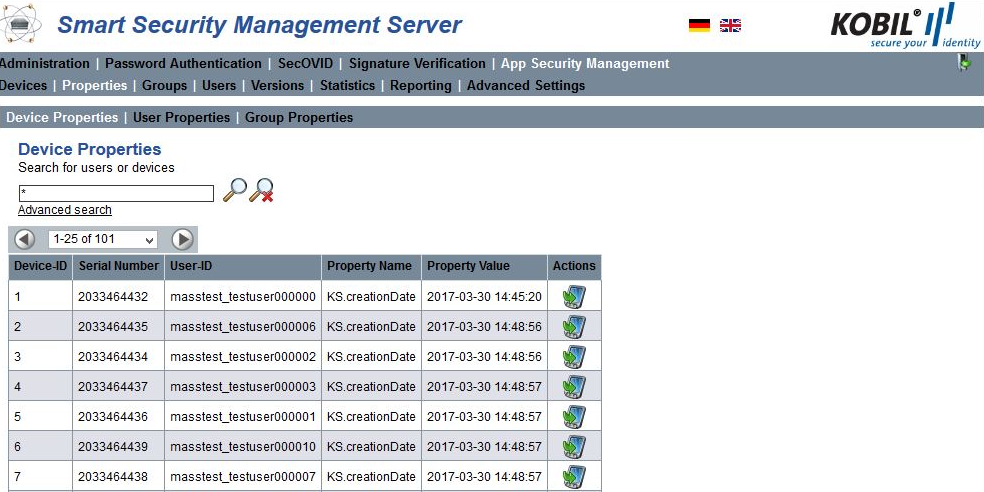

The following attributes are part of the Device Properties view:

|Device-ID|The identification number of the device internally assigned by the SSMS|
|Serial Number|Serial number of the deviceUser-ID|The user assigned to the deviceProperty Name|The given property nameProperty Value|The value assigned to the property name|
|Actions|Shows the device linked to the property|

:warning: **The ASM module sets some device properties in the normal operation. These properties start with KS. in order to define the values, which belong to the system**

###	User Properties

The user properties are available in the following view:

The information in the view is explained in the following table:

|Property-ID|Identification number of the property|
|User-ID|The user ID whom the property is about|
|Property Name|The given property name|
|Property Value|The value assigned to the property name|

###	Group Properties

|Attributes|Description|
|:----|:----|
|Property-ID|Identification number of the property|
|User-ID|The group ID whom the property is about|
|Property Name|The given property name|
|Property Value|The value assigned to the property name|

The following figure shows the Device Properties view, which manages the properties of all ASM devices. Please find more information about the devices list and its content in the table below.

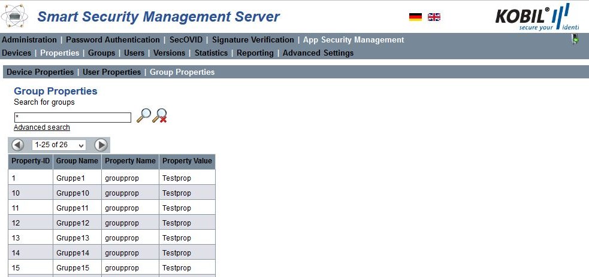

The following attributes are part of the Device Properties view:

| Attributes   | Description                                                           |
|:-------------|:----------------------------------------------------------------------|
|Device-ID     |The identification number of the device internally assigned by the SSMS|
|Serial Number |Serial number of the device                                            |
|User-ID       |The user assigned to the device                                        |
|Property Name |The given property name                                                |
|Property Value|The value assigned to the property name                                |
|Actions       |Shows the device linked to the property                                |

:warning: **The ASM module sets some device properties in the normal operation. These properties start with KS. in order to define the values, which belong to the system**

##	Groups view

In the Groups view, different user groups can be created and managed. This helps assign the version updates of devices (virtual and hardware devices) to certain groups of users **(see chapter 6.5)**. A user can be part of only one group or of no group. In addition, users can be automatically assigned to an AUTO_GROUP when they are not part of a specific group.
The group which the user belongs to is listed in the column labeled **Group Name** in the Users view.
In the next chapters, the functions of the group management are described. These functions can be managed via the Web GUI and the SOAP interface.

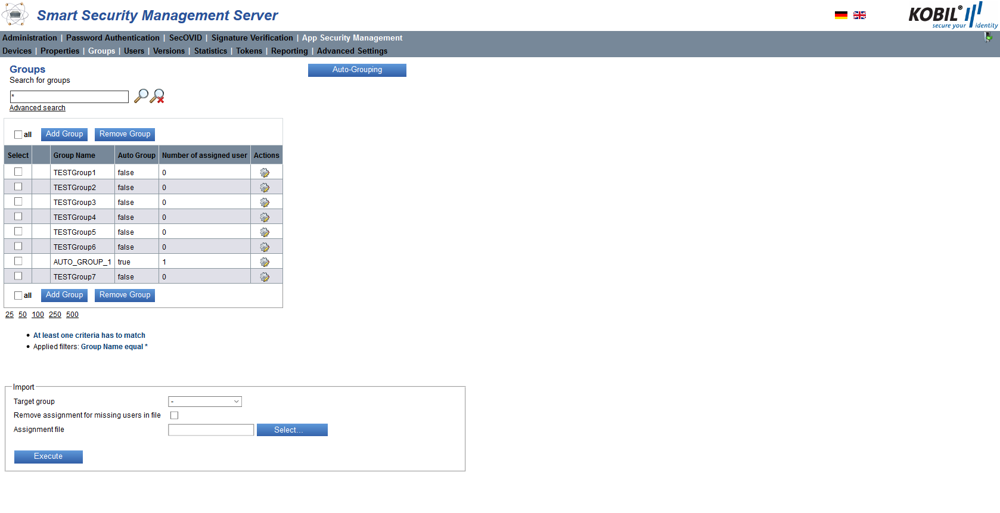

The Groups view contains the following information:

|Select                 |Checkbox for selection                                                                                   |
|-----------------------|---------------------------------------------------------------------------------------------------------|
|Group Name             |The name of the group                                                                                    |
|Auto Group             |The value is set to “true” if the group is an auto group and to “false” if the group is not an auto group|
|Number of assigned user|Number of users assigned to the group                                                                    |
|Actions                | Change the group name and deactivate / activate auto-group           |

**Note**: All users, which are not explicitly assigned to a group, are assigned to the group: [no group]. This means that the version [no group] has been assigned to the version update for this app and that this version update applies to all users who are in the group [no group]. Therefore, users assigned to another group will not receive updates for the apps of the group [no group].

### Add or remove Group

You can add a new group by selecting the button **Add Group** and by giving it a unique name in the window that pops up. You remove one or more groups by selecting the corresponding checkbox in the column **Select** and clicking **Remove Group**.

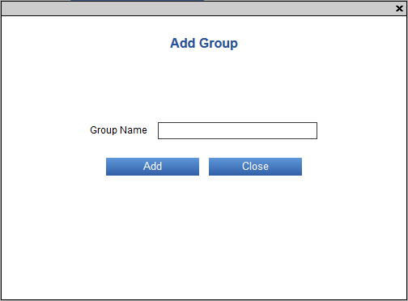 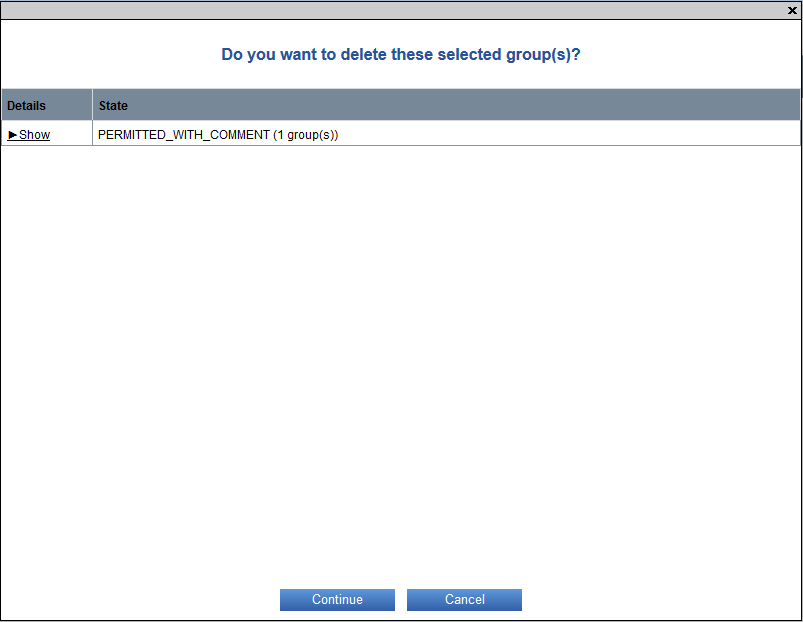

###	Edit Group

To edit a Group Name or to change an Auto Group into a normal group, click the icon  in the row of the group. The action opens the following window where you can change the name of the group. Note that it is not possible to convert a normal group into an Auto Group.

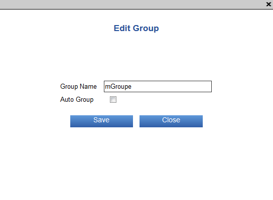

###	Add and remove User from a Group

In the Users view, selected users can be unassigned from a group and assigned to another group.
To assign a user to another group, he must at first be unassigned from his current group. You can unassign a user or multiple users from a group by selecting the user (or the users) in the “Select” column and clicking the button **Unassign Group**.

### Auto Group

This function Auto-Grouping assigns all the users that are not assigned to a group yet to an Auto Group. The name of an auto group starts with “AUTO_GROUP_” followed by an incrementing number. An auto group has a maximum number of users, which can be configured in the Advanced Settings of the Kernel module (see specific manual). As soon as this limit is reached, a new auto group is generated.
If for example 1000 users still do not belong to any group and in the Kernel Advanced Settings the maximum number of users per auto group was set to 150, then 7 auto groups will be created (each with the definition AUTO_GROUP_ followed by a number): 6 groups including 150 users and the 7th group with 100 users.

### Import

The function Import assigns existing users to a selected group by uploading a CSV file which contains one user-id per line. First you need to select a group from Target Group Dropdown box. Then, to choose the user assignment file you need to click the **Select** button. After selecting the file, you should click in the **Execute** button to do the assignment. In this panel, by clicking in the checkbox **Remove assignment for missing users in file** you can decide whether the users who are not part of the file shall be removed from the group or not. Users who are assigned to a different group are removed from the previous group. In case, the users who are specified in the CSV file but do not exist in SSMS, those will be identified as invalid users. This functionality is only managed by Web GUI, no SOAP method is implemented for this.

## Users view

The Users view is for the management of the ASM users. In the Users view, all users are listed in tabular form. In this view, you can add, edit or delete activation data. In addition, you can add, lock or unlock users, view their devices and manage their group assignment.

In this view, you can find information about the status of the users as well as other attributes, as described in the table below:

|Select                                                                                 |Checkbox for selection                                                                                                            |
|---------------------------------------------------------------------------------------|----------------------------------------------------------------------------------------------------------------------------------|
|User-ID                                                                                |String that defines the user (e.g. username)                                                                                      |
|Group Name                                                                             |The group assigned to the user                                                                                                    |
|Number of Virtual Device                                                               |The number of virtual devices of the user                                                                                         |
|Number of Hardware Device                                                              |The number of hardware devices of the user                                                                                        |
|Number of valid Activation Number                                                      |Number of still valid activation numbers of the user                                                                              |
|Locked                                                                                 |   The user of the device is locked. Moving the mouse over the icon shows additional information about the lock reason     The user was unlocked                                                                                                             |
|Actions                                                                                |  Add activation number for the corresponding user     Edit activation data for the corresponding user     Remove all activation data for the corresponding user     Lock the corresponding user    Unlock the corresponding user     View device for this user    Get logs for this user     Set user PIN (in case the option **Use Same PIN For All Devices** in the ASM Advanced Settings is set)     Remove user PIN (in case the PIN is set already and the option **Use Same PIN For All Devices** in the ASM Advanced Settings is set)|

Please find information about the search and filter options in the administrator manual for the kernel module in the chapter **Search**

### Add user

You add a user into the database by clicking the button “Add User”. At first, you are only required to enter a unique User-ID. Later, you can define the additional user attributes like the activation number manually.

After clicking the button, a window pops up, which prompts you to enter the name of the user.

A user added to this module can be seen in all other modules of the SSMS as well.

### Lock or unlock users

You can lock or unlock multiple users of the App Security Management Module at a time by selecting the user or the users in the “Select” column and clicking the buttons “Lock User” or “Unlock User” depending on whether you want to lock or unlock the user. A single user can also be locked or unlocked by clicking the Actions lock symbol for lock  and unlock  in the row of the user to be locked.

When a user is locked, he cannot log in with his device anymore and receives a corresponding error message.

###	Remove User

You remove a single user or multiple users from the database by selecting the user in the “Select” column and clicking the button “Remove User”. This action also removes the additional user attributes like the activation number.

In the dialog box that pops up, you are prompted to confirm your action.

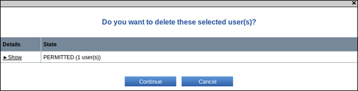

###	Add Activation Number

An activation number is a one-time password, which you can set for a user in the way described below. A user can have one or multiple activation numbers depending on the number of the devices he uses.
The user needs the activation number during the registration process, which he must perform the first time he uses his app on his device. After successful registration, the activation number is deleted, and the device is assigned to the user. To verify the registration, check whether any devices are assigned to the user in the Devices view **(chapter 1.2)**, after reloading the page.

The activation number has an expiration date, after which the activation number is invalid. Note the following format for the expiration date, DD.MM.YYYY hh:mm:ss, as used in the following example: 27.01.2014 14:12:45.
You can set an expiration date for an activation number by selecting the user in the “Select” column and clicking the button “Add Activation No.”. Afterwards, a window pops up, which gives you two options to set an expiration date: either you set it manually in the input field or you click on the calendar icon and set it via the calendar. The following figures display the manual input of the expiration date and the input via the calendar, respectively.

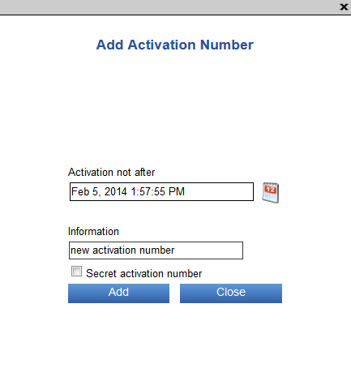  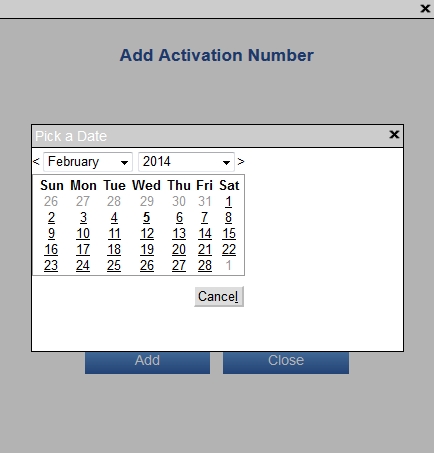

In the “Add Activation Number” window, you can enter information relating to the activation number in the corresponding field. This information can later be seen when editing the activation data by clicking “Edit activation data for this user” and can be changed, if needed.
By checking the option “Secret activation number”, the activation number is displayed in the pop-up window only when it is added. From then on, it is hidden.
The activation number(s) generated as described above must be sent via mail or e-mail to the user. The user can register his app on the SSMS only if the activation number does not expire. If the user misses the date, he must request a new activation number. Alternatively, the administrator can extend the validity period of the activation number, but only until a maximum value defined by the parameter Activation Code Max Duration in the Advanced Settings of the ASM module.  

#### Edit activation data

You can edit the activation data by clicking the Actions icon  in the row of the user whose activation data you want to change. In the window that pops up, you can edit the expiration date of the activation number and its information or remove the activation data.

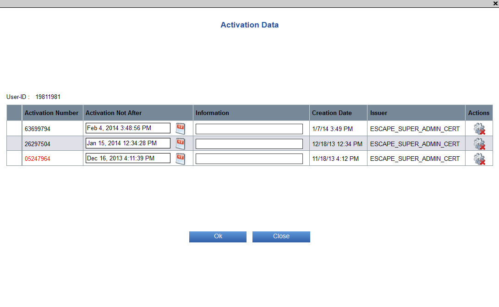

####	Remove Activation Number

You have two options to remove activation data. With the first option, you remove the activation data of a single user by clicking the Actions icon  in the row of the user whose activation data you want to remove.

With the second option, you can remove one or multiple activation numbers by selecting the users in the **Select** column and by clicking **Remove Activation No.**.

If you decide to remove all the activation numbers, the following dialog box pops up, which prompts you to confirm the action:

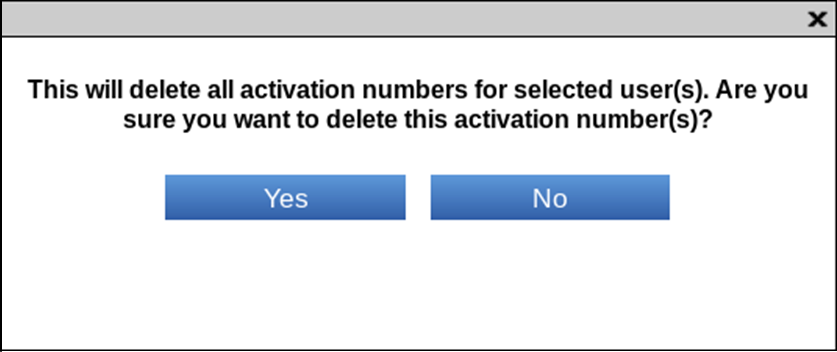

#### Export Activation Number

By clicking the button **Export Activation No.**, you export the activation number of the user or of the multiple users you previously selected in the **Select** column. The numbers are exported into an XML file and stored into a directory of your choice.

#### Create user certificate

In the **Users** view of the App Security Management module, you have the option to issue user certificates by using the **Create User Certificate** button.

A dialog will open where you can select a desired certificate profile for the appropriate application. The following certificate profiles are available:
- Encryption
-	Authentication
-	Signature
Certificates are issued by the ASM CA using the signing algorithm which is configured in the ASM advanced settings. Depending on the selected profile, appropriate values are set for the X.509 certificate extensions “key usage” and “extended key usage”. The certificate request must be uploaded as a PKCS#10-file within the dialog from the local directory. From the request file, the name of the applicant (field subject) and the public key (field subjectPublicKey) are used as input for the certificate creation. The supported encoding formats of the PKCS#10-file are DER, PEM and Base64.

To confirm the data, press **Create**. A signed X.509 user certificate (DER encoded) is created. You will receive a note after a successful certificate creation. To download and save the certificate, please click the **Download** button

####	Set user PIN

If you selected the option **Use Same PIN For All Devices** in the ASM Advanced Settings, you can set a **global** PIN for the user, which is valid for all the user’s devices. The user needs the PIN to activate his device. The PIN is valid for all the user’s devices simultaneously.
To set the PIN, click the icon  in the row of the desired user and set a PIN in the window that opens.

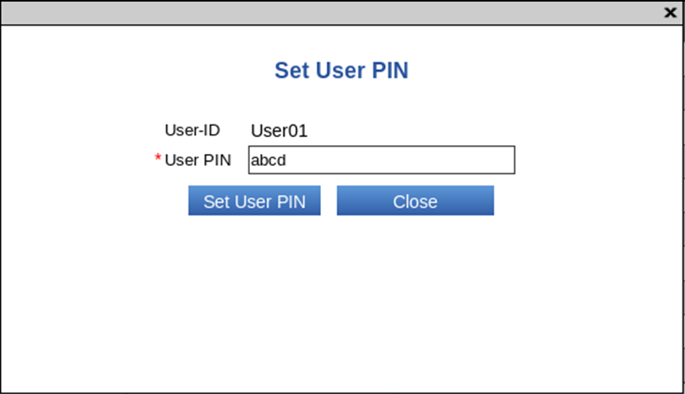

**Note**: the PIN must have the minimum length that is configured in the ASM Advanced Settings (Option **Minimum Pin Length**) to be accepted by the system.
The PIN set in this way must be sent with the activation data to the user. To register the app, the user enters the activation data he received with the PIN set by the administrator. Later, he can change his PIN via the app function **Change PIN**.

####	Remove user PIN

If you selected the option **Use Same PIN For All Devices** in the ASM Advanced Settings, you can remove the PIN of a user.
To remove the PIN, click the icon  in the row of the desired user.

:warning: **Note that a user is not able any longer to log in to all his apps if the user PIN was removed!**
