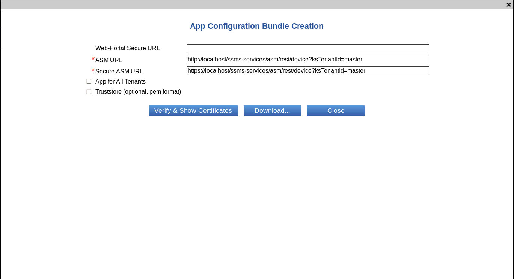
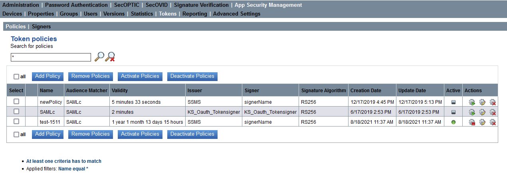

# ASM (App Security Management)

## Introduction

This section instructs you on how to manage the App Security Management Module (ASM) on the KOBIL Smart Security Management Server (SSMS). With the App Security Management module (ASM), you can manage the apps, their users and the corresponding devices (for example smartphone or mIDentity mini). Along with these management functions of the ASM, the SOAP functions provided by the service node can for example be integrated into a web portal to verify devices and users already registered on the system. In addition, note that you must install the SVM module to be able to use ASM. With SVM you can assign certificates to the user or to the device and enforce the authentication of signed data.

## General Information

This manual is aimed at the administrators who install, configure and use the KOBIL Smart Security Management Server. The document is also intended for those who use the App Security Technology and manage the apps.
This manual only describes specifically how to use the App Security Management Module (ASM). Requirement for the use of this module is the installation of the main module (Kernel) and of the SVM module, which can be simultaneously installed via the “Configuration Utility”. Please find more information about the Configuration Utility in the installation manual of the KOBIL SSMS.
For information about the other modules and documents for the administration of the SSMS, contact KOBIL support.

### Version dependent validity of the manual

As you can add the various modules to the KOBIL SSMS independently from each other, different versions of the single modules exist. To ensure compatibility of the versions, note the overview of the version compatibilities in the manual for the Kernel module.

## App Security Management Module

Please click the menu item **App Security Management** to reach the view and functions to manage devices and users. More precisely, find the following menus:
-	Devices
- Properties
- Groups
-	Users
-	Versions
-	Statistics
-	Tokens
-	Reporting
-	Advanced-Settings (with Settings and Text Resources)

To manage the users and the devices in the ASM, specific functions are provided via the GUI and the SOAP interface. The SOAP interfaces can be used to integrate the server into the existing IT infrastructure. The above-mentioned views are on the management node.

A sample application, **ASM Portal Demo**, is provided with this module. The Portal Demo and its use with an app is described in a separate manual and can be requested, if needed, from KOBIL. The Portal Demo demonstrates the App Security Management Module and, in particular, the applications Trusted Message Sign (TMS) and Trusted Web View (TWV). For your Portal website, you can of course develop and use your own web application.
The installation and configuration of the ASM Portal Demo is described in a separate manual, which can be found with the needed war file as well as the source code in the following directory:

        <SSMS_INSTALL>/modules/asm/samples/asm-portaldemo<version>/

### Role Management in the App Security Management module

A role must be assigned to each operator of the system. The division into different roles defines the authorizations of every single operator. Please find information on how to create roles and assign them permissions manual for the Kernel module. Please find the roles and authorizations to use the Management SOAP interface in the description of the single methods in chapter 10.4. The services SOAP interface is secured via SSL server authentication and does not require any other authentication of a user.

###	Create ASM CA certificates

Before you can access the views and functionalities of the App Security Management Module, you must create the required CA certificates (please find additional information on the CA certificate in the installation manual). Two types of ASM CA certificates are available, which are used for the creation of subordinate CA end-user/not sub-CA certificates for apps and devices.
The ASM CA is used to create app certificates (software)
The ASM CA HARDWARE is used to create personalized certificates for hardware devices
The certificates are created the first time you click on the tab “App Security Management”. For this purpose, you will be prompted by a pop-up window to enter the password of the SSMS CA certificate. The password of the SSMS CA certificate is identical to that of the certificate request of the SSMS and was defined by the administrator of the configuration tool.

After you have entered the password, it is verified, and you receive a notification of the successful certificate creation. Then, you have full access to all views and functions of this module.
If the certificate was created successfully, it is also shown in the Signature Verification module (SVM) Issuer Certificates view (please find additional information in the administrator manual for the SVM module).

##	Devices view

The App Security Management Devices view helps you manage the devices.
Go to this view via the menu option “App Security Management” → “Devices”. Here, all devices are listed in tabular form

The table of this view informs you about the status of all registered devices and their users as well as other attributes. The following is a detailed description:

|Select|Checkbox for selection|
|:----|:----|
|Device-ID|The device identification number internally assigned by the SSMS|
|User-ID|The user assigned to the device|
|Device|The device type (**VIRTUAL_DEVICE** or iOS, Android and Windows or **MIDENTITY_MIN**, **MIDENTITY_AIR** and **MIDENTITY_AIR_PLUS**)      **Virtual device** :  iOS and Android (Smartphone Apps)    **Virtual device**: Windows and Mac OS (PC Browser)    **Hardware**: mIDentity mini      **Hardware**: mIDentity Air (currently not supported), Air+, signPod and signDot|
|Serial Number|The serial number of the certificate belonging to the device|
|App Name|The name assigned to the app|
|App Version|The version number of the app|
|Device Version|The version number of the used device|
|Risks|The following risks are displayed in case the user changed his smartphone (for example jailbreaking on iOS) or his app. You will find more detailed information in the separated risk documentation.   - JBreak   - Manipulation   - MaliciousApp   - Uid   - CodeInjection   - RunAsRoot   - MemoryProtection   - Emulator|
|OS Type|Platform of the device where the app runs (for example ANDROID_ARM, ANDROID_x86, Android_ARMv7a, Android_ARMv8a, MAC_OS, WINDOWS, WindowsPhone_ARMV7, WindowsPhone_Emu, iOS_ARM64, iOS_ARMv7, iOS_ARMv7s, signDot, signPod).|
|OS Version|The operating system version of the device where the app runs.|
| |For example, Android 4.4 or iOS 8.0|
|Model|The device type (Samsung Galaxy, Apple, iPhone)|
|Status|  Active, a user is logged into the SSMS with his device   The device is not logged into the SSMS and is inactive|
|Last Login|Date when the user last logged into the SSMS|
|Node|The SSMS node (node name) to which the device is connected or was last connected|
|Locked|No icon The certificate assigned to the device is unlocked     The certificate assigned to the device is locked.    When you move the mouse over the icon, you receive additional information about the lock reason    The user of the device is locked|
|Actions|  Show user certificate details    Show device properties|

### Lock or unlock Devices

The App Security Management devices can be locked or unlocked via the two buttons above the table shown in Figure 2. To do this, select one or more entries via the checkboxes on the left and click the button of the action you want to carry out.
The following reasons are available:
-	Locked manually
-	Lost
-	Too many tries
-	Defect
-	Unknown
-	PIN was wrong
-	Stolen

###	Remove Device

You remove a device from the list by selecting one or more entries via the checkboxes on the left and by clicking the button “Remove device”. A window pops up which prompts you to confirm the deletion.
The deletion can also fail. The failure is indicated in the status column on the left of the user ID. In addition, an error message appears above the table.

###	Search devices

With this function, you can search for devices and users. More precisely, you can search for or filter specific entries. Enter the desired value into the input field and click the magnifier icon. Please find additional information about the search options in the administrator manual for the Kernel module in the chapter “Search”.

## Properties view

The Properties view is subdivided into three sub-views:

-	Device Properties
-	User Properties
-	Group Properties

In addition to the default properties of an AST device, user or group, customer-specific parameters can also be set and read over the AST SDK or the ASM SOAP interface e.g. an optional device name. The view Properties displays these parameters in an overview.
Please find more information about methods for setting and reading properties in the AST SDK manual or in the information about the SOAP methods in **chapter 10.4**.

###	Device Properties

The following figure shows the Device Properties view, which manages the properties of all ASM devices. Please find more information about the devices list and its content in the table below.

The following attributes are part of the Device Properties view:

|Attributes|Description|
|:----|:----|
|Device-ID|The identification number of the device internally assigned by the SSMS|
|Serial Number|Serial number of the deviceUser-ID|The user assigned to the deviceProperty Name|The given property nameProperty Value|The value assigned to the property name|
|Actions|Shows the device linked to the property|

:warning: **The ASM module sets some device properties in the normal operation. These properties start with KS. in order to define the values, which belong to the system**

###	User Properties

The user properties are available in the following view:

The information in the view is explained in the following table:

|Attributes|Description|
|:----|:----|
|Property-ID|Identification number of the property|
|User-ID|The user ID whom the property is about|
|Property Name|The given property name|
|Property Value|The value assigned to the property name|

###	Group Properties

|Attributes|Description|
|:----|:----|
|Property-ID|Identification number of the property|
|User-ID|The group ID whom the property is about|
|Property Name|The given property name|
|Property Value|The value assigned to the property name|

The following figure shows the Device Properties view, which manages the properties of all ASM devices. Please find more information about the devices list and its content in the table below.

The following attributes are part of the Device Properties view:

| Attributes   | Description                                                           |
|:-------------|:----------------------------------------------------------------------|
|Device-ID     |The identification number of the device internally assigned by the SSMS|
|Serial Number |Serial number of the device                                            |
|User-ID       |The user assigned to the device                                        |
|Property Name |The given property name                                                |
|Property Value|The value assigned to the property name                                |
|Actions       |Shows the device linked to the property                                |

:warning: **The ASM module sets some device properties in the normal operation. These properties start with KS. in order to define the values, which belong to the system**

##	Groups view

In the Groups view, different user groups can be created and managed. This helps assign the version updates of devices (virtual and hardware devices) to certain groups of users **(see chapter 6.5)**. A user can be part of only one group or of no group. In addition, users can be automatically assigned to an AUTO_GROUP when they are not part of a specific group.
The group which the user belongs to is listed in the column labeled **Group Name** in the Users view.
In the next chapters, the functions of the group management are described. These functions can be managed via the Web GUI and the SOAP interface.

The Groups view contains the following information:

|Select                 |Checkbox for selection                                                                                   |
|-----------------------|---------------------------------------------------------------------------------------------------------|
|Group Name             |The name of the group                                                                                    |
|Auto Group             |The value is set to “true” if the group is an auto group and to “false” if the group is not an auto group|
|Number of assigned user|Number of users assigned to the group                                                                    |
|Actions                | Change the group name and deactivate / activate auto-group           |

**Note**: All users, which are not explicitly assigned to a group, are assigned to the group: [no group]. This means that the version [no group] has been assigned to the version update for this app and that this version update applies to all users who are in the group [no group]. Therefore, users assigned to another group will not receive updates for the apps of the group [no group].

### Add or remove Group

You can add a new group by selecting the button **Add Group** and by giving it a unique name in the window that pops up. You remove one or more groups by selecting the corresponding checkbox in the column **Select** and clicking **Remove Group**.

 

###	Edit Group

To edit a Group Name or to change an Auto Group into a normal group, click the icon  in the row of the group. The action opens the following window where you can change the name of the group. Note that it is not possible to convert a normal group into an Auto Group.

###	Add and remove User from a Group

In the Users view, selected users can be unassigned from a group and assigned to another group.
To assign a user to another group, he must at first be unassigned from his current group. You can unassign a user or multiple users from a group by selecting the user (or the users) in the “Select” column and clicking the button **Unassign Group**.

### Auto Group

This function Auto-Grouping assigns all the users that are not assigned to a group yet to an Auto Group. The name of an auto group starts with “AUTO_GROUP_” followed by an incrementing number. An auto group has a maximum number of users, which can be configured in the Advanced Settings of the Kernel module (see specific manual). As soon as this limit is reached, a new auto group is generated.
If for example 1000 users still do not belong to any group and in the Kernel Advanced Settings the maximum number of users per auto group was set to 150, then 7 auto groups will be created (each with the definition AUTO_GROUP_ followed by a number): 6 groups including 150 users and the 7th group with 100 users.

### Import

The function Import assigns existing users to a selected group by uploading a CSV file which contains one user-id per line. First you need to select a group from Target Group Dropdown box. Then, to choose the user assignment file you need to click the **Select** button. After selecting the file, you should click in the **Execute** button to do the assignment. In this panel, by clicking in the checkbox **Remove assignment for missing users in file** you can decide whether the users who are not part of the file shall be removed from the group or not. Users who are assigned to a different group are removed from the previous group. In case, the users who are specified in the CSV file but do not exist in SSMS, those will be identified as invalid users. This functionality is only managed by Web GUI, no SOAP method is implemented for this.

## Users view

The Users view is for the management of the ASM users. In the Users view, all users are listed in tabular form. In this view, you can add, edit or delete activation data. In addition, you can add, lock or unlock users, view their devices and manage their group assignment.

In this view, you can find information about the status of the users as well as other attributes, as described in the table below:

|Select                                                                                 |Checkbox for selection                                                                                                            |
|---------------------------------------------------------------------------------------|----------------------------------------------------------------------------------------------------------------------------------|
|User-ID                                                                                |String that defines the user (e.g. username)                                                                                      |
|Group Name                                                                             |The group assigned to the user                                                                                                    |
|Number of Virtual Device                                                               |The number of virtual devices of the user                                                                                         |
|Number of Hardware Device                                                              |The number of hardware devices of the user                                                                                        |
|Number of valid Activation Number                                                      |Number of still valid activation numbers of the user                                                                              |
|Locked                                                                                 |   The user of the device is locked. Moving the mouse over the icon shows additional information about the lock reason     The user was unlocked                                                                                                             |
|Actions                                                                                |  Add activation number for the corresponding user     Edit activation data for the corresponding user     Remove all activation data for the corresponding user     Lock the corresponding user    Unlock the corresponding user     View device for this user    Get logs for this user     Set user PIN (in case the option **Use Same PIN For All Devices** in the ASM Advanced Settings is set)     Remove user PIN (in case the PIN is set already and the option **Use Same PIN For All Devices** in the ASM Advanced Settings is set)|

Please find information about the search and filter options in the administrator manual for the kernel module in the chapter **Search**

### Add user

You add a user into the database by clicking the button “Add User”. At first, you are only required to enter a unique User-ID. Later, you can define the additional user attributes like the activation number manually.

After clicking the button, a window pops up, which prompts you to enter the name of the user.

A user added to this module can be seen in all other modules of the SSMS as well.

### Lock or unlock users

You can lock or unlock multiple users of the App Security Management Module at a time by selecting the user or the users in the “Select” column and clicking the buttons “Lock User” or “Unlock User” depending on whether you want to lock or unlock the user. A single user can also be locked or unlocked by clicking the Actions lock symbol for lock  and unlock  in the row of the user to be locked.

When a user is locked, he cannot log in with his device anymore and receives a corresponding error message.

###	Remove User

You remove a single user or multiple users from the database by selecting the user in the “Select” column and clicking the button “Remove User”. This action also removes the additional user attributes like the activation number.

In the dialog box that pops up, you are prompted to confirm your action.

###	Add Activation Number

An activation number is a one-time password, which you can set for a user in the way described below. A user can have one or multiple activation numbers depending on the number of the devices he uses.
The user needs the activation number during the registration process, which he must perform the first time he uses his app on his device. After successful registration, the activation number is deleted, and the device is assigned to the user. To verify the registration, check whether any devices are assigned to the user in the Devices view **(chapter 1.2)**, after reloading the page.

The activation number has an expiration date, after which the activation number is invalid. Note the following format for the expiration date, DD.MM.YYYY hh:mm:ss, as used in the following example: 27.01.2014 14:12:45.
You can set an expiration date for an activation number by selecting the user in the “Select” column and clicking the button “Add Activation No.”. Afterwards, a window pops up, which gives you two options to set an expiration date: either you set it manually in the input field or you click on the calendar icon and set it via the calendar. The following figures display the manual input of the expiration date and the input via the calendar, respectively.

  

In the “Add Activation Number” window, you can enter information relating to the activation number in the corresponding field. This information can later be seen when editing the activation data by clicking “Edit activation data for this user” and can be changed, if needed.
By checking the option “Secret activation number”, the activation number is displayed in the pop-up window only when it is added. From then on, it is hidden.
The activation number(s) generated as described above must be sent via mail or e-mail to the user. The user can register his app on the SSMS only if the activation number does not expire. If the user misses the date, he must request a new activation number. Alternatively, the administrator can extend the validity period of the activation number, but only until a maximum value defined by the parameter Activation Code Max Duration in the Advanced Settings of the ASM module.  

#### Edit activation data

You can edit the activation data by clicking the Actions icon  in the row of the user whose activation data you want to change. In the window that pops up, you can edit the expiration date of the activation number and its information or remove the activation data.

####	Remove Activation Number

You have two options to remove activation data. With the first option, you remove the activation data of a single user by clicking the Actions icon  in the row of the user whose activation data you want to remove.

With the second option, you can remove one or multiple activation numbers by selecting the users in the **Select** column and by clicking **Remove Activation No.**.

If you decide to remove all the activation numbers, the following dialog box pops up, which prompts you to confirm the action:

#### Export Activation Number

By clicking the button **Export Activation No.**, you export the activation number of the user or of the multiple users you previously selected in the **Select** column. The numbers are exported into an XML file and stored into a directory of your choice.

#### Create user certificate

In the **Users** view of the App Security Management module, you have the option to issue user certificates by using the **Create User Certificate** button.

A dialog will open where you can select a desired certificate profile for the appropriate application. The following certificate profiles are available:
- Encryption
-	Authentication
-	Signature
Certificates are issued by the ASM CA using the signing algorithm which is configured in the ASM advanced settings. Depending on the selected profile, appropriate values are set for the X.509 certificate extensions “key usage” and “extended key usage”. The certificate request must be uploaded as a PKCS#10-file within the dialog from the local directory. From the request file, the name of the applicant (field subject) and the public key (field subjectPublicKey) are used as input for the certificate creation. The supported encoding formats of the PKCS#10-file are DER, PEM and Base64.

To confirm the data, press **Create**. A signed X.509 user certificate (DER encoded) is created. You will receive a note after a successful certificate creation. To download and save the certificate, please click the **Download** button

####	Set user PIN

If you selected the option **Use Same PIN For All Devices** in the ASM Advanced Settings, you can set a **global** PIN for the user, which is valid for all the user’s devices. The user needs the PIN to activate his device. The PIN is valid for all the user’s devices simultaneously.
To set the PIN, click the icon  in the row of the desired user and set a PIN in the window that opens.

**Note**: the PIN must have the minimum length that is configured in the ASM Advanced Settings (Option **Minimum Pin Length**) to be accepted by the system.
The PIN set in this way must be sent with the activation data to the user. To register the app, the user enters the activation data he received with the PIN set by the administrator. Later, he can change his PIN via the app function **Change PIN**.

####	Remove user PIN

If you selected the option **Use Same PIN For All Devices** in the ASM Advanced Settings, you can remove the PIN of a user.
To remove the PIN, click the icon  in the row of the desired user.

:warning: **Note that a user is not able any longer to log in to all his apps if the user PIN was removed!**

## Versions view

The Versions view is subdivided into four sub views:
- Versions
- Version Updates
- Push Notification
- Mass Reactivation

### Versions

In the Versions view, you can register the app versions and manage their updates. In this view, all available
ve rsions ar e listed in tabular form. You can add new app versions to the system and edit them.

To search for versions (see the red marking on the top left), you can filter them according to their software type, app or firmware, and use the advanced search.
For displaying only unlocked versions, the checkbox beside the version filter can be unchecked.

In this view, you can find information about the version number of all registered apps as well as their status and other attributes.

| Software Type               | App or Firmware                                                                                                                                                                                                                                                                                                                                                                                                                           |
| --------------------------- | ----------------------------------------------------------------------------------------------------------------------------------------------------------------------------------------------------------------------------------------------------------------------------------------------------------------------------------------------------------------------------------------------------------------------------------------- |
| Client Type                 | Client type of the app or of the firmware, in other words, on which operating system the version runs:  

- ANDROID\_ARM
- ANDROID\_x86
- Android\_ARMv7a
- Android\_ARMv8a
- iOS\_ASMv7s
- iOS\_ARM64
- iOS\_ARMv7
- WindowsPhone\_ARMv7
- WindowsPhone\_Emu
- MAC\_OS
- Windows
- signPod
- signDot |
| Device Type                 | Device type of the firmware:  

- MIDENTITY\_MINI
- MIDENTITY\_AIR (currently not supported)
- MIDENTITY\_AIR\_PLUS|
| App Name                    | The name of the app    |
| Version                     | The version number of the app or of the firmware |
| SDK Version                 | The SDK version of the app   |
| App-Register User           | Only this user can register the app on the SSMS. During the registration, a checksum of the app is stored in the SSMS database |
| Download URL/App Identifier | The URL under which the user can download the app or the firmware   |
| Information URL             | The URL under which the user can view information about the download of the update for the app or for the firmware     |
| Registered                  | Information whether the app version has been registered or not  |
| Integrity checked           | Information whether the integrity of the registered app is verified or not. It applies to all the users of the app                                                            |
| Locked                      | Information whether the app or the firmware is locked or not                |
| Actions                     |    Edit version  

  Delete version  

 Deletes the checksum of the version from the database. If you click the icon, this version cannot be used until it is registered again |

####	Add App Version
You can add a new app version into the database by clicking the top left button “Add Version”. Adding an app version requires the client type as well as the app version number and the registration user to be provided. If you do not enter these data, the version cannot be added to the SSMS.

The required information must match the information of the developed app and of the user who should register the app. If this is not the case, the app cannot be registered by the user.

The administrator must follow a specific format when entering the app version. The version format is specified in the following table:

| **Format**                                                  | **Value field**                                                          |
| ----------------------------------------------------------- | ------------------------------------------------------------------------ |
| Major.Minor.Build  
(MajorVersion.MinorVersion.BuildVersion) | Major is from 0 to 255  
Minor is from 0 to 255  
Build is from 0 to 65535 |

The App Name is limited to 32 bytes and is case-sensitive.

The registration user can be any user stored in the database. However, the registration user should be a company internal operator (for example the SSMS administrator), who is acquainted with the system and who can register the app on the SSMS with an activation number, to make it available to the user after that. The registration user downloads the app on his device and activates it with the activation number. During the activation, the app creates reference data and sends them to the SSMS, which stores them in the database for the respective app version. When other users access this app version, the reference data on the smartphone are verified by the SSMS to ensure that they match those stored on the SSMS during the registration of the app.

Download and/or information URL can be defined for the app versions. Entering download and information URL enables the update process of the apps, as the user can initiate the download of the update directly from the app.

In case you add an app for test purposes and do not deliver it to customers, you can check the “Disable Integrity Check” box, for the app not to be verified.

:warning: **This setting only helps developers to debug apps, if the app is not stable. But, as soon as the app is uploaded into the App Store or into Google Play and is made available, this option should be removed**

:warning: **Note that if the same firmware version exists for two different platforms and you add a new version for one platform, you must add a new version also for the other platform in order to avoid inconsistencies in the database**

**Note**: If the Client Type of the app is Windows or MacOS, you must provide an Upload Installer, which is the setup file of the application. If the Client Type of the App is Android or iOS, you can enter the App Identifier
with which the app is identified in the app store.
If the installer setup file size is bigger than the maximum accepted the available capacity can be increased by changing <install-ssms\>/configutil/webapps/mgt/WEB-INF/web.xml. For more information, please go to Installation manual in chapter “Additional Tomcat Adjustments”.

#### Submit an app (iOS) to the App Store

For detailed information please refer to “KOBIL_BestPractise_AppDelivery_iTunes” documentation.
The chapter describes the steps to submit an app (iOS) to the App Store.

1.	Register the app on the SSMS and check “Disable Integrity Check”
2.	Submit the app
3.	Download app from the Apple Store and register it with the registration user
4.	Remove “Disable Integrity Check” on the SSMS

#### App Version Actions

In the column **Actions**, you can edit an app version, by clicking the icon . The settings that you can change are illustrated in the following figure:

You delete apps which have not been registered yet or test apps by clicking on the icon . On the contrary, you cannot delete an app which has been already registered. Consequently, if you want to change the configuration of a registered app, you must edit the app as a test app, register it again and afterwards uncheck the “Disable Integrity Check” box.
You delete the credentials of a registered app by clicking the icon . In order to be able to use the app again, you must register it again.

:warning: **Note that if the same firmware version exists for two different platforms and you lock the version for one platform, you must lock the version also for the other platform in order to avoid inconsistencies in the database**

#### Create App Bundle

You create the required app files for the development of the app in the form of the zip file **App_configuration_bundle.zip** by clicking the button **Create App Bundle**. Consequently, the two files are created and saved into the directory **assets**:

| _sdk\_config.xml_    | This file contains the required parameters to build the (encrypted) connection between the SDK and the SSMS and is simultaneously a certificate store for the encrypted connection          |
| -------------------- | ------------------------------------------------------------------------------------------------------------------------------------------------------------------------------------------- |
| _trusted\_certs.pem_ | This file is created when you use the app with the hardened AST web browser (Web View). This file contains the SSL certificates (in PEM format) for the secure connection to the web server |

You additionally need the app_config.xml file in order to use the app. Please find this file in the AST-SDK.

The input information in order to be able to download the app configuration bundle is the following:

You can find an explanation of the parameters in the following table:

| Web-Portal Secure URL: | The input in this field is optional and only necessary when you use the hardened web browser of the AST (Trusted Web View) in your app.  

Enter the URL of your web portal that can be reached by the apps here.  

If this address can be reached via HTTPS, the SSMS tries to connect to the URL to automatically load the public certificate chain of the secure connection and to store it in the file “trusted\_certs.pem”.  

If the SSMS cannot reach the given HTTPS address, for example because of firewall restrictions, leave this field empty and create the file “trusted\_certs.pem” manually. For information, contact the administrator of the web portal.  

Note the information about the creation of the file „app\_config.xml“ given below:|
| ---------------------- | ------------------------------------------------------------------------------------------------------------------------------------------------------------------------------------------------------------------------------------------------------------------------------------------------------------------------------------------------------------------------------------------------------------------------------------------------------------------------------------------------------------------------------------------------------------------------------------------------------------------------------------------------------------------------------------------------------------------------------------------------------------------------------------------------------------------------------------------------------------------------------------------------------------------------------------------------------------------------------------------------------------------------------------------ |
| ASM URL                | Enter the URL of the SSMS “External Services” here. The input field is by default filled with the configured values that are defined during the installation of the SSMS with the help of the SSMS Configuration Utility e.g.:  
http://your-host-name:port/ssms-services/asm/rest/device
  your-host name  -  FQHN via which the apps access the SSMS “External Services”    port  - Port to which the devices connect to the SSMS External Services. This value is omitted for the standard http-port 80.    ssms-services  -  Name of the “SSMS Services Web Context”, as defined in the SSMS   /asm/rest/device - Internal ASM path for the AST communication service   Please note that you must enter the URL that is reachable by the apps. In case you use a load balancer or a reverse proxy in front of the SSMS, the URL can differ.  |
| Secure ASM URL:        | Enter here the URL of the SSMS “Secure External Services”. The input field is by default filled with the configured values that are defined during the installation of the SSMS with the help of the SSMS Configuration Utility e.g.: https://your-host-name:port/ssms-services/asm/rest/device   <    your-host name  - FQHN via which the apps access the SSMS “Secure External Services“     port -  Port to which the devices connect to the SSMS External Services. This value is omitted for the standard https-port 443.      ssms-services - Name of the “SSMS Services Web Context”, as defined in the SSMS configuration utility      /asm/rest/device    - Internal ASM path for the AST communication service

Please note that you must enter the URL that is reachable by the apps. In case you use a load balancer or a reverse proxy in front of the SSMS, the URL can differ.  

The SSMS tries to connect to this URL and to load the public certificate chain of the secure connection and to store it in the file sdk\_config.xml.  

In case the SSMS cannot reach the HTTPS address e.g. because of Firewall restrictions, please create a certificate file from the corresponding certificates (in PEM format) and load them via the input field Trust Store in order to make them available for the SSMS.  

**Attention:** When the Windows or Mac App is used the appropriate certificate chains must be added for each download URL of Windows/Mac version in the Version overview. For this case please create a Certificate file which contains the certificate chains for Secure ASM URL and the certificate chains for Download-URL as well. Please load this files over „Trust Store“. |
| Trust-Store            | Optional certificate file in PEM format, see description “Secure ASM URL” |    

The button “Show certificates” gives you an overview of the certificates of the app bundle. The list contains the necessary certificates, their issuers, their scope and their serial number.

After you entered the configuration information and downloaded the app bundle „App_configuration_bundle.zip“, you must transfer the file to the app developers so that they can decompress it into the “assets” directory of the app.

:warning: **Note SSMS does not support Elliptic Curve based keys**

### Version-Updates

In the view Version Updates you can set the dates and times from which the app and firmware versions become mandatory.

The table contains the following information about the updates:

| Select         | Checkbox for selection                                                                                                                                                                                        |
| -------------- | ------------------------------------------------------------------------------------------------------------------------------------------------------------------------------------------------------------- |
| Group Name     | The name of the group to which the version update was assigned                                                                                                                                                |
| Software Type  | This column identifies the app or firmware for which the update is valid                                                                                                                                      |
| Platform type  | Platform for which the update is valid                                                                                                                                                                        |
| Device Type    | Device for which the update is valid                                                                                                                                                                          |
| App Name       | App for which the update is valid                                                                                                                                                                             |
| Version        | The version for which the update is valid                                                                                                                                                                     |
| Target Version | This field shows the current highest version configured for the particular version of the app or of the firmware in the column “Version”                                                                      |
| Mandatory From | Date from which the update is obligatory. A red font signals that the date is in the past. All users that use an older version than that in the column “Update to Version” are obliged to carry out an update |
| Actions        |   Edit the version update assignment |

A version update is created via the button Assign Version-Update, described in the following chapter. You can get information about updates using the advanced search in the view “Devices”

#### Assign Version-Update

A version update is linked to a version number. This version must be registered on the SSMS.
Version updates for mobile clients are not taken from SSMS, but in the app stores. The app updates only define the date on which the update must or can be carried out.
In the window below you can assign the update to a specific group, software type (app or firmware), platform (client type), app name and app version for which the update must have been carried out before a certain date. You set the date by entering it manually or selecting it from the calendar next to the input field.

During the start of the app, SSMS verifies with the help of the app parameters whether the available updates are necessary or whether they can be carried out in a later moment. The return values of the methods to verify the status of the updates are the following:

| UPDATE\_AVAILABLE | SSMS determines that an update is available, but not necessary yet                                          |
| ----------------- | ----------------------------------------------------------------------------------------------------------- |
| UPDATE\_NECESSARY | SSMS determines that an update is necessary, because the date until which the user could update has expired |

The following diagram illustrates the process of a version update:

:warning: **Please note that you cannot roll back to older versions, but only upgrade to newer versions**

####	Unassign Version-Update
You can unassign an update for a group by selecting the group and pressing Unassign Version-Update.

####	Edit the Expiration Date

You can change the date until which all users of a certain group must have updated their app via the icon  in the “Actions” column. The following window opens where you can change the date manually or via the calendar symbol

###	Push Notification

If an app is configured to receive push notifications, you must configure the service on SSMS accordingly. To ensure the communication between the ASM module and the server for push notifications where the app is registered (APN for Apple or GCM/FCM for Google as well as HMS), the use of a unique certificate and its password (Apple) or of a key (Android) are needed. In the advanced settings, you can configure the URL for the connection to the push notification server.

| Select                                                                                  | Checkbox for selection                                                                                                                                                                                                                                                                                           |
| --------------------------------------------------------------------------------------- | ---------------------------------------------------------------------------------------------------------------------------------------------------------------------------------------------------------------------------------------------------------------------------------------------------------------- |
| App Name                                                                                | Dropdown menu containing a list of apps from which to choose the app to be enabled for push notifications                                                                                                                                                                                                        |
| Android API-Key                                                                         | A device that uses the Android app and that has the push notification function activated sets the device property KS.pushNotificationToken. This is the key which authenticates SSMS against GCM (Google Cloud Messaging) and FCM (Firebase Cloud Messaging). Please enter the value of the key into this field. |
| Huawei App Id                                                                           | The unique ID assigned by Huawei Developer to an app.                                                                                                                                                                                                                                                            |
| Huawei Secret-Key                                                                       | A unique secret key issued by Huawei for each app. This secret key is used for server-side PUSH development.                                                                                                                                                                                                     |
| APNS-Certificate                                                                        | The file name of the APNS certificate for your iOS app as received from the APNS (Apple Push Notification Service)                                                                                                                                                                                               |
| Valid until                                                                             | Period of validity                                                                                                                                                                                                                                                                                               |
| Comment                                                                                 | Additional information about the push notification                                                                                                                                                                                                                                                               |
| Actions                                                                                 |   Delete configuration  
 | Edit the configuration   
 | Display certificate details of APNS-Certificate       |

####	Add Push Notification
To configure a new push notification, click the button “Add”. A window pops up where you can configure the push notification. Please note the information about the values to be entered.

:warning: **Note that a generic certificate issued by Apple has only 12-month validity**

####	Remove Push Notification

You remove push notification configurations by selecting one, multiple or all entries in the column on the left and clicking “Remove”.

####	Edit Push Notification

Edit existing push notification configurations by clicking the symbols .

#### Push Notification Format

The push notification for Android, iOS and Huawei are sent in JSON-Format.

#####	Android

    {"data": {"KS.deviceId":"<DEVICE_ID\>","message":"<MESSAGE>"}}

#####	iOS

    {"aps":{"alert":{"body":"<MESSAGE\>"},"sound":"default","KS.deviceId":"<DEVICE_ID\>","content-available":1}}

#####	HMS

    {"data":{"KS.deviceId":"<DEVICE_ID\>","message":"<MESSAGE\>"}}

###	Mass Reactivation

:warning: **Be aware that the mass reactivation feature requires a separate licensing. Ask KOBIL support for more information**

In certain cases (OS Updates or Security Patches of Client OS) the device binding can get lost. This can potentially happen to desktop as well as mobile clients and is outside of the influence of KOBIL. As a result of the lost device binding a device login is not possible any longer. Affected users have the option to regain operability of their device with a reactivation (means the device is newly activated).

The mass reactivation feature helps to handle such issues with less effort for Helpdesk because it is transparently for the user. This view allows to configure for which Client OS and App Version a mass reactivation will be processed.

:warning: **Be aware that the SDK of the client must support mass reactivation feature as well**

| Select                                                                                    | Checkbox for selection.                                                                  |
| ----------------------------------------------------------------------------------------- | ---------------------------------------------------------------------------------------- |
| Name                                                                                      | The name of the configuration. Can be freely selected by the operator.                   |
| App Name                                                                                  | The according name of the app.                                                           |
| ClientType                                                                                | The according client type.                                                               |
| Max App Version                                                                           | The according maximum app version.                                                       |
| Active                                                                                    |  - This configuration is deactivated     - This configuration is activated                                                        |
| Actions                                                                                   |   - Deactivate the selected configuration  
    - Activate the selected configuration  
    - Edit the selected  configuration.      
    - Delete the selected configuration.  |

####	Add Mass-Reactivation Configuration

When you press the button "Add", a window pops up, which prompts you to enter the "Configuration Name" of the new mass reactivation configuration. This name must be unique for this SSMS. You must select the "Client Type", the "App Name" and the "Max App Version" to define for which clients a mass reactivation can be processed if required. Furthermore you can choose if the new configuration is active or not by enabling or disabling the checkbox "Active".

Pressing the button "Save" will create the new mass reactivation configuration.

####	Remove Mass-Reactivation Configuration

You remove a single mass reactivation configuration or multiple mass reactivation configurations by selecting the configuration in the "Select" column and clicking the button "Remove". In the dialog box that pops up, you are prompted to confirm your action.

####	Activate Mass-Reactivation Configuration

You activate a single mass reactivation configuration or multiple mass reactivation configurations by selecting the configuration in the "Select" column and clicking the button "Activate".

:warning: **If a mass reactivation configuration is deactivated, the according devices which lost their device binding are not able to login**

####	Deactivate Mass-Reactivation Configuration

You deactivate a single mass reactivation configuration or multiple mass reactivation configurations by selecting the configuration in the "Select" column and clicking the button "Deactivate".

:warning: **If a mass reactivation configuration is deactivated, the according devices which lost their device binding are not able to login**

## Statistics view

This view offers the possibility to create ASM statistics about devices, users and versions. For every selection, a summarizing table is shown on the right.

Select any type of statistic you want to create via a dropdown menu and export it into a CSV file via the button “Statistic Export”.

Statistics can have the following parameters:

-	Client types
-	Client versions
-	Device risks
-	Device types
-	Firmware versions
-	Locked devices
-	Locked users
-	OS versions

Some statistics can be additionally specified by setting the date of the event or the type of the parameter.

## Tokens view

There are several scenarios in which JSON Web Tokens (JWT) suite better than One Time Passwords (OTP). SSMS can create JWTs, when a device requests it. This view provides the environment to manage creation of JWTs.
The view “Tokens“ is subdivided into two sub-views:
-	Policies
-	Signers

###	Policies

The view “Policies” provides an overview to the configured policies. You can search for token policies by their name, add new policies or delete existing ones. Policies can be activated or deactivated. If a policy is deactivated, no tokens will be issued on behalf of that policy.
After installation SSMS provides the de-activated policy “SAMLc” (Security Assertion Markup Language connector) and the respective signer “KS_Oauth_Tokensigner”. These can be used for communication with KOBIL-SAML-connector.

The following table explains the attributes in the view **Policies**:

| Name                | Each policy must have a unique name.                                                                                                                                                                                          |
| ------------------- | ----------------------------------------------------------------------------------------------------------------------------------------------------------------------------------------------------------------------------- |
| Audience Matcher    | Devices can request JWTs by providing an audience. SSMS will create a JWT for each policy, whose ‘Audience Matcher’ matches the provided audience.                                                                            |
| Validity            | The time how long a created token would be valid (JWT claim exp).                                                                                                                                                             |
| Issuer              | Name of the token’s issuer (usually “SSMS”). This will become part of the token’s subject (JWT claim sub).                                                                                                                    |
| Signer              | Name of the token’s signer |
| Signature Algorithm | The cryptographic algorithm used for signing the token:

-   HS256 means HMAC with SHA-256
-   RS256 means RSA with SHA-256                                                                                                   |
| Creation Date       | The time when the token was created (JWT claim iat).                                                                                                                                                                          |
| Update Date         | The time of the last change to this policy.                                                                                                                                                                                   |
| Active              | If a policy is deactivated, no tokens will be issued on behalf of that policy.                                                                                                                                                |
| Actions             | Activate, deactivate, edit, remove the policy.                                                                                                                                                                                |

####	Add Policy

When you press the button “Add Policy”, a window pops up, which prompts you to enter the name of the new policy. This name must be unique for this SSMS. The “Audience Matcher” is a string, that will be used for finding policies, when JWTs shall be created. In the field “ValidFor” you can specify in minutes, hours or days, how long created token would be valid. “Issuer” will be in most cases “SSMS”, which is therefore prefilled. Then you must select a signer algorithm by typing one of the names in view Signers into the field “Select Signer”. With the checkbox “Active” you set, whether the policy is enabled or not.

:warning: **If no matching signer is available in view Signers, you can create it from here with the button Add Signer**

Pressing the button “Add” will create the new policy.

####	Remove Policy

You remove a single policy or multiple policies by selecting the policy in the “Select” column and clicking the button “Remove Policies”. In the dialog box that pops up, you are prompted to confirm your action.

:warning: **Deleting of a policy does not lead to deleting referenced token signers**

####	Activate Policies

You activate a single policy or multiple policies by selecting the policy in the “Select” column and clicking the button “Activate Policies”.

:warning: **If a policy is deactivated, no tokens will be issued on behalf of that policy**

####	Deactivate Policies

You deactivate a single policy or multiple policies by selecting the policy in the “Select” column and clicking the button “Deactivate Policies”.

:warning: **If a policy is deactivated, no tokens will be issued on behalf of that policy**

###	Signers

The view “Signers” provides an overview to the configured signers. You can search for signers by their name, add new signers or delete existing ones.

The following table explains the attributes in the view “Signers”:

| Name                      | Each signer must have a unique name.                                                                                                                                            |
| ------------------------- | ------------------------------------------------------------------------------------------------------------------------------------------------------------------------------- |
| User-ID                   | Name of the user, who owns this service.                                                                                                                                        |
| Signature Algorithm       | The cryptographic algorithm used for signing the token:

-   HS256 means HMAC with SHA-256
-   RS256 means RSA with SHA-256                                                     |
| Orphaned                  | An orphaned signer is not referenced by any policy. Only such signers can be removed.                                                                                           |
| Certificate Serial Number | (optional) In case of an asymmetric signature algorithm (e.g. RS256), a certificate is created and bound to the user named by User-ID. This is the certificate’s serial number. |
| Creation Date             | The time when the signer was created.                                                                                                                                           |
| Update Date               | The time of the last change to this signer.                                                                                                                                     |
| Actions                   | Edit, remove the signer. Download the user’s certificate.                                                                                                                       |

####	Add Signer

When you press the button “Add Signer”, a window pops up, which prompts you to enter the name of the new signer. This name must be unique for this SSMS. You must select a “Signature Algorithm” and select a user by typing its name into the field “Select Signer”.

Pressing the button “Add” will create the new signer.

####	Remove Signers

You remove a single signer or multiple signers by selecting the signer(s) in the “Select” column and clicking the button “Remove Signers”. In the dialog box that pops up, you are prompted to confirm your action.

:warning: **You can remove only signers which are orphaned**

## Reporting view

The reporting view provides an overview of all activities of devices, users, external services (e.g. SOAP-clients), etc.

In the reporting view, you can find information about the status of the carried-out actions as well as other attributes:

| Date                  | Date and time when the reporting entry was created                                                                  |
| --------------------- | ------------------------------------------------------------------------------------------------------------------- |
| User-ID               | The user ID whom the reporting entry is about                                                                       |
| Action                | The action carried out for the device or for a user.

For example: ACTIVATION, LOGIN, TRANSACTION                   |
| Status                | Result of the action (generated by the system)                                                                      |
| Error/Warning Message | Error code or warning message concerning the action (generated by the system)                                       |
| Serial Number         | The device’s serial number                                                                                          |
| Details               | Additional information like the reason why the device has been locked or the transaction ID generated by the portal |
| Operator              | The operator (role) who has carried out the action                                                                  |
| Device-ID             | The device which the reporting entry is about                                                                       |

Please find additional information about the used device by clicking on the number in the column “Device-ID”.

###	Create Usage Report

In the Reporting view, you can create a Usage Report with statistical information about the use of the ASM. In the window that opens, you can limit the logs in the Usage Report to a certain date.

The Usage Report is in XML format and, if needed, it can be downloaded and stored. It contains the following data concerning the selected time period until the creation of the report:

-	Certificate signature
-	Amount of active devices
-	Amount of active users  
-	Amount of devices
- Amount of transactions
-	Amount of users
-	CA certificate distinguished name
-	Current date
-	Start date

:warning: **Viewing the file in a browser leads to an error message, as the file does not start with “<?xml…” as necessary, but with the certificate signature. To view the Usage Report, download it, save it and open it in a text editor**

###	Archiving of old Reports

The database table “asm_reporting” can be archived in periodic time intervals. Please take care not to do the archiving during times of heavy load.
Choosing an appropriate date for asm-reportings to be archived depends on several factors:

-	If the ASM Advanced Setting "Evict Device Locked Since" is used, ensure, that devices still can be set locked accordingly to the setting
-	Is there a licensing model based on asm_usage_report.xml?
-	Is an accounting mechanism internally based on the asm_reporting table data?

The maximum age of the data in the asm_reporting table should be chosen such that:

-	the helpdesk has the data relevant for his period in stock.
-	the period of at least 2-3 days is greater than the period defined by "Evict Device Locked Since". Warning: This function will never be active for devices whose lockout time is outside the data that is present in the asm_reporting table.
-	Always have enough data to create asm_usage_report.xml.

The archiving can be performed during the SSMS operation.

## Advanced-Settings view

This chapter explains the advanced settings and their configuration options of the App Security Management module. The values given here are default values.

The Advanced Settings of the ASM module are divided into Settings and Text Resources.

###	 Settings

In the Settings view, you can set the general configurations of the ASM module.
The following configuration parameters can be adjusted:

| Device Maximum Retries                         | Maximum number of devices retries (e.g. device does a login or verifies the pin).                                                                                                                                                                                                                                                                                                                            |
| ---------------------------------------------- | ------------------------------------------------------------------------------------------------------------------------------------------------------------------------------------------------------------------------------------------------------------------------------------------------------------------------------------------------------------------------------------------------------------ |
| Device Maximum Retries Without Delay           | Maximum number of devices retries without delay.                                                                                                                                                                                                                                                                                                                                                             |
| Device Retry First Delay                       | If the first retry with delay is triggered, this time in seconds will be used as base for calculating the delay before the next retry is possible.                                                                                                                                                                                                                                                           |
| Services Maximum Retries                       | Maximum number of retries for certain services operations (e.g. Offline Scenarios). If setting 'Use Same Pin For All Devices' is NOT checked, this number also defines the number of retries for pin verification.                                                                                                                                                                                           |
| Services Maximum Retries Without Delay         | Maximum number of retries for certain services operations without delay.                                                                                                                                                                                                                                                                                                                                     |
| Services Retry First Delay                     | If the first services operation call with delay is triggered, this time in seconds will be used as base for calculating the delay before the next services operation call is possible.                                                                                                                                                                                                                       |
| Client Idle Timeout                            | The time (in seconds) after which the client is disconnected if it was not active. After this time elapses, the client must reconnect to SSMS.                                                                                                                                                                                                                                                               |
| Client Reconnection Lag                        | This parameter defines how long (in seconds) SSMS waits after the _Client Idle Timeout_ before the connection to the client is terminated.

With this parameter, the tolerance for delays in the network or maximum loads can be controlled.

The value of the Client Reconnection Lag should not exceed the sum of connectionRetryInterval and the connectionRetryCounter as defined in the app\_config.xml |
| Otp Live Time                                  | Time in seconds, how long an OTP created during an AST log-in will be valid                                                                                                                                                                                                                                                                                                                                  |
| User Maximum Retries                           | Maximum number of user-retries (e.g. activation or changing pin). If setting 'Use Same Pin For All Devices' is checked, this number also defines the number of retries for pin verification.                                                                                                                                                                                                                 |
| User Lock Period                               | When maximum user retries are reached, user is blocked for this period.                                                                                                                                                                                                                                                                                                                                      |
| Activation Number Length                       | How many digits an activation number can have.                                                                                                                                                                                                                                                                                                                                                               |
| Activation Code Alphanumeric                   | Enables or disables the support of alphanumeric characters in the activation number.                                                                                                                                                                                                                                                                                                                         |
| Activation Code Max Duration                   | Maximal duration of an activation number (in hours).                                                                                                                                                                                                                                                                                                                                                         |
| Default Activation Code Timeout                | The timeout period (in seconds) added to the expiration date of the activation number. With a timeout value of 28800, it follows that, if the activation number expires at 1 pm of the 31st of July, then:

Expiration date (31.07.2013/13:00:00 + 28800) = (31.07.2013/21:00:00)                                                                                                                            |
| Display Expired Activation Code                | Defines how long (in days) an expired activation number is displayed in the GUI.                                                                                                                                                                                                                                                                                                                             |
| Use Same Pin For All Devices                   | With this option, the same PIN (global PIN) is used for all the devices of a user.                                                                                                                                                                                                                                                                                                                           |
| Wrong Pins Are Counted At User                 | When a wrong PIN is delivered by app during login, verification of pin or creation of an activation code this will be counted on user-base (usual SSMS behavior is device-base). Please note: This setting is only valid, if 'Use Same Pin For All Devices' is enabled. Default: unchecked                                                                                                                   |
| Minimum Pin Length                             | Minimum length for the PIN. This setting is only valid when the same PIN is used for all the devices.                                                                                                                                                                                                                                                                                                        |
| QRCode Timeout                                 | Timeout (in seconds) for the display of the QRCode (find a description of the implementation of the QR code in the integration manual of SSMS).                                                                                                                                                                                                                                                              |
| Personalized Certificates                      | Necessary use of personalized hardware certificates

When this modus is active, a new personalized certificate is created for newly activated hardware devices. The personalized certificate only concerns devices which don’t have a certificate delivered by the ASM CA HARDWARE                                                                                                                           |
| Allow Unsecured App Communication              | Enables the non-encrypted app communication where it usually is

SSL-encrypted. This option can be a security leak in case the non-encrypted port is available directly from the internet.                                                                                                                                                                                                                   |
| Transaction Timeout                            | The time period (in seconds) available to the user to accept or deny the transaction before it is discarded.                                                                                                                                                                                                                                                                                                 |
| Device Go Online Timeout                       | Timeout (in seconds) for a device to go online. If the timeout elapses before the device goes online, the transaction related to the device is discarded.                                                                                                                                                                                                                                                    |
| Portal Retrieve Transaction Result Timeout     | Timeout (in minutes) after which a transaction result is discarded in case the portal failed to get the result from the SSMS.                                                                                                                                                                                                                                                                                |
| Auto Delete Old Device On New Activation       | Auto Delete Old Device On New Activation                                                                                                                                                                                                                                                                                                                                                                     | When a user activates a new virtual device, SSMS verifies whether an old virtual device with the same features as the new one exists. If so, SSMS automatically deletes the old device. This is only possible when the app is activated by the same user. |
| Auto Delete Old Device On New Activation       |
| Evict Device Locked Since                      | Defines after how much time (in days) locked devices are discarded. When the value is set to 0, no deletion of locked devices occurs.                                                                                                                                                                                                                                                                        |
| Google Push Notification Server DNS            | The DNS of the Google’s Firebase Cloud Messaging (FCM) push notification server for Android.                                                                                                                                                                                                                                                                                                                 |
| Apple Push Notification Server DNS             | The DNS of the Apple push notification server for iOS.                                                                                                                                                                                                                                                                                                                                                       |
| Huawei Push Notification Server DNS            | The DNS of Huawei push kit server (HPK).                                                                                                                                                                                                                                                                                                                                                                     |
| Huawei Token DNS                               | The DNS of Huawei Authorization (create/ refresh token ).                                                                                                                                                                                                                                                                                                                                                    |
| Apple Push Notification Server Port            | The port of the Apple push notification server for iOS.                                                                                                                                                                                                                                                                                                                                                      |
| Transaction Per Portal ID                      | Defines whether the portal which sent the transaction should be the only portal fetching the result.                                                                                                                                                                                                                                                                                                         |
| Support Asm Offline Clients                    | Defines whether SSMS communicates with offline clients.                                                                                                                                                                                                                                                                                                                                                      |
| Length Otp Asm Offline Clients                 | Length of an OTP for ASM offline clients in bytes. Possible values are 6 or 8.                                                                                                                                                                                                                                                                                                                               |
| Allowed Time Difference Secure Sequence        | This value gives the allowed difference in seconds between the current server time and the time stamp of the SecureSequence. 0 means that all differences will be ignored.                                                                                                                                                                                                                                   |
| Time Stamp Precision                           | A time stamp contributes to the calculation of OTPs. Hereto time slots, which represent all timestamps within a time range by the time value in the middle of this range, are provided. The value of the time stamp precision gives the length (in minutes) of a single time slot. Allowed values are 0, 1, 2, 3, 4, 5, 6, 10, 12, 15, 20, 30, 60.

0 means that time stamp is not used for calculation.     |
| Additional Time Slots                          | Defines whether additional time slots should be used to calculate an OTP if the generation of an OTP with a given time stamp has failed. If the value is set to 1, then the preceding and the succeeding time slots are used. If the value is set to 2, then the preceding of the preceding and the succeeding of the succeeding time stamps will be used too.                                               |
| Atc Variance                                   | The ATC value must be the same for the client and the server If the verification of an OTP with its ATC (Application Transaction Counter), fails, then the verification with ATC+1, ATC+2 until ATC+\[ATC-Variance\] is tried.                                                                                                                                                                               |
| Property Availability                          | Defines the value in days of the time period that a device, user or group property is available to be updated by the AST device.                                                                                                                                                                                                                                                                             |
| Report to File                                 | Reports are stored in files not in the database. If the size of the report buffer is set to 0, this option is ignored.                                                                                                                                                                                                                                                                                       |
| Report Buffer Size                             | Defines how many reports can be buffered before they are stored in the database or as a file. If the value is set to 0, reports are immediately stored in the database without buffering.                                                                                                                                                                                                                    |
| Maximum Reports to store at once               | Defines how many reports (max.) must be stored in the cache until they are stored in the database or as a file.                                                                                                                                                                                                                                                                                              |
| Report storage time                            | Defines the maximum idle time in seconds to collect the configured number of reports before store the reports in the database or as a file.                                                                                                                                                                                                                                                                  |
| Report insert statement maximum                | Defines the maximum length of the Oracle multi-insert statement for writing the reports in the database.                                                                                                                                                                                                                                                                                                     |
| Report Filter                                  | Sets a filter for reports which must be ignored. Format:

'(ACTION,STATUS)|(ACTION,STATUS),...'. E.g. '(DEVICE\_LOGIN,OK)|(LOGIN,OK). If the size of the report buffer is set to 0, this option is ignored.                                                                                                                                                                                                  |
| Urls Address Book Servers                      | Comma-separated list (maximum 2 entries!) Of URLs to address book servers.

For example, 'http://server:1234/rest/v1/'                                                                                                                                                                                                                                                                                       |
| Address Book Eco Identifier                    | The Eco Identifier is part of the URL of an address book servers and is required to access certain methods of the Address Book server. If nothing is defined, the node ID of the SSMS server is used.                                                                                                                                                                                                        |
| Address Book Timeout Connect                   | Period in seconds, how long the SSMS waits until a connection to the address book server can be established. 0 means unlimited.                                                                                                                                                                                                                                                                              |
| Address Book Timeout Read                      | Period in seconds, how long the SSMS waits for a response from the address book server. 0 means unlimited.                                                                                                                                                                                                                                                                                                   |
| Address Book Certificate Ignore                | If this parameter is enabled, the certificate server is ignored when establishing an SSL connection to the address book server.                                                                                                                                                                                                                                                                              |
| Address Book Task Handlers                     | Maximum number of processing threads that are handled to communicate with the Address Book server.                                                                                                                                                                                                                                                                                                           |
| Address Book Task Accept Count                 | Maximum number of messages for the address book server that are buffered by the SSMS when all the processing threads are busy in the SSMS. If the number is exceeded, each additional message is not sent to the address book server but stored in a file until processing threads are available again.                                                                                                      |
| Start Hour For Anonymous User Cleaner Job      | Specify the time (hour of the day) at which the Cleaner job, which is still anonymous but no longer valid user will be deleted.                                                                                                                                                                                                                                                                              |
| Device Unused Time For Anonymous User Deletion | Specify (in minutes) how long an anonymous user must be inactive before it will be deleted.                                                                                                                                                                                                                                                                                                                  |
| Anonymous Activation Code Timeout              | Timeout for the activation code that is created for an anonymous user                                                                                                                                                                                                                                                                                                                                        |
| Anonymous User Group Name                      | Name of the group to which the anonymous users are assigned.                                                                                                                                                                                                                                                                                                                                                 |
| Anonymous User Member Of Contact Lists         | Comma separated listIds from Address Book Server. User becomes the member of these lists during Anonymous user creation process.                                                                                                                                                                                                                                                                             |
| Anonymous User Accessor Of Contact Lists       | Comma separated listIds from Address Book Server. User becomes the accessor of these lists during Anonymous user creation process.                                                                                                                                                                                                                                                                           |
| Signature Algorithm                            | Defines the signature algorithm for signing the ASM certificates (users, device certificates, etc.). Possible values are SHA1-RSA and SHA256-RSA.                                                                                                                                                                                                                                                            |
| Push Messages To Online Devices Enabled        | When set, push messages for transactions and display messages will be sent even the device is online.                                                                                                                                                                                                                                                                                                        |
| Duration Between AST Login Parts               | Maximum allowed duration (in milliseconds) between AST-login part 1 and 2.                                                                                                                                                                                                                                                                                                                                   |
| Asm Reporting Tracing                          | If set, reporting information will be put to the trace. Default: unchecked                                                                                                                                                                                                                                                                                                                                   |

Note that your settings become effective after you confirm them with “Save”.

#### Calculation of valid time period for Offline OTP

The current time is included in the OTP calculation. The clock times on SSMS and client can be different (here are not different time zones!), TimeSlots is expected. All time stamps within a TimeSlot have the same time, the time in the middle of this TimeSlot. TimeSlots split a full hour into time intervals of the same length (allowed lengths (in minutes): 0, 1, 2, 3, 4, 5, 6, 10, 12, 15, 20, 30, 60, 0 means that the time stamp at The OTP calculation is not taken into account). The length of a TimeSlot is defined by AsmAdvancedSettings.timeStampPrecision. The administrator can configure AsmAdvancedSettings.additionalTimeSlots to allow for greater time differences between client and SSMS: If the OTP verification fails with the current TimeSlot, the SSMS calculates and verifies OTP values with the time stamp of the previous / succeeding TimeSlots.

For example: TimeStampPrecision = 2; AdditionalTimeSlots =. 1 A TimeSlot is 2min long. Each OTP, e.g. Between 10:00:00 and 10:02:00 has the time 10:01:00. AdditionalTimeSlots = 1 means that the SSMS will also accept OTPs with the time stamps 09:59:00 and 10:03:00 (ie OTPs generated in the period from 09:58:00 to 10:04:00).

###	 Text Resources

Please find a description of the Text Resources in the Kernel section.

###	 Queuing

Transactions sent by the Portal can receive transaction IDs in order to be identified by the SSMS. Transaction IDs allow the portal to send multiple transactions and messages to a device at once. The queuing function is governed by license. This function is only possible when in ASM Transaction Queue Length has the  value > 1. We can check that in Kernel-> License management view. Accordingly, so many parallel transactions and messages can be sent by the portal to a user.

As soon as the user starts one of his devices, he receives the transactions as they are sent by the portal and in this order, he can confirm them. In case the user’s devices are offline, the push notification is sent to all the devices.
