# Kernel

After logging in the master tenant, try switching tenant in top right, by clicking on Login as. You will see the newly created tenant present and you can select the same from drop down list and once done click Switch to Tenant.

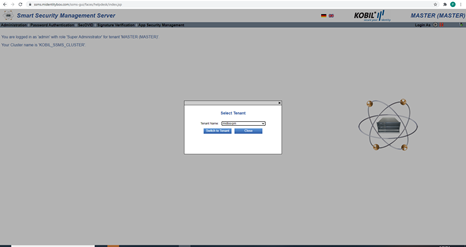  

•	Once you are switched to the newly created tenant, please create new operator and new portal user credentials for this tenant. These operator credentials and portal user credentials will be shared with partners for making SOAP calls to MGT and SVC modules respectively.  

## Role Management  

Each operator of the system must have a role which defines the permissions assigned
to the operators.  

## Log-in  

The operator requires a certificate, which must be imported into the browser (find a more detailed description in the SSMS installation manual), to log into the system. The certificate defines the role and the authorization of the operator. The certificate defines which role and consequently which permissions the operator possesses. The super administrator can create the certificates via the SSMS GUI: The operator needs the certificate to log into the KOBIL SSMS; consequently, he must receive it along with its password.  

## Navigation Menu  

You can access the Management System via the home page (see Figure 3) with the following URL:

**https:<Servername\>/ssms-gui/faces/**  

where <Servername\> is your host name.  

As mentioned above, the roles define the authorizations of the operators. Find information about the functions of the different roles in the tables contained in every module-specific manual.  

After logging into the SSMS, every operator is notified about which role has been assigned to his account. The role allows or limits the functions and views available to him on the SSMS.  

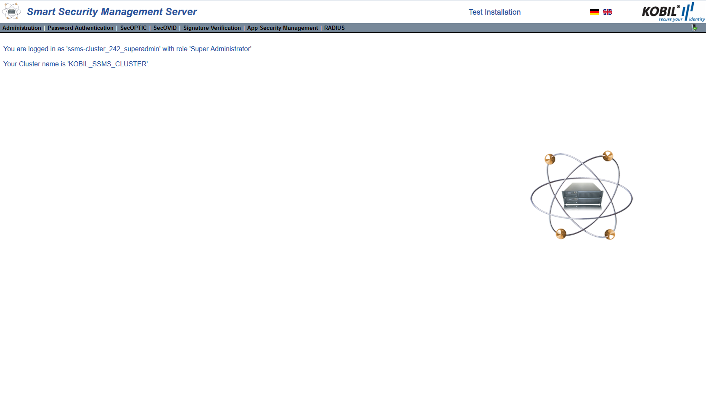

The home page leads the user to the different module views of the SSMS. The available modules are displayed in the navigation menu at the top of the page. If you click on any module, its submenu is then shown a level deeper in the navigation menu.  

## Select Entries  

In some views, the data are displayed as lists, as shown in Figure. Check or uncheck the boxes on the left of the data to select or unselect entries. In order to select all entries, check the box “all”, as shown by the red marking in the following Figure.  

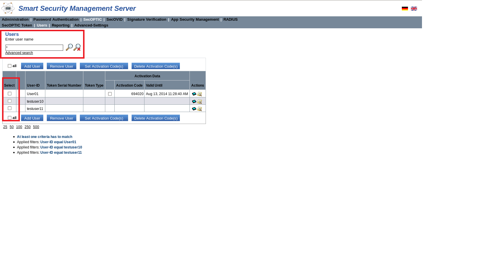  

## Search  

In a list of entries, you can search or filter specific entries. You can type your search string into the field as shown in Figure 4 (top left marking) or you can perform an advanced search. Find information about the filter options in the following paragraphs.  

##	Search for User(s)  

You can search or filter entries according to specific attributes, whose values can be set in the search field. Afterwards, you start the search by clicking on the magnifier symbol   next to the search field.
The values can include the following wildcards (placeholders).  

|    <br\>\?   or \_    |    <br\>Question   mark or underscore for exactly one character.               |
|--------------------|-------------------------------------------------------------------------------|
|    <br\> \*   or  \%    |    <br\>Asterisk   or percentage sign for any number of signs.                 |
|    <br\>\          |    <br\>Backslash   as escape symbol                                           |
|    <br\> \(  \)        |    <br\>Please   do not use for search square brackets, only round brackets    |  

Note that, particularly in the advanced search, you can use the wildcards only in alphanumerical text searches; (the database type of the target field must be: VARCHAR, CHAR, Text, etc.) moreover, they only work with the "equal" and “not equal” operators. (Depending on database types, wildcards can be used with "not equal" type of search and not only with "equal" and can also be used with "not equal" type of search and not only with "equal".  

##	Reset Search  

By clicking on the other magnifier symbol, you can delete a search result and return to the standard display.  

##  2.6.3	Advanced Search  

With the advanced search, you can combine a selection of attributes in different search queries. These attributes allow you to specify complex search queries. Attributes and conditions can be added or removed with the symbols + or - (see Figure).  

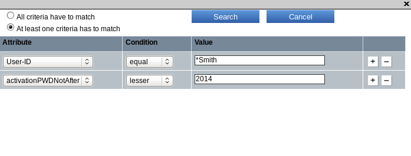  

You can define each attribute with the conditions "equal", "not equal", "greater" and "lesser". If you formulate several search queries, you can select whether all criteria must match or whether only one must match (see Figure).  

**Note**: The advanced search delivers different results if you search for letters or numbers, particularly with the conditions “lesser” < or “greater” >.  

For numbers, the result of the search is unambiguous. For example, with the condition “lesser” applied to the device serial number 2123, i.e. <2123, you receive all serial number smaller than 2123.  

However, if you search for letters or words using the conditions mentioned above, the result depends on the database and on the database type (MySQL, MSSQL or Oracle) and can vary from the example illustrated below.  

If you created the users “test user”, “Test User” and “TEST USER” in the database and you search for “test” in small letters with the condition lesser, you receive the results “Test User” and “TEST USER”. These results depend on the ordinal numbers assigned to letters in the UTF-8 encoding. As capital T has a smaller ordinal number in the UTF-8 encoding than lower case t, “Test User” and “TEST USER” are delivered as search results. More precisely, the “T” in “Test” has a smaller ordinal number than the “t” in “test” and each letter in “TEST” is smaller than in “test”.  

Example of an advanced search:  

"Search for all devices of a certain batch containing the application TestApp01, and that were used within the last 7 days (current date is 05/05/2014)."  

This search query consists therefore of 4 criteria:  

|     Attribute          |     Condition    |     Value        |
|---------------------------|---------------------|---------------------|
|     Serial number      |     >            |     200905110    |
|     Serial number      |     <            |     200905115    |
|     Device-ID          |     ==           |     TestApp01    |
|     Last login time    |     >            |     04.30.14     |  

**Note**: In the advanced search filter for a point in time, you can only enter the date. A further time specification is currently not supported.  

##	Buttons  

The buttons are placed above and below the table and offer the same functionalities twice. With the buttons, you can carry out an action for one or many users or devices. To carry out an action, check the boxes on the left of the ID entries, corresponding to the users or to the devices and click the button of the action. In addition, you can carry out the action for all users, checking “all” on the bottom- or on the top-left.  

  

With these buttons you can carry out actions for a single user or for a group (Add User cannot be a group action), while with the actions icons on the right, you can only carry out actions for a single user or device.  

##	Actions Icons  

As mentioned above, with the action icons on the right of each row, you can only carry out actions for a single object. In contrast to the buttons, you can click the icon directly in the particular row to carry out the action and you do not need to select the user or the device beforehand (see previous chapter).  

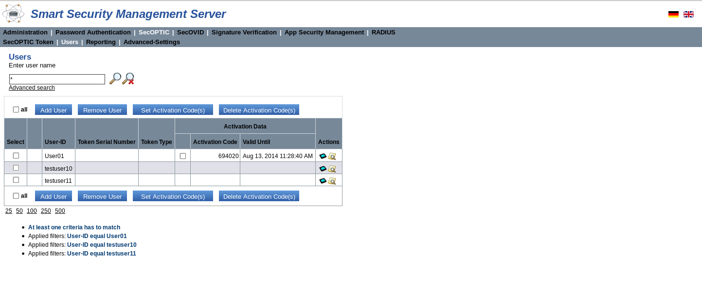  

## Smart Security Management Server GUI Views  

The Administration view contains a menu to access the functions for administrating the KOBIL Smart Security Management Server. The submenus of the Administration view are:  

* Information  
*	Access Management  
* Users  
* Portal-Services  
* License management  
*	Audit  
* Monitoring  
* IAM Settings  
* Advanced-Settings  

## Information View  

The information view informs you in detail about the system configuration. As shown in Figure 8, the view is divided into the two areas listed below. The number of the nodes in the first area can vary, depending on how many nodes (servers) you have configured.  

* information  
* Database information  

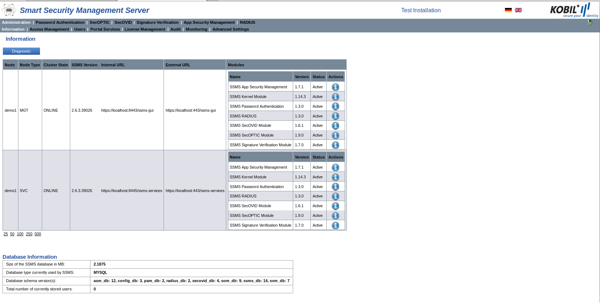  

The following table explains the descriptions contained in the two areas.  

|     Node             |                   |     Name of the installed node.                                                                                                     |
|-------------------------|-------------------|----------------------------------------------------------------------------------------------------------------------------------------|
|     Node Type        |                   |     Node type: Management (MGT) or   Services (SVC).                                                                                |
|     Cluster State    |                   |     Current   status of the node. If the node is active, the status is ONLINE; if the node   is inactive, the status is OFFLINE.    |
|     SSMS Version     |                   |     Version   of the installed SSMS.                                                                                                |
|     Internal URL     |                   |     The   internal URL under which the node can be reached.                                                                         |
|     External URL     |                   |     The   external URL under which the node can be reached.                                                                         |
|     Modules          |     Name       |     The   exact module description.                                                                                                 |
|                         |     Version    |     Version   number of the module.                                                                                                 |
|                         |     Status     |     Current   status of the module.                                                                                                 |
|    Actions                     |     icon     |     By clicking on the icon the detailed system properties are displayed                                                                                                 |  

Detailed module properties are displayed as follows:  

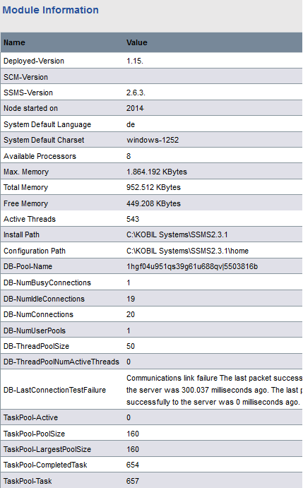  

Module information  

|     Name                       |     Value                                                                     |
|-----------------------------------|----------------------------------------------------------------------------------|
|     Deployed-Version           |     Module   version                                                          |
|     SCM Version                |     Revision number                                                           |
|     SSMS-Version               |     SSMS   version                                                            |
|     Node started on            |     Date on which the node was started                                        |
|     System Default Language    |     Information about the operating   system: system settings for language    |
|     System Default Charset     |     Information about the operating   system: system settings for charset     |
|     System Time                |     Current timestamp when the   information about the node was created       |
|     Available Processors       |     Information about the machine: number   of processors                     |
|     Max. Memory                |     Size of the maximum available memory   for the application                |
|     Total Memory               |     Size of the memory reserved for the   application                         |
|     Free Memory                |     Size of the reserved memory currently   used by the application           |
|     Active Threads             |     Number of the currently active   threads                                  |
|     Install Path               |     Path to the installation directory                                        |
|     Configuration Path         |     Path to the home directory                                                |
|     DB-Pool-Name                     |     Name of the database connection pool                                                                                                        |
|     DB-NumBusyConnections            |     Number of busy connection in the pool                                                                                                       |
|     DB-NumConnections                |     Number of connection in the pool                                                                                                            |
|     DB-NumIdleConnections            |     Number of all idle connections in the pool                                                                                                  |
|     DB-NumUserPools                  |     Number of users in the pool                                                                                                                 |
|     DB-ThreadPoolSize                |     Number of threads in the pool                                                                                                               |
|     DB-ThreadPoolNumActiveThreads    |     Number of active threads in the pool                                                                                                        |
|     DB-LastConnectionTestFailure     |     Error message of the last failed   database connection. Please note that the server might still be working   despite the error message.     |
|     TaskPool-Active                  |     Active number of tasks that currently   run in the background.                                                                              |
|     TaskPool-PoolSize                |     Number of tasks in the pool.                                                                                                                |
|     TaskPool-LargestPoolSize         |     Maximum number of tasks running   simultaneously observed at some point in time.                                                            |
|     TaskPool-CompletedTask           |     Tasks   completed during the whole uptime of the server.                                                                                    |
|     TaskPool-Task                    |     Number   of tasks running since the node start-up.                                                                                          |
|     TaskPool-Task                    |     Number   of tasks running since the node start-up.                                                                                          |

Database information:  

|     Size of the SSMS database in MB             |     Size of the SSMS database.                             |
|----------------------------------------------------|---------------------------------------------------------------|
|     Database type currently used by SSMS        |     Database type (e.g. MSSQL, MySQL or   Oracle).         |
|     Database schema version(s)                  |     Schema   version of the database for every module.     |
|     Total number of currently stored   users    |     Number of users added to the   database.               |  

## Diagnostic

Via a diagnostic feature in the information view, you can receive additional information about the SSMS. In particular, by clicking the button “Diagnostic”, a dialog box appears where you can choose the date when you want to generate a diagnostics file, which is per default the current date. After clicking “Create Diagnostics” a .zip file is created containing the SSMS log file, the settings of every module and database information.  

Every time that you create a diagnostic file, you receive information about the time in which the last diagnostic file was created.  

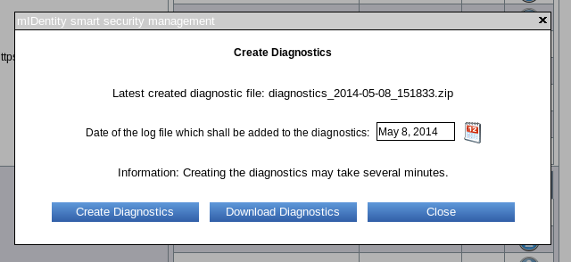  

After receiving successful confirmation of the creation of a diagnostic file, you can download and unzip it.
The following information is generated:  

* Log files of every node  
* The configured advanced settings of every module  
* Database type and size as well information about the module versions in the database  
* Configurations of the SSMS connections  
* Installed and deployed modules  
* Radius trace file (in case Radius is used)  
* Tomcat trace file  

## Access Management View  

The Access Management view is divided into three submenus:  

* Operator Management  
* Role Management  
* Role-Permissions  

These menus stand for creating certificates for SSMS operators, giving operators roles and granting specific permissions to roles respectively.  

## Operator Management  

In the Operator Management view, you can create certificates for all the operators of the SSMS. The certificates assigned to the operators define their roles. They are listed in tabular form in the Operator Management view.  

After the installation, the certificate for the role Super Administrator is listed in the table. This certificate allows producing other certificates assigned to operators.  

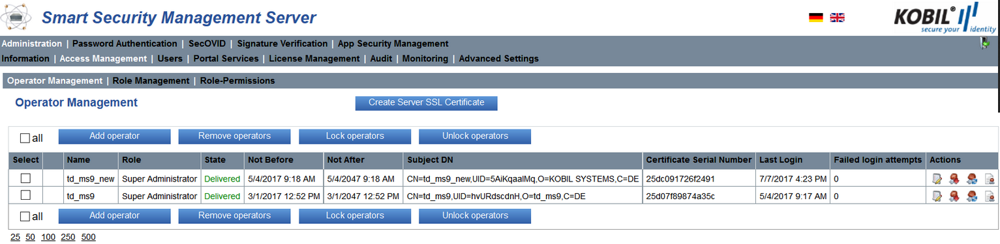  

The table with the certificates contains the following information.  

|     Select                       |     Put   a checkmark to select one or multiple entries.                                                                                                                                                                                                                                                                                                            |
|-------------------------------------|------------------------------------------------------------------------------------------------------------------------------------------------------------------------------------------------------------------------------------------------------------------------------------------------------------------------------------------------------------------------|
|     Name                         |     Operator   name as contained in the Subject DN.                                                                                                                                                                                                                                                                                                                 |
|     Role                         |     The   role of the certificate.                                                                                                                                                                                                                                                                                                                                  |
|     State                        |     The   status is “Produced” after clicking the button “Generate certificate” and   “Delivered” after clicking the “Download” action icon.                                                                                                                                                                                                                        |
|     Not Before                   |     The   date since the certificate can be used                                                                                                                                                                                                                                                                                                                    |
|     Not After                    |     The   date until the certificate can be used                                                                                                                                                                                                                                                                                                                    |
|     Subject DN                   |     Unique   name of the certificate.                                                                                                                                                                                                                                                                                                                               |
|     Certificate Serial Number    |     Unique   serial number of the certificate.                                                                                                                                                                                                                                                                                                                      |
|     Last Login                   |     When   an operator logs in to SSMS, login time is stored and displayed here.                                                                                                                                                                                                                                                                                    |
|     Failed login attempts        |     Number   of failed login attempts since last successful login. The counter will be   only increased if the login fails due to an error that is in the technical   scope of SSMS, i.e. operator is blocked, or operator has no role assigned.   Errors during SSL connection establishment are not counted. Maximum possible   value: 32767. Default value: 0    |  

In addition to the actions in the table, you can also manage the operators by means of the buttons above the table. In particular, you can remove, lock or unlock the operators by selecting one or multiple operators in the left-most column and by clicking the action button.  

##	Add Operator  

In order to produce certificates assigned to operators click “Add Operator” on the top left of the page. In the window that pops up, you enter the operator name, his e-mail and the role assigned to the operator. In addition, you must generate a password for the certificate and enter your CA (Certificate Authority) password (see Figure).  

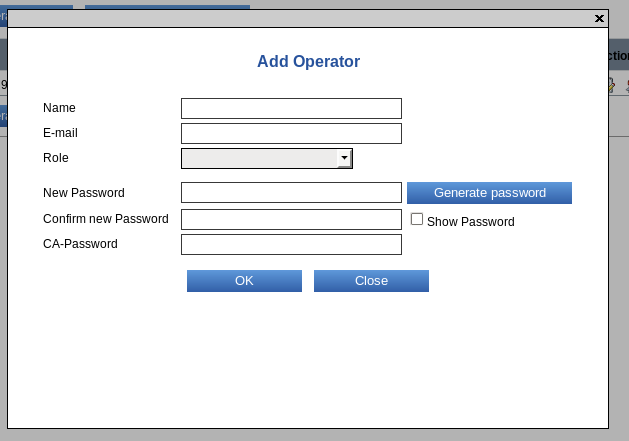  

The certificate is generated and has the status “Produced”. Via the action button, you can download the certificate and transfer it to the operator.  

:warning:: The certificate status “Delivered” does not mean that the operator has received the certificate. This must still be additionally delivered to the respective operator.  

:warning:: For security reasons, send the password and the certificate separated from each other.  

## Remove, lock and unlock Operator  

In the view Operator Management, you also have the possibility to remove, lock and unlock operators. You achieve this by selecting an operator or all the operators in the left-most column “Select” and by clicking the corresponding button.  

## Create Server SSL Certificate  

By clicking on the button „Create Server SSL Certificate“, you have the possibility to create an X.509 certificate for the purpose of SSL server authentication.  

A dialog will pop up where you can upload the certificate signing request, initiate the certificate creation, and download your created certificate.  

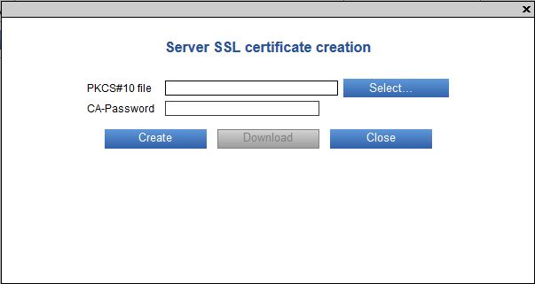  

Certificates are issued by the SSMS CA using the signing algorithm "SHA256-RSA". The certificate request must be uploaded as a PKCS#10-file within the dialog from the local directory. From the request file, the name of the applicant (field subject) and the public key (field subjectPublicKey) are used as input for the certificate creation. The name of the applicant is also taken as the value for the X.509 "Subject Alternative Name" extension of type "DNS Name" or "IP Address" accordingly chosen to the syntax of that name. The supported encoding formats of the PKCS#10-file are DER, PEM and Base64.  

## Role Management  

The Role Management view lists the system roles available directly after the SSMS installation and the roles that you add by yourself.  

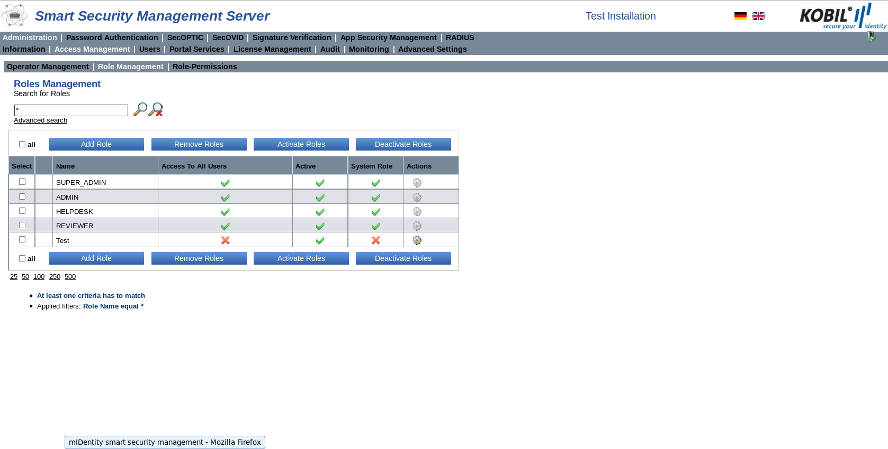  

The roles table contains the following information:  

|Select|Put a checkmark to select one or multiple entries.|
|:--|:--|
|Name|Role name.|
|Access To All Users|Defines whether the role has access :heavy_check_mark: or :x: not   to all users.|
|Active|Defines whether the role is active :heavy_check_mark: or not :x:.|
|System Role|Defines whether the role is a system role :heavy_check_mark: or not :x:. |  
|Actions|Modify role. You can carry out this action only for non-system roles.|  

In addition to the action in the table, you can also manage roles by means of the buttons above the table.  

## Add Role  

In particular, you can add other roles than the roles assigned by the system by clicking the button “Add Role”. In the window that pops up, you can enter a name for the new role, define whether the role has access to all users and select the already existing role that has similar permissions to the new role.  

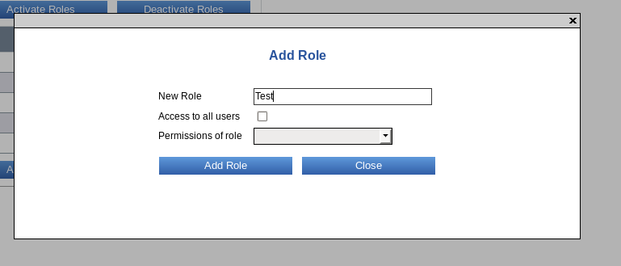  

The newly created role can be assigned to an operator as described in chapter 3.2.1.  

## Remove Roles  

In addition, you can remove already added roles by selecting one or multiple roles in the most-left column and by clicking the button “Remove Roles”. Please note that you are **only** allowed to remove roles with specific features: different roles than the role assigned to you or to another operator, non-system roles and roles that have no permissions assigned. If you try to remove prohibited roles, a red cross appears on the left of the role name and an error message appears above the table.  

## Activate and deactivate Roles  

When you add a role, it is automatically active, so you need the option “Activate Roles” only in case you deactivated a role beforehand. You can deactivate roles by selecting one or multiple roles in the most-left column and by clicking the button “Deactivate Roles”. Please note that you are not allowed to deactivate the role assigned to you or to another operator.  

## Modify Role  

You can modify the role by clicking . In particular, you can change the role name and the permission to access all users.  

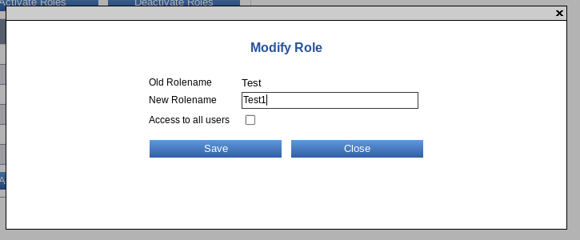  

## Role-Permissions  

You can view the system roles and the roles that you created in the view “Role Management” with their permissions in the view “Role-Permissions”.  

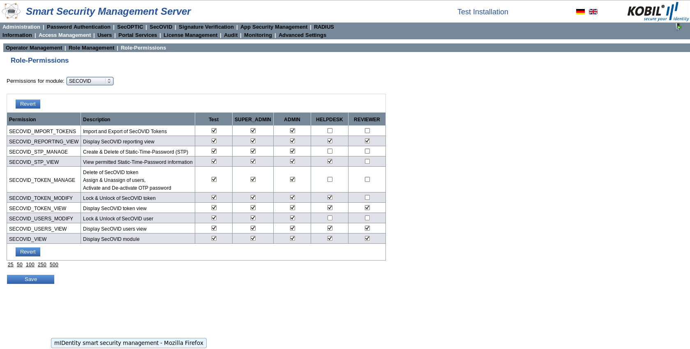  

In this view, you can change both the permissions of the system role and of the roles you created. You can select “All Modules” from the dropdown list on the top or select a module in order to show only the permissions of that module. To change the permissions, check or uncheck the boxes relating to the role and the permissions.  

To make your changes effective, you must confirm them by clicking on the “Save” button at the bottom of the page. If you refresh the page or click on the “Revert” button before saving the changes, the changes will be lost.  

Roles and permissions are also needed for the management of the SOAP interface. You can find a description of the single methods in the single administrator manuals. The services SOAP interface is secured by a SSL authentication and does not require any further user authentication.  

## Users View  

The Kernel Users view shows all the users of the SSMS in tabular form.  

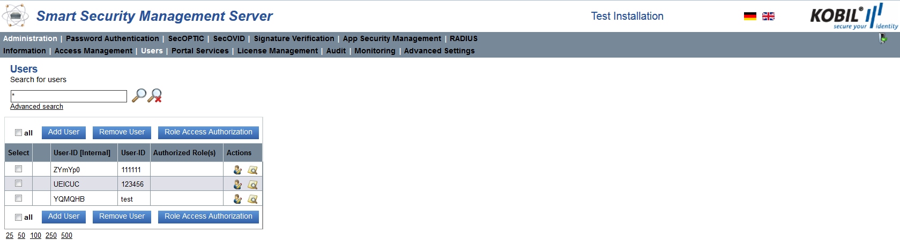  

The following table lists the information contained in the view.  

|     Select                |     Put   a checkmark to select one or multiple entries.                                                    |
|------------------------------|----------------------------------------------------------------------------------------------------------------|
|     User-ID[Internal]     |     User   unique name (visible only on SSMS).                                                              |
|     User-ID               |     User   unique name.                                                                                     |
|     Authorized Role(s)    |     The   roles which can manage the user. Please note that the system roles have   access to all users.    |
|Actions|Show modules of the user.  |  
|Actions|Action for changing the user. In particular, the user ID (given by the user) can be changed.|  

## Add User  

You can a user to the Kernel module by clicking on the button “Add User” and entering the unique username.  

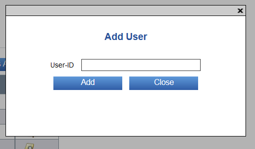  

Please note that the maximal size of the user ID is 64 bytes, which does not always correspond to 64 characters. In case of UTF-8:  

* a-z, A-Z, 0-9 are 1 byte  
* Turkish, Cyrillic, special characters are 2 bytes  
* Arabic, Asian languages 3 bytes  

Therefore, according to the character type, 64, 32 or 21 characters can be used for a user.  

## Remove User  

You can remove one or multiple users by making one or multiple selections on the left-most column and clicking the “Remove User” button.  

## Role Access Authorization  

You can decide which role or roles have the permission to one or multiple users by making one or multiple selections on the left-most column and clicking the button “Role Access Authorization”. A window pops up where the User-ID is shown and where you can select which role or roles have access to that user. The name of the role shows up in the column Authorized Role(s).  

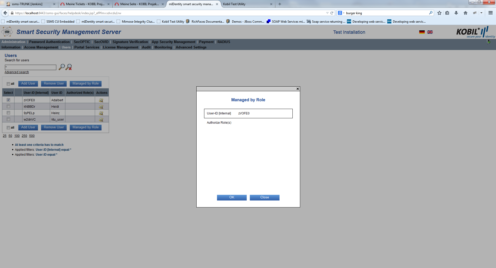  

Please press “OK” in order to save your changes.  

## Portal Services View  

The function of the Portal-Services is to manage the portals that communicate with the SSMS via the SOAP interface. In case many portals are active, the SSMS must be able to identify the single portals. This authentication is accomplished by HTTP BASIC Authentication (RFC 2617). More precisely, the Portal ID functions as UserName and the portal password (SharedSecret) functions as password. As the communication with the SOAP interface is SSL-based, the UserName and the Password are protected against unauthorized access.  

## Authentication required  

If you use many portals, check the option “Authentication is required”. Only afterwards, you can then configure a portal with an ID, a password and additional comments.  

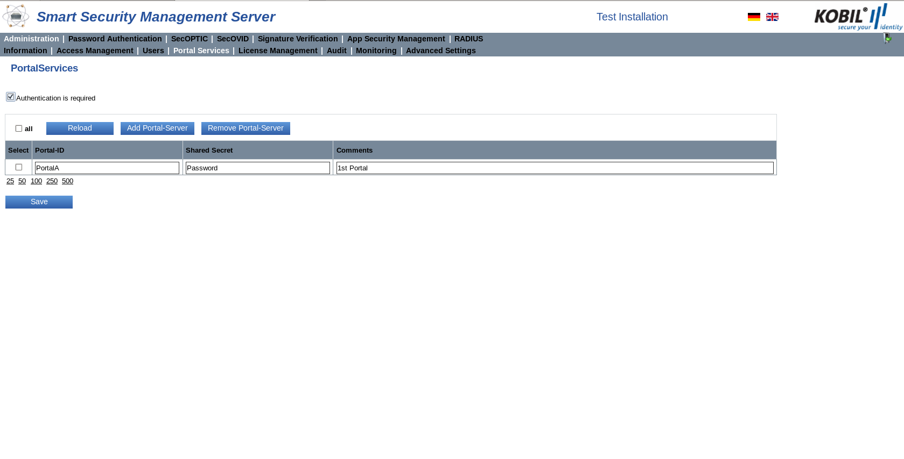  

## Add Portal-Server  

You can add a portal by clicking “Add Portal-Server”. The number of portals you can add depends on the kernel license restriction indicated by the name maxPortals (see chapter 3.5). If the restriction maxPortal is not specified, only one portal can be connected to the SSMS.  

You can add the information contained in the following table:  

|     Portal-ID    |     Name of the Portal-Server to be   connected                             |
|---------------------|--------------------------------------------------------------------------------|
|     Password     |     Password of the Portal-Server to be   connected                         |
|     Comments     |     Input field for additional   information about the portal (optional)    |  

Be careful when portal IDs are used these must be unique for each portal.  

After you added one or multiple portals, remember to click “Save” in order to make your changes effective.  

## Remove Portal-Server  

You can remove portals by selecting the appropriate checkboxes on the left and by clicking “Remove Portal-Server”.  

## License Management View  

The KOBIL SSMS has a license system for the entire product portfolio. The license file defines how long you are authorized to use the licenses for the modules installed. During this time period, you can use a certain number of devices or tokens. The license file also defines, according to the license scope, which access rights you have to the different modules. If the license has expired, you have restricted access to the system. You receive an error message and the service will not work anymore. The data stored in the database remain preserved.  

The license upload into the system is reserved to the role of the super administrator.  

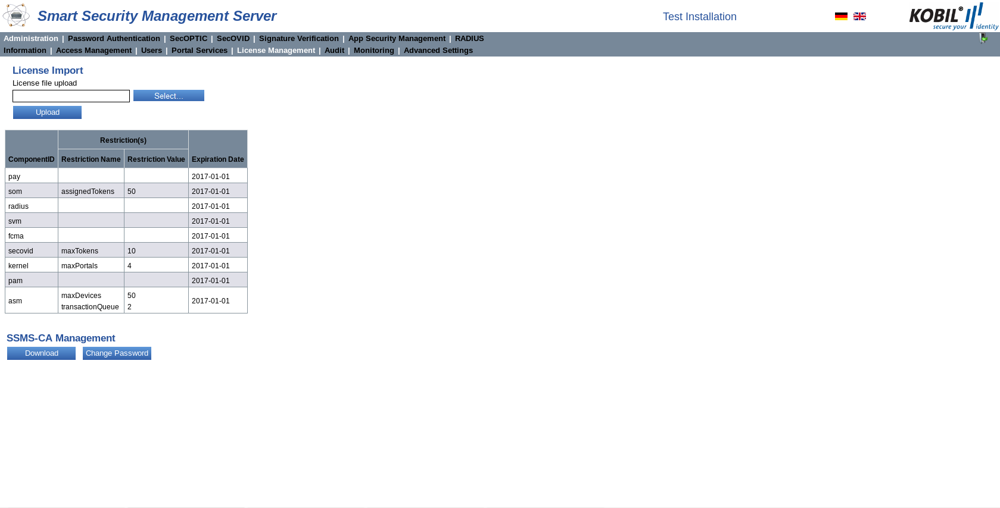  

Along with the expiration date of the license, some modules have additional restrictions. For example, the module SOM has a maximum number of tokens that can be assigned. When the number is reached, the operator receives the error message that no tokens can be added. To make full use of the license, you can delete unused tokens from the database and add others until you reach the limit defined by the license.  

A license change can be requested at KOBIL. The license file is sent by KOBIL in XML format contains the module-specific restrictions. It must be then imported in the License import GUI.  

## Download the SSMS-CA Certificate  

You can download the certificate via the button „Download“. This certificate is needed during the order process of a new license.  

## Change the CA Certificate Password  

You can change the SSMS CA certificate password via the button „Change Password“. Please enter the old as well as the new password into the input field and confirm via the button “OK”.  

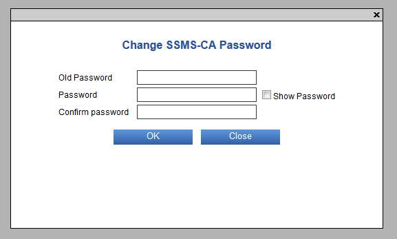  

## Audit View  

In the Audit view all administrative actions that an operator successfully completed on the SSMS via GUI or SOAP are recorded. The actions recorded and shown in this view concern all SSMS modules.  

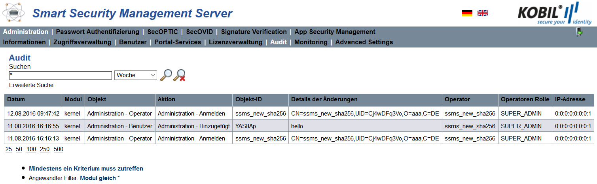  

The following table gives information is available about the management actions:  

|     Date                     |     Date   and time of the action.                                                                                                                                                                                                                                                                                                                                                                                                                                                                                |
|---------------------------------|----------------------------------------------------------------------------------------------------------------------------------------------------------------------------------------------------------------------------------------------------------------------------------------------------------------------------------------------------------------------------------------------------------------------------------------------------------------------------------------------------------------------|
|     Module                   |     Module   in which the operator carried out the action.                                                                                                                                                                                                                                                                                                                                                                                                                                                        |
|     Object                   |     Area   of the module where the action was carried out.                                                                                                                                                                                                                                                                                                                                                                                                                                                        |
|     Action                   |     Description   of the action carried out.                                                                                                                                                                                                                                                                                                                                                                                                                                                                      |
|     Object-ID                |     ID   of action. The ID is not part of sensitive information; no PINs or passwords   are stored.                                                                                                                                                                                                                                                                                                                                                                                                               |
|     Details about Changes    |     Detailed   information about the action.                                                                                                                                                                                                                                                                                                                                                                                                                                                                      |
|     Operator                 |     Name   of the operator, who carried out the action.                                                                                                                                                                                                                                                                                                                                                                                                                                                           |
|     Operator role            |     Role   of the operator.                                                                                                                                                                                                                                                                                                                                                                                                                                                                                       |
|     IP-Address               |     SSMS   checks first the following headers in given priority:     Request   Headers with Priorities   1) X-Forwarded-For    2) Proxy-Client-IP    3) WL-Proxy-Client-IP    4) HTTP_X_FORWARDED_FOR    5) HTTP_X_FORWARDED    6) HTTP_X_CLUSTER_CLIENT_IP    7) HTTP_CLIENT_IP    8) HTTP_FORWARDED_FOR    9) HTTP_FORWARDED    10) HTTP_VIA    11) REMOTE_ADDR     If any of the header has IP-Address   assigned, it takes the value of the header and store it.    |  

You can search for specific actions filtering the results according to the information in the table above. You can search for example by object-ID, module name etc. Please find additional information about the search in chapter 2.6.  

## Monitoring View  

The monitoring view offers the SSMS operator an overview about important server information. The information is displayed for one node, MGT or SVC, or for both nodes. You can decide which node to show in the monitoring by choosing one or both in the drop-down list on the top left of the GUI. In addition, you can choose to show the results of a specific time period: unlimited, but also of the last day, week, month or year.  

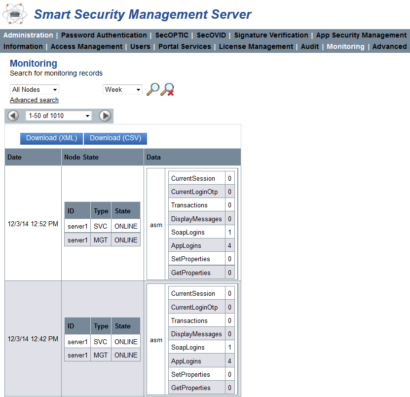  

The following table lists the information showed in the view:  

|Date||Date and time when the monitoring information was created. You can set the time interval in the Kernel Advanced Settings (see chapter 3.8).|
|:--|:--|:--|
|Node State|ID|Unique name of the node|
||Type|MGT, SVC or both|
||state|The node(s) can have the states ONLINE and OFFLINE. When the node is offline, no information from the database can be delivered. |
|Data||Information about the node. Please find more information in chapter 3.1. |  

When searching within the monitoring, please note that when selecting, only entries for aggregated properties that apply to all nodes are displayed. The Count search cannot be performed on all nodes, but only applied to one node at a time.  

## Download Monitoring Information  

Monitoring information can be downloaded in CSV or in XML format via the button „Download“.  

## Advanced-Settings View  

The Advanced Settings view can only be accessed by the Super Administrator and the Administrator. The other SSMS operators (roles) have no access to this view.  

This chapter explains the advanced settings and the configuration possibilities of the KOBIL SSMS. The values in the table are default values:

## Description of the Settings  

|     Log Level                      |     Setting   of the log mode (WARN, INFO, DEBUG and TRACE). Loggers forward ERROR, WARNING   and INFO logs to the chosen logging system. Default value is INFO.                                                                                                            |
|---------------------------------------|--------------------------------------------------------------------------------------------------------------------------------------------------------------------------------------------------------------------------------------------------------------------------------|
|     Rows Per Page                  |     The   maximum number of rows per page. Default value is 25.                                                                                                                                                                                                             |
|     Table Maximum Length           |     The   maximum number of table rows that are loaded simultaneously. Default value is   4000.                                                                                                                                                                             |
|     Additional Loggers             |     With   this option, you can specify additional loggers.                                                                                                                                                                                                                 |
|     Server Time Zone               |     Information   about the currently used date and time format. If you leave the field empty,   the SSMS use the system default settings.                                                                                                                                  |
|     Cluster Registration Port      |     The   port at which to register the cluster node on the management node. If the   configured port is already occupied by another application, SSMS will try to   open the next higher port number. Default port is 12001.                                               |
|     Cluster Communication Port     |     The   port range for the communication of the cluster nodes. Default start value is   7600 until 7610.                                                                                                                                                                  |
|     Cluster Name                   |     The   Cluster Name for all the nodes. Default value is „KOBIL_SSMS_CLUSTER“.                                                                                                                                                                                            |
|     Cluster Response Timeout       |     Timeout   setting in milliseconds for the response of the cluster. Default value is 5000.                                                                                                                                                                               |
|     Cluster Startup Retry Delay    |     After a cluster communication is failed, the next   start-up retry will be delayed by this time given in seconds.   Default value is 120.                                                                                                                               |
|     Allow to change User ID        |     Possibility   to change user ID if setting is checked. Default value is unchecked.                                                                                                                                                                                      |
|     Maximum Users in Auto Group    |     The   maximum number of users in an auto group. Default value is 5000.                                                                                                                                                                                                  |
|     Http Proxy Host                |     The host name of your http proxy in case you use a http   proxy. Default value is empty.                                                                                                                                                                                |
|     Http Proxy Port                |     The port of your http proxy in case you use a http   proxy.                                                                                                                                                                                                             |
|     Http Non Proxy Hosts           |     Access to matching IP addresses or host names defined   in this setting will bypass a configured http proxy for https and http   protocol. The default value is "localhost\|127.*\|[::1]". You can use   "*" as a wildcard for parts of the IP address or host name.    |  
|     Rest Session Default Timeout                     |     The inactivity timeout of a REST session in seconds.   An inactive REST session expires after this time. Default value is 300. |                                                                                                                                                                                                                                                                                 
|     Monitoring Statistic Interval                    |     Time interval in minutes for the creation of monitoring   files in the database. The value 0 deactivates the monitoring function.   Default value is 1.                                                                                                                                                                                                                                                            |   |
|     Monitoring History                               |     Hours that the monitoring records should be kept in the   database. Default value is   168 hours.                                                                                                                                                                                                                                                                                                                  |   |
|     Diagnostics Max File Size                        |     Maximum   file size when creating diagnostics (in MB). If a file is larger than this   value, it will be truncated. Default value is 250MB.                                                                                                                                                                                                                                                                        |   |
|     Special Variables                                |     Special parameters to fill in only if advised to do so   by KOBIL.                                                                                                                                                                                                                                                                                                                                                 |   |
|     Banner Text                                      |     Title displayed in the page header                                                                                                                                                                                                                                                                                                                                                                                 |   |
|     Banner Color                                     |     Color of the text in the page header                                                                                                                                                                                                                                                                                                                                                                               |   |
|     Username For RESTServices                        |     Basic-Authentication   credentials for REST-Services. Default value is empty.                                                                                                                                                                                                                                                                                                                                      |   |
|     Password For RESTServices                        |     Basic-Authentication   credentials for REST-Services. Default value is empty.                                                                                                                                                                                                                                                                                                                                      |   |
|     Enable Operator Credential   Authentification    |     Operator can login to SSMS-GUI or call SOAP-MGT-methods   with operator name and password (HttpBasicAuthentication). Default value is   checked.                                                                                                                                                                                                                                                                   |   |
|     Enable SSL Session Verification                  |     During login to SSMS-GUI or for a   SOAP-MGT-call SSMS validates the SSL session ID in addition to the ID of the current   HTTP session. Default value is unchecked.                                                                                                                                                                                                                                               |   |
|     Client Inactivity Timeout                        |     The inactivity time out for   management GUI client users defined in seconds. The management GUI client   user will be logged off automatically after this time of inactivity in the GUI.   The session expired page will be displayed. The user needs to authenticate   himself again to re-enter the management GUI.    Default: 15 minutes (900 seconds)    Minimum: 60 seconds, Maximum: 5400 seconds    |   |
|     SOAP Session   Inactivity Timeout                |     The SOAP session (management only) will be   automatically discarded after this inactivity timeout (in minutes). Default   value is 10 minutes.                                                                                                                                                                                                                                                                    |   |
|     Audit Filter                                     |     Filter for audit actions (separated by \|) that shall be   ignored (means: those actions are not stored in database). Format: 'ACTION\|ACTION\|...'.   Example: 'SSMSLOGIN\|SSMSLOGIN_SOAP'. Default value is empty.     Note: If the format of an action is invalid or the   action is unknown actions will be ignored.                                                                                     |   |
|     Urls Address Book Servers                        |     Comma-separated   list (maximum 2 entries!) of URLs to address book servers.      For example,   'http://server:1234/rest/v1/'                                                                                                                                                                                                                                                                               |  
|     Address Book Eco Identifier                           |     The Eco   Identifier is part of the URL of an Address Book server and is required to   access certain methods of the Address Book server. If nothing is defined, the   node ID of the SSMS server is used.                                                                                                                                                                                                                                                                                                                                                                                                                                                                                                                                                                                    |
|     Address Book User Name                                |     The username   for Basic authentication of Address Book server.                                                                                                                                                                                                                                                                                                                                                                                                                                                                                                                                                                                                                                                                                                                               |
|     Address Book Password                                 |     The password   for Basic authentication of Address Book server.                                                                                                                                                                                                                                                                                                                                                                                                                                                                                                                                                                                                                                                                                                                               |
|     Address Book Timeout Connect                          |     Period in   seconds, how long the SSMS waits until a connection to the Address Book   server can be established. 0 means unlimited.                                                                                                                                                                                                                                                                                                                                                                                                                                                                                                                                                                                                                                                           |
|     Address Book Timeout Read                             |     Period in   seconds, how long the SSMS waits for a response from the Address Book server.   0 means unlimited.                                                                                                                                                                                                                                                                                                                                                                                                                                                                                                                                                                                                                                                                                |
|     Address Book Certificate Ignore                       |     If this   parameter is enabled, the certificate server is ignored when establishing an   SSL connection to the Address Book server.                                                                                                                                                                                                                                                                                                                                                                                                                                                                                                                                                                                                                                                           |
|     Address Book Task Handlers                            |     Maximum   number of processing threads that are handled to communicate with the Address   Book server.                                                                                                                                                                                                                                                                                                                                                                                                                                                                                                                                                                                                                                                                                        |
|     Address Book Task Accept Count                        |     Maximum   number of messages for the Address Book server that are buffered by the SSMS when   all the processing threads are busy in the SSMS. If the number is exceeded,   each additional message is not sent to the Address Book server but stored in   a file until processing threads are available again.                                                                                                                                                                                                                                                                                                                                                                                                                                                                               |
|     Address Book Idle Connection Timeout   In Pool        |     Address Book   Server: Timespan in seconds indicates how long connection stays idle in an   Address Book Connection Pool.                                                                                                                                                                                                                                                                                                                                                                                                                                                                                                                                                                                                                                                                     |
|     Trace Exporter                                        |     Export traces to   chosen Trace Exporter (Default: None). This denotes the backend for the   collected trace data.     The setting 'None'   implies turning off the tracing feature at all. In particular, messages sent   from SSMS to external components will not carry any span context information.                                                                                                                                                                                                                                                                                                                                                                                                                                                                                |
|     Trace Sampler                                         |     Process/Export   trace span based on chosen sampling method (Default: Never).     This setting has   an effect only in the case when SSMS initiates a root span, and thus a new   trace. In all other cases, SSMS will export or drop spans as given in the   context of the foregoing (remote) parent span.     Note: External   component may override the sampling flag of spans inside an ongoing trace   during their processing. SSMS does not do this.     Note: Opting for   'Never' sampling in combination with the 'Trace Exporter' set to something   other than 'None', will keep internal processing of traces, spans and their   contexts activated. In particular, messages sent from SSMS to external   components will carry span context information.    |
|     Trace Exporter Url                                    |     URL for Trace   Exporter. The URL must be complete, containing the IP/DNS name, port, and   path.                                                                                                                                                                                                                                                                                                                                                                                                                                                                                                                                                                                                                                                                                             |
|     Probability                                           |     Probability for probability-based   sampling. E.g. With probability 0.1, approximately 1 in 10 traces will be   sampled. (Default: 0.0)     This setting has   an effect only in the case when the ‘Trace Sampler’ is set to   ‘Probabilistic’. See the ‘Trace Sampler’ description for more details.                                                                                                                                                                                                                                                                                                                                                                                                                                                                                   |
|     Trace Auditing                                        |     If this flag is   activated, auditing data will be placed to distributing tracing. Default value   is unchecked.|  

:warning:: Please do not change these parameters unless you are fully aware of the consequences of the changes.  

## IAM Settings  

### Identity and Access Management support feature  

SSMS provides the feature of using an external authentication & authorization application, especially an Identity- & Access Management System, named IAM in the following.  

The IAM shall act as an identity provider to authenticate users to access services provided by SSMS. For now, the IAM shall only provide the authentication. The service provider SSMS shall remain as the authorization provider for its services. The IAM must provide authentication information to SSMS as part of an ID token. The ID token will be provided as JSON Web Token (JWT). SSMS accepts identities and their attributes, which the IAM authenticates.  

* Using an IAM for user authentication during login process to SSMS is only enabled for SSMS Management GUI.  
* SSMS SOAP or REST services are currently not managed by a configured IAM.  
* SSMS Configuration Utility is not managed by a configured IAM.
* SSMS is still the authorization provider for SSMS management services.  
* SSMS can communicate with any IAM application which supports the OpenID Connect protocol (part of OAuth2).  
* User authentication during login process to SSMS will be handed over to a configured IAM.
* If the user is authenticated by the IAM, SSMS accepts the provided ID token, verifies the validity of the ID token and the provided user (operator) information and authorizes the user for SSMS management services as usual. The operator information must match an existing operator in SSMS.  
* If the IAM feature is enabled, no login with SSMS SSL client certificate as well as the user/password login and basic auth is possible. Except will be the use of SSMS client certificate SUPER_ADMIN, for more see section 3.9.4.  
* During the SSMS session the validity of the ID token is not verified again. This is to ensure, that configurations done in the SSMS management GUI session will not get lost, if the ID token is limited in time (by max_age ID token claim). The outdated ID token would cause a logout propagation of the user.  
  * If the user logs out at IAM and the user has not logged out from SSMS manually before, no logout propagation by IAM is supported by SSMS. The user can still operate on SSMS. The user must logout from SSMS manually or SSMS will run into the session timeout, if the operator does not use the system for specified period.
* No further SSMS user logout handling with the IAM is currently implemented.  
* SSMS_Operatorname custom claim as a SSMS user attribute must be added to the ID token returned by the IAM. For more see section 3.9.1.1.  

The current implementation is a basic design of OpenID Connect protocol and the authorization grant flow standard for authenticating a user using an IAM. Following protocol attributes are supported.  

## Additional claims to be added to the ID token  

**The ID token**  

The ID token is created and returned by the IAM on authentication request of SSMS. The ID token is returned as a JSON Web Token (JWT) with properties accordingly to the value of the OpenID protocol attribute scope, defined in the settings view. This provides the default user attributes required by SSMS to identify the user and provide the authorization rules. Additionally, the JWT ID token must have compiled a custom claim with extended information about the user.  

**Custom claims**  

:warning:: Custom claims must be compiled separately as a part of the ID token. This must be done by the IAM administration.  

Beside the default JWT claims the ID token must provide following custom claim:  

|     Custom   claim key    |     Value type    |     Description                                                                                                                                                                                                                                                                                                                                                                                                                                                                                                                                                                        |
|------------------------------|----------------------|-------------------------------------------------------------------------------------------------------------------------------------------------------------------------------------------------------------------------------------------------------------------------------------------------------------------------------------------------------------------------------------------------------------------------------------------------------------------------------------------------------------------------------------------------------------------------------------------|
|     SSMS_Operatorname     |     String        |     IAM   must return the operator name in this claim. This is to provide the   possibility for IAM administration to use the default claim “sub” for whatever   the IAM administration requires it for other managed applications (i.e. the   username).      The   operator name is the username in SSMS provided by the user /password login or   the SSL client certificate.      This   is mandatory.     NOTE:     IAM   administration must compile this custom claim into the ID token. Otherwise   the SSMS will return 401, unauthorized message.    |   

## Supported claims  

Accordingly to the default scope “openid” SSMS supports following claims:  

* iss
* exp
* aud  

Additional supported claims:  

* nonce  

All other claims are ignored.  

## The IAM Settings view  

To use the IAM feature, SSMS has integrated a view in Administration view, named “IAM Settings”. This view is to configure, if the IAM authentication shall be used or not, and to define the required attributes to communicate with the IAM server endpoints. If an IAM is configured, the use of the IAM can be toggled on and off without the need to redefine all the properties again. If changes done here, SSMS nodes get informed automatically, no restart of SSMS is required.  

:warning:: Be very careful with the definitions made in this view and having switched on the usage of an IAM. If any misconfiguration in the endpoints or in the settings have been made, this would lock SSMS for any other user than the SUPER_ADMIN operator. For more about having locked SSMS see section Help for locked up SSMS by misconfigured IAM.  

**Required user permissions**  

To enable to view this submodule and manage the settings two permissions are provided which are not assigned to any role by default at installation. You first must assign those permissions to at least the SUPER_ADMIN role. KERNEL_IAM_SETTINGS_VIEW is required to enable managing the settings by giving the additional permission KERNEL_IAM_SETTINGS_MANAGE.  

|     Permission                    |     Display name                    |     Description                    |     Default assignment to role    |
|--------------------------------------|----------------------------------------|---------------------------------------|--------------------------------------|
|     KERNEL_IAM_SETTINGS_VIEW      |     Kernel   IAM Settings View      |     Display   IAM settings view    |     None                          |
|     KERNEL_IAM_SETTINGS_MANAGE    |     Kernel   IAM Settings Manage    |     Edit   IAM settings            |     None                          |  

## Description of the Settings  

This chapter explains the IAM settings and the configuration possibilities of the KOBIL SSMS.
Following IAM settings can be adjusted:  

|     Enable IAM                      |     Enable   or disable user authentication during login using an IAM based on OpenID   Connect protocol.     Default   value is untoggled (disabled, false)                                                                                                                                                                                                                                                                                           |
|----------------------------------------|-----------------------------------------------------------------------------------------------------------------------------------------------------------------------------------------------------------------------------------------------------------------------------------------------------------------------------------------------------------------------------------------------------------------------------------------------------------------|
|     IAM URL                         |     The   IAM URL, including protocol, host and port (if required). E.g. https://kobil.ergon.ch:8080     Default   value is empty.                                                                                                                                                                                                                                                                                                                     |
|     Authorization Code Endpoint     |     Path for getting the authorization code.     E.g. "/auth/oauth2/authorizationCodeEndpoint"     Default   value is empty.                                                                                                                                                                                                                                                                                                                        |
|     Token Endpoint                  |     Path for getting the authorization   token.     E.g. "/auth/oauth2/tokenEndpoint"     Default   value is empty.                                                                                                                                                                                                                                                                                                                                 |
|     Client Id                       |     The   client ID of SSMS to be defined by the IAM administration. E.g.   "kobiltest". It is the unique identifier for the application   managed by IAM.     Default   value is empty.                                                                                                                                                                                                                                                               |
|     Client Secret                   |     The   client secret for SSMS to be defined by the IAM administration. E.g.   "jwAJR2chPCU6FCTt4q9GFyyf3C6BcBUE"     Default   value is empty.                                                                                                                                                                                                                                                                                                      |
|     Scope                           |     The   scope(s) (separated by blanks) used by SSMS during authentication to   authorize access to required user details provided by OIDC standard claims in   the ID token.      Accordingly,   to OpenID Connect standard, the value “openid” is required. SSMS currently   requires it to get user information belonging to this scope. Please do not   remove it. Further standard values are profile or email.     Default:   "openid"    |
|     Use Nonce                       |     If   enabled, SSMS sends additionally a nonce when requesting the authorization   code. This nonce is verified when retrieving the token to ensure, that SSMS is   the initiator of the IAM request. May prevent relay attacks.      Default:   Enabled (toggled, true)                                                                                                                                                                            |
|     Socket Timeout                  |     Timeout   in milliseconds when communicating with IAM server for requesting the ID   token. It specifies the timeout for waiting for data or the maximum period of   inactivity between two consecutive data packets.      Default:   5000                                                                                                                                                                                                         |
|     Connect Timeout                 |     The   connection timeout in milliseconds for establishing the connection to IAM   when sending the ID token request.      Default:   5000                                                                                                                                                                                                                                                                                                          |
|     Connection   Request Timeout    |     The   connection request timeout in milliseconds for requesting a connection for   establishing the connection to IAM when sending the ID token request.        Default:   1000                                                                                                                                                                                                                                                                    |  

## Help for locked up SSMS by misconfigured IAM  

This section shall give you information what needs to be done, if SSMS is configured to use the IAM feature and:
* 	IAM settings have been misconfigured
* IAM does not respond due to network problems or IAM malfunctions
* unexpected login-preventing situations  

To prevent this lock of SSMS Management GUI, it is possible to by-pass the IAM authentication during the login to SSMS by using a client-auth certificate, which according user in SSMS has the role SUPER_ADMIN. When using this certificate, the authentication at IAM will not be done, SSMS treats this certificate as if no IAM is configured. Therefore, KOBIL strongly recommends storing the certificate separately from SSMS machines on a separate secured storage.  

## Text Resources  

Some modules of the SSMS (ASM, SecOVID) contain a function in the Advanced Settings for creating Text Resources. Text resources are templates to display transaction-related messages to the users. The following chapters describe the creation of templates and the settings of the values connected to them.  

## Text Resources View  

The customer can sign payment transactions with his app. During the transaction, relevant information about the transaction is displayed to the customer on the app. To show the transaction information, templates can be created in this view, which are, then, dynamically filled in with the concrete values of a transaction (for example Amount, Currency, Reference).  

The templates are defined by a unique key and the key value. The key is language-dependent, this means, in case you want to define and use a template for more languages, you must import or add the template in the Text Resources for each language. Therefore, you can create templates for different uses and languages.
The components of a template in a payment transaction are the following and include static and dynamic components:
* Static text (in the selected language),
* Formatting characters as well as
*	wildcards (transaction items)
In the Text Resources view, you can add templates for different languages. In addition, you can change or delete already saved templates.  

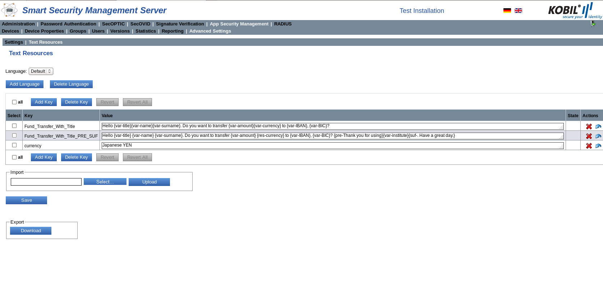  

The list in the Text Resources view informs about the key, its value, its state and the actions that can be carried out with it.  

|     Select    |     Checkbox for selection                                                                                        |
|------------------|----------------------------------------------------------------------------------------------------------------------|
|     Key       |     The   language-dependent key for which the template is valid                                                  |
|     Value     |     The   value of the key. The value defines the information message generated on the   device or on the app     |  
|State|Status notification about the template (is generated by the system)   :heavy_plus_sign: key added before saving the changes or refreshing the page.   :x: key deleted before saving the changes or refreshing the page.|
|Actions|The icon is displayed when an entry has been added but has not been permanently saved yet|
|Actions|This action deletes a template|
|Actions|A template not saved yet can be reset with this option.|  

## Template Description  

Templates allow re-using information with content, which varies only in part. More precisely, during the web services method calls, the template stored in the text resources is referenced and the variable content is written in an ItemList and passed. A template contains text and formatted elements (items). An item consists of the following elements.
1. Start sequence	{
2. Item name 		(var/res/pre/suf)
3. Separator 		-
4. Contents		content of the template
5. End sequence	}  

|     Item name    |     Description                                                                                                                                                                                                                                                                                                                     |
|---------------------|----------------------------------------------------------------------------------------------------------------------------------------------------------------------------------------------------------------------------------------------------------------------------------------------------------------------------------------|
|     var          |     “var” defines the content of a key in   the ItemList < SimpleEntryItem \>. The ItemList is a list to be filled by   the customer. If no entry is found in the list, an exception is thrown. If   the value of “SimpleEntryItem” is “null”, the complete “var” item, in case it   is surrounded by “pre” and “suf”, is ignored.    |
|     res          |     The content of “res” is a resolving   entry from the ResourceBundle. If no entry was found in the ResourceBundle,   an exception is thrown.                                                                                                                                                                                     |
|     pre          |     A “pre” item can   precede a “var” item. The content of the “pre-text” is displayed before the   next “var”. This item is optional.                                                                                                                                                                                             |
|     suf          |     A “suf” item can   follow a “var“ item. The content of the suffix text is displayed after the   “var”. The item is optional.                                                                                                                                                                                                    |  

A template is validated at run time with the values that the client passes in a transaction. During the validation, the template is parsed, and the elements mentioned above are recognized. If one symbol of the item must be displayed in the text, this element is preceded with a hash as escape character #. To display var, pre and suf as text within the sequence { }, also use hash #. To display the hash # itself, it must be escaped with #.  

**Basic example:**  

The following template is included in the English text resources:  

>TextResourceKey(TemplateKey) -> Fund_Transfer_With_Title  
>  
>TextResourceValue(TemplateValue) -> Hello {var-title} {var-name} {var-surname}. Do you want to transfer {var-amount} {var-currency} to {var-IBAN}, {var-BIC}?  

An object is generated by the portal at run time (TransactionParam.java), with the following values, among others:  

> •	deviceId=1; (or -1 in case the SSMS decides to which user’s device the transaction is sent)  
>•	userId=Kazunori.Yamauchi; (or depending on how the customer stores his users)   
>•	templateName=Fund_Transfer_With_Title;    
>•	List\<SimpleEntryItem\> list = new List\<SimpleEntryItem\>();    
>* list.add(new SimpleEntryItem(title, Mr.));  
>* list.add(new SimpleEntryItem(name, Kazunori));  
>* list.add(new SimpleEntryItem(surname, Yamauchi));  
>* list.add(new SimpleEntryItem(amount, 1000));  
>* list.add(new SimpleEntryItem(currency, YEN));  
>* list.add(new SimpleEntryItem(IBAN, JP 03 1234 1234 1234 1234 56));  
>* list.add(new SimpleEntryItem(BIC, ABCDEFGH));  
>
>•	entryItems=list;  

The SSMS resolves the template as follows:  

> Hello Mr. Kazunori Yamauchi. Do you want to transfer 1000 YEN to JP 03 1234 1234 1234 1234 56, ABCDEFGH?  

**Advanced example, with RES(resource):**  

>TextResourceKey(TemplateKey) -> Fund_Transfer_With_Title_RES  
>  
>TextResourceValue(TemplateValue) -> Hello {var-title} >{var-name} {var-surname}. Do you want to transfer >{var-amount} {res-currency} to {var-IBAN}, {var-BIC}?  
>  
PLUS  
>  
>TextResourceKey -> currency  
>  
>TextResourceValue -> Japanese YEN  

An object is generated by the portal at run time (TransactionParam.java), with the following values, among others:  

>•	deviceId=1; (or -1 in case the SSMS decides to which user’s device the transaction is sent)  
>•	userId=Kazunori.Yamauchi; (or depending on how the customer stores his users)  
>•	templateName=Fund_Transfer_With_Title_RES;  
>•	List<SimpleEntryItem\> list = new List<SimpleEntryItem\>();  
>* list.add(new SimpleEntryItem(title, Mr.));  
>* list.add(new SimpleEntryItem(name, Kazunori));
>* list.add(new SimpleEntryItem(surname, Yamauchi));  
>* list.add(new SimpleEntryItem(amount, 1000));  
>* list.add(new SimpleEntryItem(IBAN, JP 03 1234 1234 1234 1234 56));  
>* list.add(new SimpleEntryItem(BIC, ABCDEFGH));    
>
>•	entryItems=list;  

In the list, no value for “currency” is specified, as this is marked with “{res-“. Consequently, the SSMS will search for it in the Text Resources. The text depends on the value and on the language (for example English “Japanese YEN”, German “Japanischer YEN”).   

With this functionality, you can use the template in many variations.  

The SSMS resolves the template as follows:  

> Hello Mr. Kazunori Yamauchi. Do you want to transfer 1000 Japanese YEN to JP 03 1234 1234 1234 1234 56, ABCDEFGH?  

**Advanced example, with PRE and SUF:**  

>TextResourceKey(TemplateKey) -> Fund_Transfer_With_Title_PRE_SUF
>  
>TextResourceValue(TemplateValue) -> Hello {var-title} {var-name} {var-surname}. Do you want to transfer {var-amount} {res-currency} to {var-IBAN}, {var-BIC}? {pre-Thank you for using}{var-institute}{suf-. Have a great day.}
>  
>PLUS
>  
>TextResourceKey -> currency
>  
>TextResourceValue -> Japanese YEN  

An object is generated by the portal at run time (TransactionParam.java), with the following values, among others:  

>•	deviceId=1; (or -1 in case the SSMS decides to which user’s device the transaction is sent)  
>•	userId=Kazunori.Yamauchi; (or depending on how the customer stores his users)  
>•	templateName=Fund_Transfer_With_Title_RES;  
>•	List<SimpleEntryItem\> list = new List<SimpleEntryItem\>();  
>* list.add(new SimpleEntryItem(title, Mr.));
>* list.add(new SimpleEntryItem(name, Kazunori));
>* list.add(new SimpleEntryItem(surname, Yamauchi));
>* list.add(new SimpleEntryItem(amount, 1000));
>* list.add(new SimpleEntryItem(IBAN, JP 03 1234 1234 1234 1234 56));
>* list.add(new SimpleEntryItem(BIC, ABCDEFGH));
>* list.add(new SimpleEntryItem(institute, null));
>
>•	entryItems=list;  

The SSMS resolves the template as follows:  

> Hello Mr. Kazunori Yamauchi. Do you want to transfer 1000 Japanese YEN to JP 03 1234 1234 1234 1234 56, ABCDEFGH?  

If the value of “institute” is set to null, the part of the template that contains the variable “institute” is not returned, if it is surrounded by “{pre- … {suf-“.  

In case a value is added for “institute”:  

>•	deviceId=1; (or -1 in case the SSMS decides to which user’s device the transaction is sent)  
>•	userId=Kazunori.Yamauchi; (or depending on how the customer stores his users)  
>•	templateName=Fund_Transfer_With_Title_RES;  
>•	List<SimpleEntryItem\> list = new List<SimpleEntryItem\>();  
>* list.add(new SimpleEntryItem(title, Mr.));  
>* list.add(new SimpleEntryItem(name, Kazunori));  
>* list.add(new SimpleEntryItem(surname, Yamauchi));  
>* list.add(new SimpleEntryItem(amount, 1000));  
>* list.add(new SimpleEntryItem(IBAN, JP 03 1234 1234 1234 1234 56));  
>* list.add(new SimpleEntryItem(BIC, ABCDEFGH));  
>* list.add(new SimpleEntryItem(institute, All Nippon Bank));  
>
>•	entryItems=list;  

The SSMS resolves the {pre- … {suf- template and the following message is generated:  

>Hello Mr. Kazunori Yamauchi. Do you want to transfer 1000 Japanese YEN to JP 03 1234 1234 1234 1234 56, ABCDEFGH? Thank you for using All Nippon Bank. Have a great day.  

## Add Language  

You can add languages by clicking the button “Add language”. Default value is no language; consequently, all input values of the text resources are saved under the setting “Default”. After you chose the desired language, you can define the text resources with respect to it.  

After clicking the button “Add language”, this window opens where you can choose the language from the drop-menu and click “Add”.  

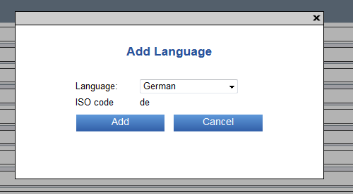  

To save the languages, you must “Save” your settings in the text resources view.  

## Delete Language  

To delete a previously added language, you can select the language and click “Delete Language”.  

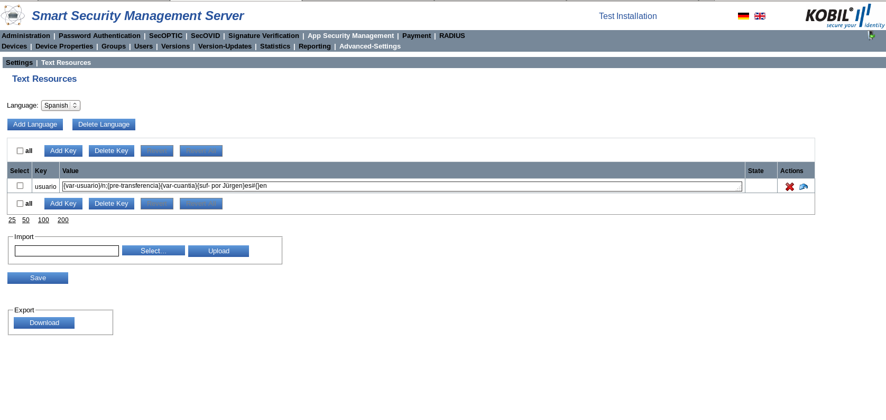  

A dialog box pops up, in which you must confirm the deletion of the language.  

:warning:: Please note that the removal of an entry cannot be reset.  

## Add Key  

Click the button “Add Key” to add language-specific entries for the language previously chosen, according to the templates described in chapter 4.2. To do this, select the respective language via the drop-down menu (see marking in Figure 27). If you have no added languages, the key will be added to the default language.  

The following is the window for adding a new key:  

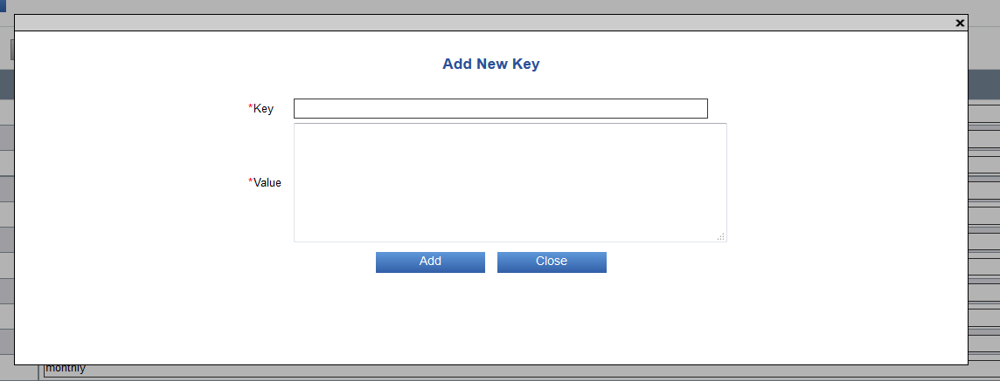  

**Example:**  

Key:		User  
Value:		{var-user}/n; {pre-Transfer}{var-amount}{suf- to Jürgen.}en#{}de  

To confirm the input values, click “Save” in the general Text Resources view.  

:warning:: During the creation of a key, the syntax of the value is **not verified**.  

## Delete Key  

To delete an already existing key, select the language of the key, check the box of the key and click the button “Delete key”. If you have no added languages, the key will be removed from the default language.  

More precisely, carry out the following steps:  

1.	Select the language or use Default  

  

2.	Check box of the key  

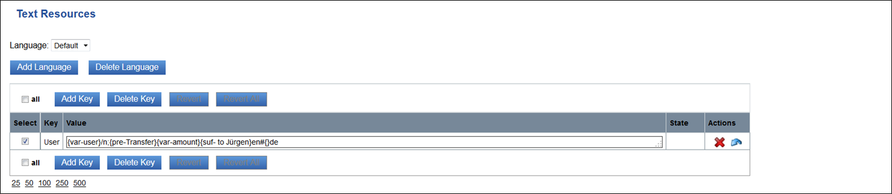  

3.	Delete the key  

  

4.	Save  

To confirm the input values, click “Save” in the general Text Resources view.  

You can also delete a key by clicking the red cross in the actions icon column and by saving the changes.  

## Revert/ Revert all  

With the buttons “Revert” and “Revert all”, you can reset the changes that have not been saved on the server yet and bring the Text Resources to the original condition.  

## Import  

In the area “Import“, you can simultaneously import many templates saved in a file.  

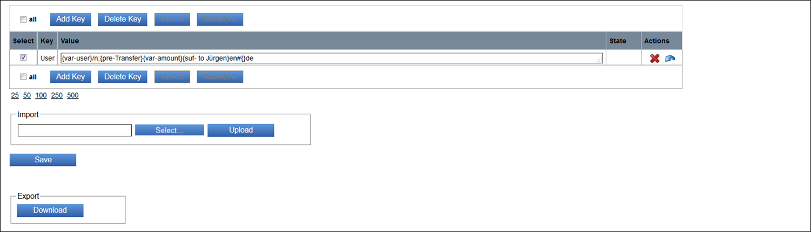  

After importing the templates from an external file, click “Save” to confirm the changes on the server.  

:warning:: Please note that the encoding of the imported file must be UTF-8.  

## Export  

In the area “Export”, you can store templates saved on the server in an external file, by clicking “Download”.  

  

## Licenses of third-party Software  

SSMS uses components of third parties and is obliged to make the license texts of these components available.  

It is enough that these licenses are named in the accompanying documentation; they must not be available in the binary itself or in the GUI. KOBIL must inform you, as a customer, that these texts or the basic information about the licenses are named. In addition, take notice of the restrictions named in the KOBIL license.  

## SOAP Interfaces  

Two SOAP interfaces are included in the installation of the Kernel Module. Find a detailed description of the SOAP interfaces and of their functions in the Java documentation (javadoc) in HTML format.  
* Windows:	C:\Program files\KOBIL\SSMS\modules\kernel\doc
* Linux:		/opt/KOBIL/SSMS/modules/kernel/doc  

The documentation is divided into management and services; consequently, into two different directories:  

One SOAP interface is on the management node (ManagementWs).  

The URL is  

https:// <FQHN oder IP-Adresse\>:8443/ssms gui/soap/mgt/kernel/KernelManagementWs  

The Management SOAP interface is used to integrate the management tasks concerning the users with the systems of the IT environment.  

The second SOAP interface is on the services node (ServicesWs). This interface is used for the integration into applications.  

The URL is:   
https:// <FQHN oder IP-Adresse\>:8445/ssms-services/soap/svc/kernel/KernelServicesWs  

Use these interfaces only within a secured environment. As, via the SOAP interfaces, sensitive information like configuration changes and validity verification of passwords are carried out, it is important for security reasons that these interfaces are accessed in a computing center separated and secured from the internet.   

**Roles and permissions**  

The use of the Management SOAP interfaces is controlled by roles which define the permissions of every operator. The table below describes the KernelManagementWs SOAP methods and informs you about which operator of the SSMS have the permission to run the methods. The Services SOAP interface is authenticated only by SSL and does not need any other authentication of the operator.  

## KernelManagementWs  

Find a detailed description of the functions and of the error messages in the java documentation contained in the installation (javadoc). You can find it in form of a html file in the following directory: <SSMS_INSTALL>\modules\kernel\doc\mgt_soap_api. The following methods are part of this interface:  

|**Permission**|**Methods**|
|:--|:--|
|**KERNEL_VIEW**|**getNodes**|
||The method returns all the information of the available SSMS nodes.|
|**KERNEL_MONITORING_VIEW**|**getMonitoring**|
||The method returns the monitoring information of the selected modules.|
|**SSMS_SERVER_SSL_CERT_CREATE**|**createServerSSLCertificate**|
||This method creates an X.509 Server SSL certificate based on provided certificate signing request (CSR).|
|**KERNEL_AUDITING_VIEW**|**getAuditingItems**|
||The method returns the auditing information of the selected modules.    The method allows to set the filters auditAction, auditSubject, operatorRoleId. These filters are Integer-values.   Example: auditAction=1 means that a user was added. The according mapping is done in class KernelAuditingAction, but this class is not part of the SOAP interface!   A list of all related IDs can be found in chapter 6.1.1|
|**SSMS_USER_VIEW**|**getUsers**|
||The method returns a list of all userIDs that are matching to the given filter.|
|**SSMS_USER_MANAGE**|**removeUser**   The method removes a user from the database.   **renameUser**   The method changes the name of a user in the database.   **addUser**   The method adds a user to the database.|
|**SSMS_GROUP_VIEW**|**getGroups**   The method returns a list of all group names in the database that are matching to the filter.   **getUserGroup**   The method retrieves the group name to which the given user is assigned to.|
|**SSMS_GROUP_MANAGE**|**addGroup**   The method adds a group with the given name to SSMS.   **modifyGroup**   The method modifies group name and "auto group" flag of the given group.   **removeGroup**   The method removes the group with the given name from SSMS.   **assignGroupToUser**   The method assigns a user to a group.   **unassignGroupFromUser**   The method unassigns a user from a group.|
|**SSMS_OPERATOR_VIEW**|**getOperators**   The method returns a list of operators based on the provided filter.|
|**SSMS_ROLEPERMISSION_MANAGE**|**importRolePermissions**   The method imports the role permissions from XML data.   **exportRolePermissions**   The method returns an XML byte array, containing all role permission settings.|
|||
|**SSMS_ADVANCED_SETTINGS_VIEW**|	**getAdvancedSetting**   The method returns the value of an Advanced Setting.   **getAdvancedSettings**   The method returns values of several Advanced Settings.|
|**SSMS_ADVANCED_SETTINGS_MANAGE**|**setAdvancedSetting**   The method sets the value of an Advanced Setting variable.   **setAdvancedSettings**   The method sets the values of several Advanced Setting variables.|
|**DB_TEXT_RESOURCE_VIEW**|	**getTextResources**   The method returns a resource bundle from the database.|
|**DB_TEXT_RESOURCE_MANAGE**|	**storeTextResources** The method saves a resource bundle to the database.|
|**KERNEL_IAM_SETTINGS_VIEW**|**getIamSettings**   The method returns the values of IAM settings.|
|**KERNEL_IAM_SETTINGS_MANAGE**|	**setIamSettings**   The method sets the values for IAM settings variables.|

## KernelAuditingFilter  

The method getAuditingItems allows to set the filters auditAction, auditSubject, operatorRoleId. These filters are Integer-values.  

**Role Ids**  
Default role Ids  

|     SUPER_ADMIN    |     1    |
|-----------------------|-------------|
|     ADMIN          |     2    |
|     HELPDESK       |     3    |
|     REVIEWER       |     4    |  

**Action Ids**:
KERNEL  

|     SSMSADD                     |     1     |
|------------------------------------|--------------|
|     SSMSASSIGN                  |     2     |
|     SSMSCHANGEPASSWORDSSMSCA    |     3     |
|     SSMSDOWNLOADSSMSCA          |     4     |
|     SSMSIMPORT                  |     5     |
|     SSMSLOCK                    |     6     |
|     SSMSMODIFY                  |     7     |
|     SSMSREMOVE                  |     8     |
|     SSMSRENEW                   |     9     |
|     SSMSSTARTED                 |     10    |
|     SSMSSTOPPED                 |     11    |
|     SSMSUNASSIGN                |     12    |
|     SSMSUNLOCK                  |     13    |
|     SSMSACTIVATE                |     14    |
|     SSMSDEACTIVATE              |     15    |
|     SSMSLOGIN                |     16    |
|     SSMSLOGOUT               |     17    |
|     SSMSLOGIN_FAILED         |     18    |
|     SSMSLOGIN_SOAP           |     19    |
|     SSMSLOGOUT_SOAP          |     20    |
|     SSMSLOGIN_SOAP_FAILED    |     21    |  

**Subject Ids:**  
KERNEL  

|     SSMSADVANCEDSETTINGS    |     1     |
|--------------------------------|--------------|
|     SSMSGROUP               |     2     |
|     SSMSLICENCE             |     3     |
|     SSMSOPERATOR            |     4     |
|     SSMSPORTALSERVICE       |     5     |
|     SSMSNODE                |     6     |
|     SSMSROLE                |     7     |
|     SSMSROLEPERMISSION      |     8     |
|     SSMSTEXTRESOURCE        |     9     |
|     SSMSUSER                |     10    |
|     SSMSUSERGROUP           |     11    |
|     SSMSUSERROLE            |     12    |
|     SSMSX509CERTIFICATE     |     13    |

## KernelServicesWs  

Find a detailed description of the functions and of the error messages in the java documentation contained in the installation (javadoc). You can find it in form of a html file in the following directory: <SSMS_INSTALL>\modules\kernel\doc\svc_soap_api. The following methods are part of this interface:  

|     Method                            |     Description                                                                      |
|------------------------------------------|-----------------------------------------------------------------------------------------|
|     getNodes                          |     Retrieve   information about all SSMS nodes.                                     |
|     getProperty                       |     Get   a property for a user or a group.                                          |
|     getProperties                     |     Get   a list of properties for a user or group.                                  |
|     setProperty                       |     Set   a property to a user or to a group.                                        |
|     removeProperty                    |     Remove   a property of a user or a group.                                        |
|     searchUserPropertyStringValues    |     Search   for users, which own a property with the given key and string value.    |
|     searchUserPropertyValues          |     Search   for users, which own a property with the given key and binary value.    |  
