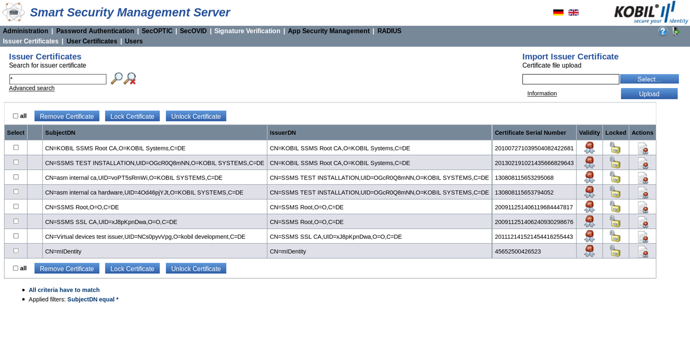
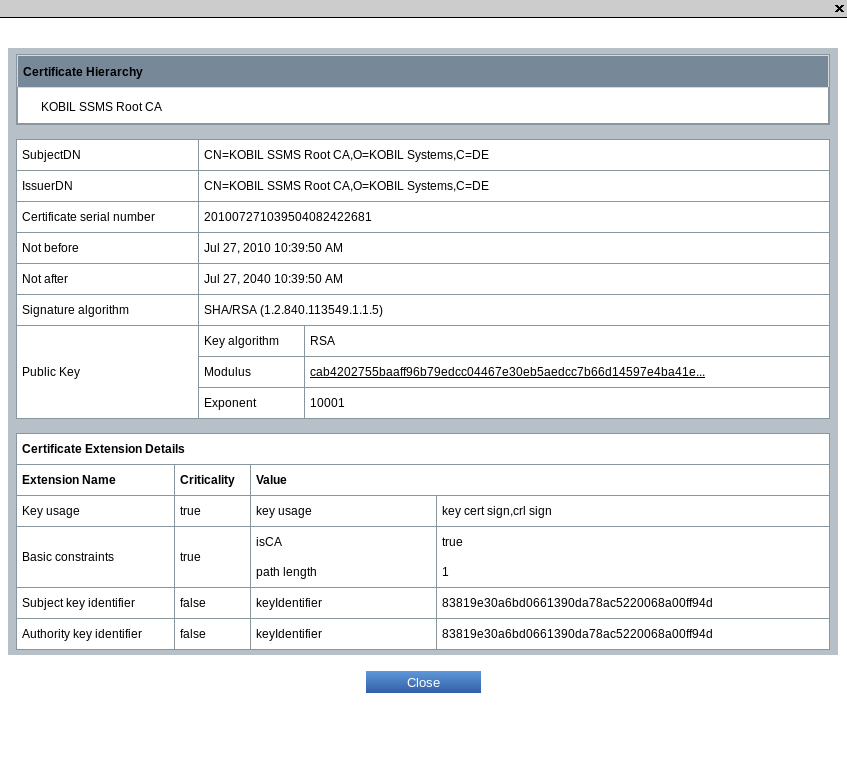
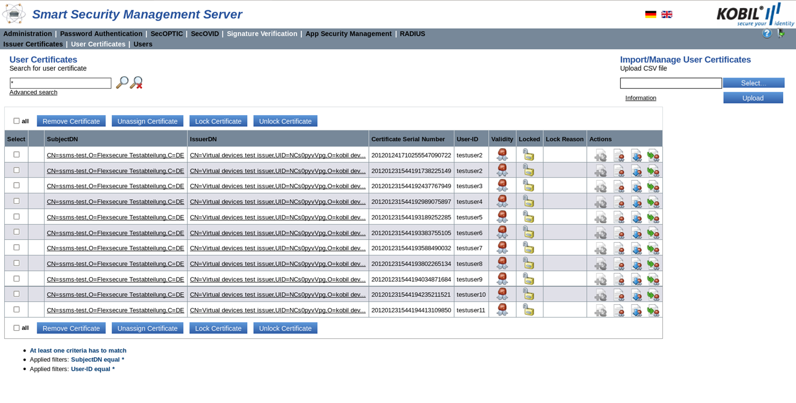
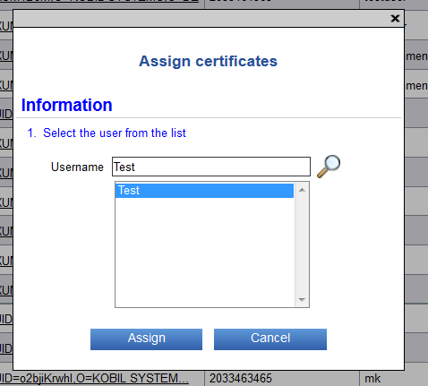
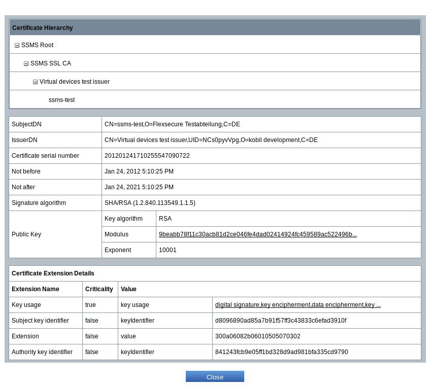
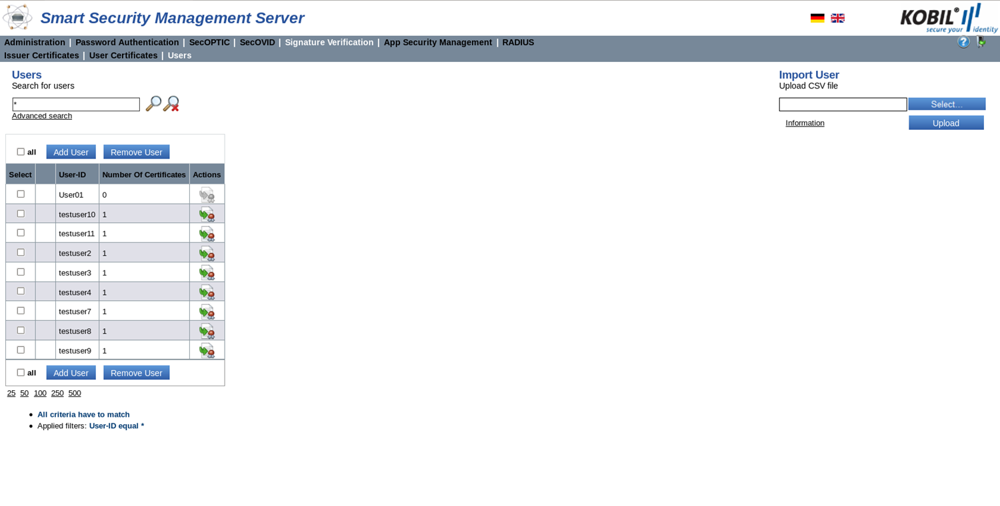

# SVM

## Introduction  

This manual instructs you on how to manage the Signature Verification Module (SVM) on KOBIL Smart Security Management Server (SSMS). Please find a detailed description of all the settings in the administrator manual for the Kernel module. The Signature Verification Module (SVM) helps you manage certificates; more precisely, you can verify certificates, add new certificates or update them.  

## General information  

This manual is aimed at the operators who install, configure and use the KOBIL Smart Security Management Server. The document is also intended for the responsible administrators of the management system and for those who implement the App Security Technology and manage the apps.  

This manual only describes specifically how to use the Signature Verification Module (SVM). This manual does not describe the other modules of the SSMS, which must be necessarily used with the main module (Kernel). For information about the other modules and documents for the administration of the SSMS, contact the support.  

## Version dependent validity of the manual  

As you can add the various modules to the KOBIL SSMS independently from each other, different versions of the single modules exist. To ensure compatibility of the versions, note the overview about the version compatibility in the installation manual of the KOBIL SSMS.  

## Signature Verification Module  

The Signature Verification Module (SVM) manages certificates and helps you verify certificates, adding new certificates and updating them.  

The Signature Verification Module (SVM) can be used only after installing the Kernel module. Please find detailed information on the installation of the Kernel module in the installation manual of the KOBIL SSMS:  

Clicking the menu item Signature Verification brings you to the views and functions to manage the certificates individually. More precisely, find the following submenus:
* Issuer certificates
* User certificates
*	Users  

Managing the certificates occurs via the GUI and the SOAP interfaces and their functions. To control the SOAP management functions, you can use the optionally delivered command line tool. In addition, you can use the SOAP interface to integrate the server into your IT infrastructure. The following tool runs the methods of the management node:  

Signature Verification Certificate Manager  
You can import, export and manage certificates via this command line tool. Note that the certificates must be encoded in X509v3 format.  

With the **Certificate Manager** (find a detailed description in chapter 1.6.1) you can:
* Import certificates
* Lock certificates (status locked) or unlock certificates (status unlocked)
* Remove certificates from the server
* Assign certificates to a user
* Manage user information  

On the contrary, with the SOAP functions belonging to the services nodes, you can verify certificates. This functionality can be integrated for example into a web portal to verify issued server certificates.  

## Role management in the Signature Verification Module  

A role must be assigned to each operator of the system. The division into different roles defines the authorizations of every single operator. Please find information on how to create roles and assign them permissions manual for the Kernel module.
Concerning the SOAP interfaces, you can find information about roles and authorizations to use the Management SOAP interface in the description of the single methods in chapter 1.5. The services SOAP interface is secured via SSL server authentication and does not require any other authentication of the user.  

## Issuer Certificates view  

In the issuer certificates view, you can manage the issuer certificates; more precisely, you can add new issuer certificates, remove existing certificates as well as lock or unlock certificates.  

Go to this view by clicking the menu item “Signature Verification” and then its submenu “Issuer Certificates”. Here, all registered issuer certificates are listed in tabular form (see Figure 1). For instructions on search and filter options, please refer to the administrator manual for the Kernel module (chapter “Search”).  

  

In this view, you can find information about the status of all registered issuer certificates, as well as other attributes:  

|     Select                       |     Checkbox for selection                          |
|-------------------------------------|--------------------------------------------------------|
|     SubjectDN                    |     The   certificate’s owner Distinguished Name    |
|     IssuerDN                     |     The certificate’s issuer Distinguished Name     |
|     Certificate serial number    |     Serial number of the certificate                |  

|Validity||Icon that shows the validity of the certificate. For precise information on the validity period, open the certificate detail information clicking the corresponding actions icon|
|:--|--|:--|
|Locked||“true” means: the certificate is locked|
|Locked||“false” means: the certificate is unlocked|
|Actions||Opens the detail information of the certificate|  

## Import issuer certificate  

You can import an issuer certificate via the upload field. Note that the certificate must be in X509v3 format.  

  

With the button „Select“, you can specify the path of the certificate to be imported. With the button “Upload”, the certificate is added to the database.  

:warning: Note that the certificate chain must be respected; this means that you must import a CA certificate after the corresponding root certificate.  

## Lock or Unlock an Issuer Certificate  

In this view, you can lock or unlock the issuer certificates. To do this, select one, multiple or all the certificates via the checkboxes and click the button for the action you want to carry out.  

  

## Lock issuer certificate  

You lock a certificate by checking the box on its left and clicking the button “Lock certificate”. A certificate must first be unlocked to be able to verify signed information of the user whose user certificate depends on this issuer certificate.  

## Unlock issuer certificate  

Unlocking a certificate by checking the box on its left and clicking the button activates the authorization of the certificate again and allows the verification of the user’s signed information with this issuer certificate.  

## Remove Issuer Certificate  

You can remove an issuer certificate from the system, by selecting a certificate and clicking the button “Remove certificate”.  

If you try to remove a certificate, which additional issuer certificates are connected to, you receive an error message with the information that the certificate could not be removed, because other issuer certificates in the database depend on it.  

You also may not remove an issuer certificate which additional user certificates are connected to. Also for this action, you receive an error message explaining the problem.  

The solution to this is to first remove all issuer or user certificate depending on this issuer certificate to remove it.  

## Detail information of the issuer certificates  

In the detail view, you can see the certificate information; in particular the validity period, the signature algorithm and the public key.  

To access this view, click the icon  

  

## User certificates view  

In this view, you can lock or unlock user certificates, remove them or also control their assignment to a user. Check one or more certificates boxes in the Select column and click the appropriate button.  

Go to this view by clicking the menu item “Signature Verification” and then its submenu “User Certificates”. Here, all registered user certificates are listed in tabular form. For instructions on search and filter options, refer to the administrator manual for the Kernel module (chapter “Search”.).  

  

In this view, find information about the status of all registered user certificates, as well as other attributes:  

|     Select                       |     Checkbox for selection                               |
|-------------------------------------|-------------------------------------------------------------|
|     SubjectDN                    |     The   certificate’s owner Distinguished Name         |
|     IssuerDN                     |     The certificate’s issuer Distinguished Name          |
|     Certificate serial number    |     Serial number of the certificate                     |
|     User ID                      |     The user name whom the certificate is assigned to    |

|Validity||Icon that shows the validity of the certificate. For precise information on the validity period, open the certificate detail information clicking the corresponding actions icon.|
|:--|--|:--|
|Locked||“true” means: the certificate is locked.|
|||“false” means: the certificate is unlocked.|
|Lock reason ||The reason for blocking the certificate. The administrator can select the lock reason from a list.|
|Actions||Assign a certificate to the user. |
|||Display the certificate’s detail information|  
|||Download user’s certificate|
|||View the issuer certificate for this user certificate|  

## Import and Manage User Certificates  

You can import the user certificates as CSV file via the upload field and manage them. Note during the import of the user certificates that these are encoded in base64 format. In order to manage already existing certificates, you only need to write the issuer distinguished name (issuerDN) and the certificate serial number.  

  

By clicking “Select”, you give the path to the CSV file with the required data to be inserted. Clicking “Upload”, the information in the selected CSV file is added to the database.  

:warning: Note that the certificate chain must be respected; this means, import a user certificate after an already existing CA certificate or root certificate.  

## CSV import and user certificate management  

As mentioned above, you import the user certificates or manage already imported certificates via a CSV file (comma separated value). This file contains a table with all the user certificates with ID and their attributes. The information of the CSV formatted file can be given in the table regardless of the order.  

The content of the file can for example be formatted as follows:  

**certificate, issuerDN, certificateSerialNumber, locked, user**  

|     Certificate                |     base64 encoded certificate     (mandatory when the certificates are imported,   optional when they are managed).                                                             |
|-----------------------------------|-------------------------------------------------------------------------------------------------------------------------------------------------------------------------------------------|
|     issuerDN                   |     DN of the issuer certificate. This value must be set   in quotation marks, as it includes commas.      (optional if the certificate is available, otherwise   mandatory).    |
|     certificateSerialNumber    |     Certificate serial number.                                                                                                                                                         |
|     locked                     |     Integer that indicates the status of the certificate   (1 is for locked, 0 for unlocked). Default value for imported certificates is   unlocked.                                   |
|     user                       |     Name of the user whom the certificate is assigned   to. The string is empty when the certificate is unassigned (optional, for   imported certificates default value is empty)      |  

**NOTE**: : Do not write any comments in the file, but only information for the import.  

:warning: For the CSV import, the file must be UTF-8 encoded without BOM, because this could lead to display problems. Alternatively, use the ANSI character set on Windows.  

## Lock or Unlock User Certificates  

In this view, you can lock or unlock a certificate. To do this, select one, multiple or all the certificates via the checkboxes on the left and click the buttons above.  

  

## Lock user certificate  

You lock a certificate by selecting the certificate and clicking the button “Lock certificate”.  

Until you unlock the certificate, signed data of the user cannot be verified and authenticated actions for that user cannot be carried out by the SSMS.  

## Unlock user certificate  

You unlock a user certificate and activate the authorization of the certificate again by selecting the certificate and clicking the button “Unlock certificate”. The SSMS can now authenticate the signed data of the user with that certificate.  

## Remove user certificate  

You remove a user certificate from the system by selecting the certificate and by clicking the button “Remove certificate”. After that, you may not use the certificate anymore.  

## Unassign user certificate  

You unassign a certificate from a user by selecting the certificate and by clicking the button ”Unassign certificate”. The user and the certificate continue to exist.  

## Assign certificate to user  

You also can assign a certificate to a user with no assigned certificate yet by clicking the symbol . A window pops up where you can enter a user name, search for it and confirm it by clicking the name in the name list that appears. Confirm your choice by clicking “Assign”.  

  

## Certificate detail information  

The detail view informs you about detailed certificate information, in particular the validity time, the signature algorithm and the public key.  

Click on the icon   to reach this view.  

  

## Users view  

In the user view, you can manage the users and their assignment to certificates.  

Go to this view by clicking the menu item “Signature Verification Module” and then its submenu “Users”. Here, all registered user certificates are listed in tabular form. For instructions on search and filter options, refer to the administrator manual for the Kernel module (chapter “Search”.  

  

The list of this view informs you about the status of all registered users as well as the number of certificates assigned to them. Clicking “Actions”, you see the assigned certificates to the user. The table of this view contains the following attributes:  

|Select||Checkbox for selection. |
|:--|--|:--|
|User ID||User name.|
|Number of certificates||Number of certificates assigned to the user.|
|Actions||Display the corresponding user certificate. |  

## Add user  

A user added into this module exists also in all other SSMS modules. To add a user into the module and consequently into the database, choose between one of the following methods:  

## Add user via the button  

You add a user into the database by clicking the button “Add user”. Here, enter the user ID as a string. This user ID may not already exist in the database.  

The additional user attributes like the assignment of the user to a certificate must be defined manually.  

## Import user via CSV file
You can also import multiple users at a time. To do this, you need a table in the form of a CSV formatted file where all users with ID are contained.  

The content of the file is formatted as follows:  

**User-ID**  

|User ID|String to define the user ID (may not be empty)|
|:--|:--|  

**Note:**  Do not write any header or comments in the file. Enter only information that must be imported.  

If you have access to a CSV file to import the user certificates, you can give its path via the button “Select” and import it with the button “Upload”. Errors during the import are displayed in an error message.  

Note that you may not upload the same information twice. You receive the error message that for example the users already exist.  

:warning: For the CSV import, the file must be UTF-8 encoded without BOM, because this could lead to display problems. Alternatively, use the ANSI character set on Windows.   

Each CSV file should contain at most 5.000 data sets, otherwise, problems and an interruption of the upload can occur.  

## Remove user  

You can remove one or more users from the list by selecting one or more users and by clicking the button “Remove User”. A dialog box opens up to confirm the action of removing the user or the users.  

Note that the certificates assigned to the user are not deleted. Removing a user can also fail. The failure is suggested in the status column on the left of the user ID. In addition, an error message appears above the table.  

## SOAP interfaces  

Three SOAP interfaces are included in the installation of the Signature Verification Module. Please find a detailed description of the SOAP interfaces and of their functions in the Java documentation (javadoc) in HTML format, contained in the module specific directory of the SSMS installation directory.  

* Windows 	C:\Program Files\KOBIL\SSMS\modules\svm\doc  
* Linux/Solaris: 	/opt/KOBIL/SSMS/modules/svm/doc  

The documentation is divided into management and services; consequently, into two different directories.  

Two SOAP interfaces, one for the issuer and one for the user certificates, are on the management node.  

The URL for the management SOAP interface of the issuer certificates is:  

>https://\<FQHN  oder IP-Adresse\>:8443/<ssms-gui\>/soap/mgt/svm/IssuerCertificateManagementWs  

The URL for the management SOAP interface of the user certificates is:  

>https:// \<FQHN oder IP-Adresse\>:8443/ssms-gui/soap/mgt/svm/UserCertificateManagementWs

The third SOAP interface is created on the Services node (ServicesWs). This interface is used for integration in the applications that carry out signature verifications.

The URL for the services SOAP interface is:  

>https:// \<FQHN oder IP-Adresse\>:8445/ssms-services/soap/svc/svm/SvmServicesWs  

The management SOAP interfaces are used to integrate the management tasks concerning the different signatures into the systems of the IT environment. To use these interfaces the command line tool Certificate Manager is delivered. It works for the management of the issuer certificates as well as of the user certificates (please find more information in 1.6.1).  

Use these interfaces only within a secured environment. As, via the SOAP interfaces, sensitive information like configuration changes and validity verification are carried out, it is important for security reasons that these interfaces are accessed in a computing center separated and secured from the internet.  

**Configuration**:  

Note that there are access limitations to the SOAP services, which can be configured in the Advanced Settings of the Kernel module. Only a Super Administrator and an Administrator can change these settings.

**Roles and permissions:**  

The use of the Management SOAP interfaces is controlled by roles, which define the permissions of every user. The table below describes the SOAP methods of the classes IssuerCertificateManagementWs and UserCertificateManagementWs of the Management SOAP methods and informs you about which users of the SSMS have the permission to run the methods. The Services SOAP interface is authenticated only by SSL and does not need any other authentication of the user. For the Management SOAP interface, the roles or the operators are Super Administrator, Administrator, Help desk and Reviewer.  

## IssuerCertificateManagementWs  

Please find a detailed description of the functions and of the error messages in the javadoc contained in the installation (javadoc). You can find it in form of an html file in English in the following directory:  

\<SSMS_INSTALL\>\modules\svm\doc\mgt_soap_api. The following methods are part of the IssuerCertificateManagementWs class:  

|**Permission**|**Methods**|
|:--|:--|
|**SVM_ISSUER_CERTIFICATE_MANAGE**|**addCertificate**   The method adds a DER encoded certificate to the database.     It returns true if the certificate has been added, false if the certificate existed already.     Permission granted to Super Administrator and Administrator.    **removeCertificate**   The method removes a DER encoded certificate from the database.    It returns true if the certificate has been removed, false if the certificate did not exist yet.    Permission granted to Super Administrator and Administrator.|
|**SVM_ISSUER_CERTIFICATE_MODIFY**|**lockCertificate**   The method locks a DER encoded certificate.    It returns true if the certificate has been locked, false if the certificate was already locked.    Permission granted to Super Administrator, Administrator and Help desk.    **unlockCertificate**   The method unlocks a DER encoded certificate.    It returns true if the certificate has been unlocked, false if the certificate was already unlocked.    Permission granted to Super Administrator, Administrator and Help desk.  
|**SVM_ISSUER_CERTIFICATE_VIEW**|**getCertificates**   The method returns a list of certificates that match the search filter.    It returns an empty list when no certificate was found.    Permission granted to all operators.|  

## Description of the filter for the method getCertificates  

The method getCertificates of the IssuerCertificateManagementWs contains different filter parameters. You can call the methods of this interface using the command line tool Certificates Manager, which is explained in detail in chapter 1.6.1.  

To call this method with the command line tool, use:  

>Linux/Solaris: 	./certificate-manager.sh getIssuerCertificates “\<filter\>”    Windows: 	certificate-manager.cmd getIssuerCertificates “\<filter\>”  

Instead of \<filter\> use the following search filters in quotation marks:  

## certSN
Filter the results searching for the certificate serial number with the data type string:  

For example: ./certificate-manager.sh getIssuerCertificates “(certSN=123456)”  

## subjectDN  

Filter the results searching for the subject distinguished name with the data type string:  

For example: ./certificate-manager.sh getIssuerCertificates “(subjectDN=CN=mIDentity)”  

## issuerDN  

Filter the results searching for the issuer distinguished name with the data type string:  

For example: ./certificate-manager.sh getIssuerCertificates “(issuerDN=CN=mIDentity)”  

## notAfter  

Filter the results searching for the date until which the certificate is valid with the data type Date:  

For example: ./certificate-manager.sh getIssuerCertificates “(notAfter=2021-11-20 16:18:21)”  

## notBefore  

Filter the results searching for the date after which the certificate is valid with the data type Date:  

For example: ./certificate-manager.sh getIssuerCertificates “(notBefore=2011-11-01 16:18:21)”  

## locked  

Filter the results searching for information about locked issuer certificates with the data type Boolean. Set the value to true or false correspondingly. The call returns the number of the certificates which match the parameter.  

For example: ./certificate-manager.sh getIssuerCertificates “(locked=true)”  

**Note**:  

In search filters, you can use equal (=), not equal (!=), lesser than (<) or greater than (>).  

Remember to set the quotation marks and the brackets.  

## UserCertificateManagementWs  

Find a detailed description of the functions and of the error messages in the java documentation (javadoc) contained in the installation. You can find it in form of an html file in English in the following directory:  

>\<SSMS_INSTALL\>\modules\svm\doc\mgt_soap_api. The following methods are part of the UserCertificateManagementWs class:  

|**Permission**|**Methods**|  
|:--|:--|
|**SVM_USER_CERTIFICATE_MANAGE**|**addCertificate**  The method adds a DER encoded certificate to the database.    It returns true if the certificate has been added, false if the certificate existed already.    Permission granted to Super Administrator and Administrator.    **removeCertificate**   The method removes a DER encoded certificate from the database.    It returns true if the certificate has been removed, false if the certificate did not exist yet.    Permission granted to Super Administrator and Administrator.|
|**SVM_USER_CERTIFICATE_MODIFY**|**assignCertificate**   The method assigns a DER encoded certificate to a user.    It returns true if the certificate has been assigned to a user, false if the certificate was already assigned.    Permission granted to Super Administrator, Administrator and Help desk.    **unassignCertificate**   The method unassigns a DER encoded certificate from a user.    It returns true if the certificate has been unassigned from a user, false if the certificate was already unassigned.    Permission granted to Super Administrator, Administrator and Help desk.    **lockCertificate**   The method locks a DER encoded certificate in the database.    It returns true when the certificate has been successfully locked, false when the certificate was already locked.    Permission granted to Super Administrator, Administrator and Help desk.    **unlockCertificate**   The method unlocks a DER encoded certificate in the database.    It returns true when the certificate has been successfully unlocked, false when the certificate was already unlocked.    Permission granted to Super Administrator, Administrator and Help desk.|
|**SVM_USER_CERTIFICATE_VIEW**|**getCertificatesInfo**    This method returns from the database a list of all the SVMCertificateInfo objects that match the search filter given. The list is empty when no value matching the search filter is found. Otherwise, it returns an object with the following data:    -	String IssuerDN,    -	String SubjectDN;    -	BigInteger: serial number,    -	String userID,    -	Date not before,    -	Date not after and    -	String certificateType      Permission granted to all the operators.     **getCertificate**   The method returns a DER encoded certificate.    Permission granted to all the operators.    **getUserByIssuerAndSerial**   The method returns the UserID matching the given issuerDN and serial number.    Permission granted to all the operators.    **getUserByDEREncodedCertificate**   The method returns the UserID matching the given DER encoded certificate.    Permission granted to all the operators.|
|**SSMS_USER_MANAGE**|**addUser**   The method adds a new user to the database.    It returns true if the user has been successfully added to the database, false if the user already existed in the database.    Permission granted to Super Administrator and Administrator.    **removeUser**   The method removes a user from the database.    It returns true if the user has been successfully removed, false if the user did not exist in the database yet.    Permission granted to Super Administrator and Administrator.|  

## Description of the filter for the method getCertificatesInfo  

The method getCertificatesInfo of the UserCertificateManagementWs class includes different parameters which determine the search filter. To manage the certificates in the Signature Verification Module, you can use the external Certificate Manager tool, which is thoroughly described in chapter 1.6.1.  

The general call of this method is:  

>Linux/Solaris:	./certificate-manager.sh getUserCertificatesInfo “<filter>”    
>Windows: 	certificate-manager.cmd getUserCertificatesInfo “<filter>”  

For <filter>, use the following parameters in brackets and quotation marks:  

## certSN  

Filter the result searching for the certificate serial number with the data type String:  

>For example: ./certificate-manager.sh getUserCertificatesInfo “(certSN=123456)”  

## subjectDN  

Filter the result searching for the Subject Distinguished Name with the data type String:  

>For example: ./certificate-manager.sh getUserCertificatesInfo “(subjectDN=CN=mIDentity)”  

## issuerDN  

Filter the result searching for the Issuer Distinguished Name with the data type String:  

>For example: ./certificate-manager.sh getUserCertificatesInfo “(issuerDN=CN=mIDentity)”  

## notAfter  

Filter the result searching for the date until which the certificates are valid with the data type Date:  

>For example: ./certificate-manager.sh getUserCertificatesInfo “(notAfter=2021-11-20 16:18:21)”  

## notBefore  

Filter the result searching for the date after which the certificates are valid with the data type Date.  

>For example: ./certificate-manager.sh getUserCertificatesInfo “(notBefore=2011-11-01 16:18:21)”  

## locked  

Filter the results searching for information about locked issuer certificates with the data type Boolean. Set the value to true or false correspondingly.  

>For example: ./certificate-manager.sh getUserCertificatesInfo “(locked=true)”  

**Note**:  

In search filters, you can use equal (=), not equal (!=), lesser than (<) or greater than (>).  

Remember to set the quotation marks and the brackets.  

## AuditingFilter  

The method allows to set the filters auditAction, auditSubject, operatorRoleId. These filters are Integer-values. Further information for this method can be found in Kernel administration manual.  

|     SVM            |                |
|-----------------------|----------------|
|     SVMADD         |     5001    |
|     SVMASSIGN      |     5002    |
|     SVMEXPORT      |     5003    |
|     SVMLOCK        |     5004    |
|     SVMMODIFY      |     5005    |
|     SVMREMOVE      |     5006    |
|     SVMUNASSIGN    |     5007    |
|     SVMUNLOCK      |     5008    |
|     SVMDISCARD     |     5009    |  

## SvmServicesWs  

For a detailed description of the functions and error messages refer to the java documentation (java doc) in English in html format. This is available in the following directory:  
>\<SSMS_INSTALL\>\modules\svm\doc\svc_soap_api. The following functions belong to this interface:  

|     Name                             |     Description                                                                                                                                                                                                                                                                                                                                                                                                                                                                                   |
|-----------------------------------------|------------------------------------------------------------------------------------------------------------------------------------------------------------------------------------------------------------------------------------------------------------------------------------------------------------------------------------------------------------------------------------------------------------------------------------------------------------------------------------------------------|
|     **verifyUser**                       |     The method verifies the signature   of an attached or of a separate PKCS#7 document with optional validity check   for an unknown user. The user certificate must be in the form of PKCS#7   signed data.     It returns date and time of the   verification.     Note that if the value of the   parameter “timeOfVerification” has not   been set, the current time of the system will be used. If the value for   “data” has not been set, no PKCS#7 document will be used.    |
|     **verifyKnownUser**                  |     The method verifies the signature   of an attached or of a separate pkcs7 document with optional validity check for a known user.   The user certificate must not be in the form of PKCS#7  signed data, but it must be available in   the database.     It returns date and time of the   verification.                                                                                                                                                                                |
|     **verifyUserForTrustAnchor**         |     The method verifies the signature   of an attached or of a separate pkcs7 document with optional validity check for an unknown user.   Additional parameter is a list of valid root certificate names. The user   certificate must be in the form of pkcs7 signed data.     It returns date and time of the   verification.     Note that the input parameter “validRootCANames” is a list   of RFC2253 formatted Root CA names.                                                  |
|     **verifyKnownUserForTrustAnchor**    |     The method verifies the signature   of an attached or of a separate pkcs7 document with optional validity check for a known user. Additional parameter is a list of valid root certificate   names. The user certificate must not be in the form of pkcs7 signed data, but   it must be available in the database.     It returns date and time of the   verification.     Note that the input parameter “validRootCANames“ is list of RFC2253 formatted Root CA names.           |
|     **getCertificates**                  |     The method returns the user   certificates that are linked to the given userId in DER encoded form. |  

## External Signature Verification application  

To manage the certificates in the Signature Verification Module, you can use the external application Certificate Manager.  

This chapter describes the installation, configuration and use of this external application, which is a command line tool that you can start from your Client PC. The application uses the SOAP interface to connect to the KOBIL SSMS. You can find the link to the SOAP interface in chapter 1.5.  

In order to successfully use the external application, a valid license for the module must be available on the server.  

**Important**: In the properties files, **no backslashes "\\"** should be used in the directory paths:  

>For example: C:/Program Files/KOBIL/SSMS/modules/svm/utils/svm-apps-\<version\>/ on Windows and /opt/KOBIL/SSMS/modules/svm/utils/svm-apps-\<version\>/ on Linux and Solaris.  

Note that to use the external application on a client, the Java Crypthography Extension (JCE) must be additionally installed.  

You can copy this from the installation directory of the SSMS in the subdirectory jre/lib/security/ or download it from the web site.  
http://www.oracle.com/technetwork/java/javase/downloads/index.html.  

You can then extract the two files **local_policy.jar** and **US_export_policy.jar** and copy them into the directory jre/lib/security/ on your Client PC. You must substitute the existing versions of the files with these versions.
In addition, you must copy the files **iaik_jce-3.16.jar** (subdirectory jre/lib/ext/) and **java.security** (subdirectory jre/lib/ext/) of the SSMS installation into the corresponding directory of your local java installation.  

Required configuration parameters of the external application:  

For the configuration of the external application, you must configure the keys and the certificates for the secure communication with the SSMS. More precisely, you must enter the path to these files in the config file of the application (in the subdirectory /config).  
To authenticate and authorize the external application against the SSMS, you need a key and a certificate, which must be assigned to the role “Administrator” or “SuperAdmin” and must be a p12 file. Either use the certificate and key “SuperAdmin” generated during the SSMS installation and added to the directory \<SSMS_HOME\>/certs or generate another certificate via the graphical interface of the SSMS (find more information in the Kernel manual, chapter “Role Management View”, paragraphs “Create a role” and “Download certificate”). You also need the password of the key.  

To verify the authenticity of the SSMS, you need the CA certificate belonging to the SSMS installation. This CA certificate must be available as a truststore in JCEKS format with the file extension “jks”. The trustore is used to verify the issuers of the SSL certificates of the server. The truststore is generated during the SSMS installation and added to the directory \<SSMS_HOME\>/certs and can be used directly. Default password for protecting the integrity of this truststore is 123456. This password can be changed later.  

Note that the password currently valid must also be entered into the Tomcat (server.xml). If you change it, you must change it in all the relevant configuration files.  

The following parameters must be entered into the properties file:  

>\### key file of the operator (PKCS#12)  
>soap.SSL.KeyStoreFile = /path to the certificate/ssms-superadmin.p12 oder admin.p12  
>\### trust store file containing the ssms servers root and ca certificate (java key store)
>soap.SSL.TrustStoreFile = /path to the certificate/truststore.jks  
>\### pass phrase to access the trust store  
>soap.SSL.TrustStorePassPhrase = 123456  

Information for all Linux users:  

You may need to change the permissions to run the files of the external application (for example chmod 755 ./issuer-certificate-manager.sh). For security reasons, the rights of the lib directory must be adjusted after decompressing the application archive file. More precisely, all other users and the group must have read permissions (z. B. chmod 644 ./svm-apps-\<version\>/lib/).  

## Certificate Manager  

With the Certificate Manager, you can manage the certificates and the users of the Signature Verification Module. Follow these paths to reach the application in the installation directory:
* Windows: 	C:\Program Files\KOBIL\SSMS\modules\svm\utils\svm-apps-\<version\>\<release\>
* Linux/Solaris: 	/opt/KOBIL/SSMS/modules/svm/utils/svm-apps-\<version\>\<release\>  

## Scope of the application  

This application offers different certificate management functions to manage the certificates in the KOBIL SSMS database. To carry out these management functions, the user needs a private key and an SSL client certificate to authenticate himself on the KOBIL SSMS. This certificate must match the role or the permissions of the user, in order to run the certificate management functions (see chapter 1.1 role management). The user additionally needs a truststore, containing the KOBIL SSMS SSL server certificate chain, to verify the server authentication.  

## Requirements  

* Check the network connection to the KOBIL SSMS on which the certificates and the users should be managed
* JRE Version 1.7.0_25 or higher
* Be sure that the directory path to the binary library contains the right Java version  

## Installation  

* Copy the zip file into the directory of your choice from which the certificates and the user should be managed
* Unzip the archive file
* Switch to the newly generated directory  

## Configuration of the application  

1. The configuration file certificate-manager.properties is in the subdirectory config/ of the application.  
2. Define every parameter. No value must be left empty. Some parameters are preconfigured; you can either use these values or enter other values.  
3. To connect to the SOAP interface, you need certificates, keys and keystore. Examples of the parameters that you need are listed in Text 1 on the preceding page.  
4. For the SOAP URL, use the host name of the server and **not** the IP address.  

## Start the application

Run the Certificate Manager script (for example on Windows certificate-manager.cmd or on Linux/Solaris certificate-manager.sh) with the right parameters.  

./certificate-manager.sh \<command\> \<command parameter1\> [command parameter n]   
(Example 1: ./certificate-manager.sh removeIssuerCertificate “CN=mIDentity“ 123456)   
(Example 2: ./certificate-manager.sh assignUserCertificate “CN=Issuer DN “ 456123 testuser01)  

Find additional functions available in the application in chapter 1.6.1.7.  

## Log file of the application  

The external application certificate manager usually generates a log file in the directory of the application: certificate-manager.log. You can adjust the path to the log file in the log4j.properties.  

log4j.appender.R.File=certificate-manager.log  

In the above example, the log file is in the directory of the application.  

In the configuration of the log file, be sure that you enter the correct path and that the application can write and read files in the given directory. If the log file cannot be generated, the application does not give **any** warning or information. The application continues its operations, without generating a log file.  

## Available management functions  

|addIssuerCertificate “\<path to the certificate file\>”|Adds an issuer certificate to the database.|
|:--|:--|
|removeIssuerCertificate “\<issuerDN\>” \<serial number\>|Removes an issuer certificate from the database.|
|lockIssuerCertificate “\<issuerDN\>” \<serial number\>|Locks an issuer certificate.|
|unlockIssuerCertificate “\<issuerDN\>” \<serial number\>|Unlocks an issuer certificate.|
|getIssuerCertificates “\<filter\>”|Returns all issuer certificates that match the selected filter (the description of the filter is in chapters 1.5.2 and 1.5.4)|
|addUserCertificate  “\<path to the certificate file\>”|Adds a user certificate to the database.|
|removeUserCertificate “\<issuerDN\>” \<serial number\>|Removes a user certificate from the database.|
|assignUserCertificate  “\<issuerDN\>” \<serial number\> \<userID\>|Assigns a user certificate to a user.|
|unassignUserCertificate “\<issuerDN\>” \<serial number\>|Unassigns a user certificate from a user.|
|lockUserCertificate “\<issuerDN\>” \<serial number\> “\<lock reason\>”|Locks a user certificate in the database.|
|unlockUserCertificate “\<issuerDN\>” \<serial number\>|Unlocks a user certificate in the database.|
|getUserCertificatesInfo “\<filter\>”|Returns all user certificates that match the selected filter (the description of the filter is in chapters 1.5.2 and 1.5.4)|
|getUserCertificate  „\<issuerDN\>“ \<serial number\>|Returns the user certificate that matches the filter.|
|getUserByIssuerAndSerial “\<issuerDN\>” \<serial number\>|Returns the user name that match the filter.|
|getUserByDEREncodedCertificate “\<path to the certificate file\>”|Returns the user name that matches the filter.|
|addUser “\<userID\>“|Adds a user to the database.|
|removeUser “\<userID\>“|Removes an already added user from the database.|
