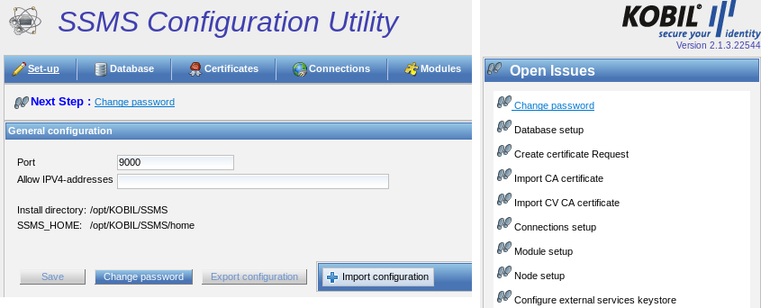
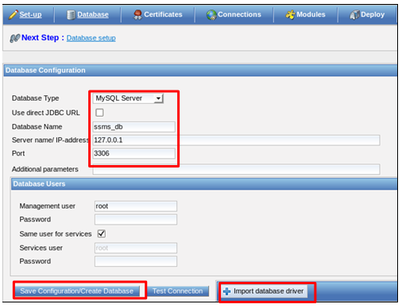
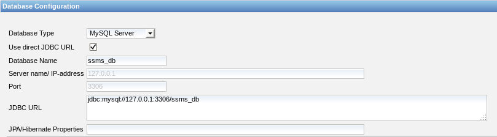
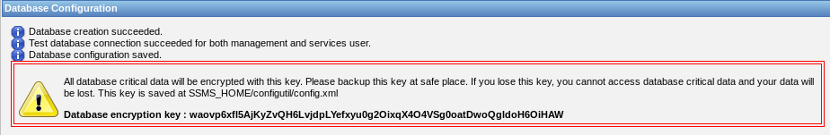

# The Configuration Program

With the configuration utility, you can adjust all the settings required to start the SSMS. More precisely, you can for example create the required database tables, generate the certificates, and install the SSMS modules.  

**NOTE:**  **Before starting the configuration utility, assure yourself that any other installed SSMS instance has been stopped and that it is not running in parallel.**  

If you install many management and services nodes in a cluster, you must run the installation program on every node.  

## 1. Start the Configuration Utility  

**On Windows**, start "KOBIL SSMS Configuration Utility.exe". You can find this file in the SSMS installation directory or as a shortcut on the desktop or in the start menu. This depends on your settings during the installation. The default path for Windows is  

    C:\\Program Files\\KOBIL Systems\\SSMS  

**On Linux**, start the shell script "KOBIL SSMS Configuration Utility". With default settings, you can find the directory on  

    /opt/KOBIL/SSMS  

After starting the configuration utility, open the browser and go to the following URL: https://localhost:9000/  

The port depends on the installation settings, so, if you did not change it during the installation, it remains 9000.  

## 2. Overview of the Configuration Program  

After entering the URL in the browser, you see the overview page with the following navigation menu
* Set-up  
* Database  
* Certificates  
* Modules  
* Deploy  
* Logoff  
* Terminate  

You can see an overview of the open issues, to be processed chronologically, on the right side of the page . In addition, a notification under the navigation menu informs you about the next open issue.  

  

## 3. Setup  

On the first page, a setup overview, you can change the password. The setup page shows you the general values settings made during the installation: the port for reaching the configuration utility as well as the installation and the home directory. On the setup page, you can also limit the access to the configuration utility to specified external IPv4 addresses.  

## 4. Change Password  

You can change the password, which was set during installation process. The password preserves the configuration settings and protects against unauthorized access to the configuration utility. To do that, click on "Change password" and set a password.  

  

## 5. IP Addresses  

You can access the configuration utility from everywhere. However, you can limit the access by entering an IP address range and saving it. Define only comma-separated IP addresses in IPv4 format.  

**NOTE:** **Use only IP addresses in IPv4 format!**  

## 6. Save Settings  

Click on "Save" to save the settings made on the setup page.  

## 7. Exporting and Importing the Configuration  

If you install several nodes, please export the configuration file config.xml from the previous installation and then import it for each additional node. With the import of the file config.xml, every additional node contains the same database key databaseEncryptionKey, stored in this file along with other information.  

**Note:** Please create the export newly after the update of the SSMS so that changed values in the export are considered. Please check the imported values in the configuration utility for correctness.  

Therefore, you can export the configuration only after creating the database. To do this, follow the instructions in the next chapter.  

config.xml contains information for:  
* the configuration utility (password and port)  
* the database configuration of the SSMS (databaseEncryptionKey, database name, connections to the database, node ID)  

The file config.xml is always stored in <SSMS_HOME>\configutil  

## 8. Database
You are required to configure the database as second step. You can select the database type among the options and you can specify the name of the database to be created. To do this, you must have installed a database management system.  

There are two ways to connect to the database:  

1. **Use Direct JDBC URL:** The option “Use Direct JDBC URL” allows a direct connection to the desired database via the inputs “JDBC-URL” and “JPA/Hibernate Properties”. The default value of the JDBC URL is already presented according to the selected database type. If the proposed value is incorrect, you can change the server name/IP-address, port, database name and additional parameters in appropriate URL format. With this option, you can also connect to Oracle RAC, which has a different JDBC URL format than the Oracle database server. Optionally you can also enter JPA/Hibernate Properties for troubleshooting purpose e.g. hibernate.show_sql=true (This shows all Hibernate queries fired to Database).  

1. **Do Not Use Direct JDBC URL:** If you choose this option, leave “Use Direct JDBC URL” unchecked. If you leave this option unchecked, you need to enter the appropriate database name, server name/IP-address, port and additional parameters. The default values for these fields are presented according to the selected database type (e.g. default settings for the port are 1433 for MSSQL, 3306 for MySQL and 1521 for Oracle Database). In this case the JDBC URL is evaluated by the system according to the given user inputs.  

After configuring the database, you are required to configure the database users with their passwords to allow them to access the database. You can define separate users and passwords for both the management and the services nodes.  

As additional parameters, you can define values for creating the database, which depend on the JDBC driver. You can also leave this value empty.  

**Note:**  **Information on database permissions (GRANT) are available under:** **\SSMS_INSTALL\modules\(modulename)\db\grant*.sql**  

  

  

## 9. Database driver  
In order to create the database and the tables after the selection of MSSQL, MySQL or Oracle Database, you additionally need the corresponding database connector (JDBC). The connector is delivered with installation for MSSQL and Oracle and may not be imported additionally. For MySQL the import is required and can be carried out via the button “Import database driver”. You can download the appropriate database driver (connectors) for MySQL at the following URL:  

**MYSQL:**

**MSSQL:** [http://www.microsoft.com/en-us/download/details.aspx?displaylang=en&id=11774]

The MySQL package only contains one connector with the file name **mysql-connector-java-/<version/>-bin.jar** which is the one to be integrated.
In addition, note the license agreement for the Oracle database JDBC connector. You can find the license agreement in the directory <SSMS_INSTALL>/doc/licences.
In case you need to substitute the database driver for Oracle and MSSQL, you must copy the correct driver (JAR file) into the following directory:

    opt/KOBIL/SSMS/modules/kernel/mgt

    opt/KOBIL/SSMS/modules/kernel/svc

    opt/KOBIL/SSMS/configutil/WebContent/WEB-INF/lib

 Please note that the names of your database driver classes must correspond to one of the following, according to the database used:

for **MSSQL:** com.microsoft.sqlserver.jdbc.SQLServerDriver

for **Oracle:** oracle.jdbc.driver.OracleDriver  

## 10. Create Database Tables  

After entering the password, you create the database by clicking on “Create Database”.

If the database was created, you can test the connection to the database by clicking on the next button to the right. You receive the following messages if the creation of the database was successful:  

  

You must keep the database key "databaseEncryptionKey" in a safe place. The database key is stored both in the database and in the config.xml file. You can back up the database key by copying the config.xml to another data storage device. To export the file, click on "Export configuration" in the "Setup" window.  

**NOTE:** **The databaseEncryptionKey is only generated once and saved in the config.xml file. Therefore, if you install and set up multiple nodes or servers, please export this file in the "Setup" window by clicking on “Export configuration” and import it on every additional node, so that every node contains the same databaseEncryptionKey.**  

## Oracle Database with use of an Oracle Client  

In case you want to use an Oracle database with an Oracle Client, for example because you need additional database functions, note the following points:  

1. The Oracle Client must be installed on the same system as the  
2. The SSMS uses the Oracle driver in version 19.3.0.0. The version of the Oracle client, which you can download from the Oracle web site, must be identical to the version of the  
2. In case you need another version of the Oracle Client, you must substitute the driver on the SSMS.  

3. In case you want to let MGT and SVC run on the same, the driver delivered with the SSMS (ojdbc8-19.3.0.0.jar) be moved from these directories

       opt/KOBIL/SSMS/modules/kernel/mgt and opt/KOBIL/SSMS/modules/kernel/svc to this directory opt/KOBIL/SSMS/tomcat/lib

**Please note that KOBIL does not guarantee the correct functioning of other drivers than the ones delivered.**  

## Configuration of the Oracle Client in the CU  

In the database view of the Configuration Utility you must select the option “Use Direct JDBC URL”. Additionally change the JDBC-URL according to the JDBC driver used.  In case you use JDBC thin, suggested by Oracle, enter the following URL:  

    Jdbc:oracle:thin:@Service_Name

Additionally you must change the files KOBIL SSMS Configuration Utility.lax and SSMS.lax in the SSMS installation:

**lax.nl.java.option.additional =-Doracle.net.tns_admin=path to the file tnsnames.ora in the installation of the Oracle Client**  

In case you use JBDC OCI, enter the following URL:          Jdbc:oracle:oci:@Service_Name  

**Please note that all the settings described in chapter 3.4.3 are deleted in case you update the SSMS. Therefore, you must repeat all the above steps.**  

## SSMS database connection pool settings  

To make SSMS work efficiently with the database, please be careful in the configuration of the database connection pool. The default installation of SSMS is so configured that it works properly in most environments. This means that for the first installation and configuration of an SSMS test environment, you can skip this chapter and directly read chapter 3.6. However in case of installations with a very high load, administrators should monitor the database, the SSMS performance and the amount of used database connections. Please find more information in the chapter Monitoring in the Kernel manual.

The next chapter contains a detailed description of the quantity of database connections of the SSMS and how they are configured.  

## General Information  

SSMS is a request driven system. Every request requires a thread to execute the job. These threads are maintained in 3 pools by different components of SSMS:  

1. Tomcat-Thread-Pool  
1. Cluster-Thread-Pool  
1. SSMS Internal Task Executer  

A request can be one of the following:  

1. An ASM device sends data to SSMS    
  a. A thread from the amount of Tomcat threads is used  

2. The portal calls a SOAP Method  
  b. A thread from the amount of Tomcat threads is used  

3. An SSMS node calls another SSMS node  
  c. A thread from the amount of cluster threads is used  

4. Background tasks  
  d. A thread from the amount of SSMS internal task executer thread pool is used  

Almost all requests require a database connection to read data from or write data to the database. These connections are taken from the database connection pool and returned to the pool when the requests terminates.  

#### Database Connection Pool  

A connection pool is a cache of database connections, used for requests. If a new connection would be created for every request, this would cost too much effort and resources. Instead, an existing connection is used from the connection pool. Connection pools improve the speed of the request and reduce the resources used.  
