# The Configuration Program

With the configuration utility, you can adjust all the settings required to start the SSMS. More precisely, you can for example create the required database tables, generate the certificates, and install the SSMS modules.  

:warning: **Before starting the configuration utility, assure yourself that any other installed SSMS instance has been stopped and that it is not running in parallel**  

If you install many management and services nodes in a cluster, you must run the installation program on every node.  

## Start the Configuration Utility  

**On Windows**, start "KOBIL SSMS Configuration Utility.exe". You can find this file in the SSMS installation directory or as a shortcut on the desktop or in the start menu. This depends on your settings during the installation. The default path for Windows is  

    C:\Program Files\KOBIL Systems\SSMS  

**On Linux**, start the shell script "KOBIL SSMS Configuration Utility". With default settings, you can find the directory on  

    /opt/KOBIL/SSMS  

After starting the configuration utility, open the browser and go to the following URL: https://localhost:9000/  

The port depends on the installation settings, so, if you did not change it during the installation, it remains 9000.  

## Overview of the Configuration Program  

After entering the URL in the browser, you see the overview page with the following navigation menu
* Set-up  
* Database  
* Certificates  
* Modules  
* Deploy  
* Logoff  
* Terminate  

You can see an overview of the open issues, to be processed chronologically, on the right side of the page . In addition, a notification under the navigation menu informs you about the next open issue.  

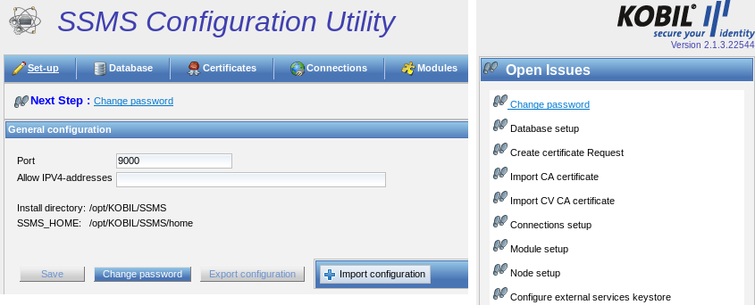  

## Setup  

On the first page, a setup overview, you can change the password. The setup page shows you the general values settings made during the installation: the port for reaching the configuration utility as well as the installation and the home directory. On the setup page, you can also limit the access to the configuration utility to specified external IPv4 addresses.  

### Change Password  

You can change the password, which was set during installation process. The password preserves the configuration settings and protects against unauthorized access to the configuration utility. To do that, click on "Change password" and set a password.  

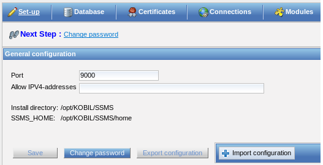  

### IP Addresses  

You can access the configuration utility from everywhere. However, you can limit the access by entering an IP address range and saving it. Define only comma-separated IP addresses in IPv4 format.  

:warning: **Use only IP addresses in IPv4 format!**  

### Save Settings  

Click on "Save" to save the settings made on the setup page.  

### Exporting and Importing the Configuration  

If you install several nodes, please export the configuration file config.xml from the previous installation and then import it for each additional node. With the import of the file config.xml, every additional node contains the same database key databaseEncryptionKey, stored in this file along with other information.  

:warning: **Please create the export newly after the update of the SSMS so that changed values in the export are considered. Please check the imported values in the configuration utility for correctness**

Therefore, you can export the configuration only after creating the database. To do this, follow the instructions in the next chapter.  

config.xml contains information for:  
* the configuration utility (password and port)  
* the database configuration of the SSMS (databaseEncryptionKey, database name, connections to the database, node ID)  

  

The file config.xml is always stored in <SSMS_HOME>\configutil  

## Database  

You are required to configure the database as second step. You can select the database type among the options and you can specify the name of the database to be created. To do this, you must have installed a database management system.  

There are two ways to connect to the database:  

1. **Use Direct JDBC URL:** The option “Use Direct JDBC URL” allows a direct connection to the desired database via the inputs “JDBC-URL” and “JPA/Hibernate Properties”. The default value of the JDBC URL is already presented according to the selected database type. If the proposed value is incorrect, you can change the server name/IP-address, port, database name and additional parameters in appropriate URL format. With this option, you can also connect to Oracle RAC, which has a different JDBC URL format than the Oracle database server. Optionally you can also enter JPA/Hibernate Properties for troubleshooting purpose e.g. hibernate.show_sql=true (This shows all Hibernate queries fired to Database).  

1. **Do Not Use Direct JDBC URL:** If you choose this option, leave “Use Direct JDBC URL” unchecked. If you leave this option unchecked, you need to enter the appropriate database name, server name/IP-address, port and additional parameters. The default values for these fields are presented according to the selected database type (e.g. default settings for the port are 1433 for MSSQL, 3306 for MySQL and 1521 for Oracle Database). In this case the JDBC URL is evaluated by the system according to the given user inputs.  

After configuring the database, you are required to configure the database users with their passwords to allow them to access the database. You can define separate users and passwords for both the management and the services nodes.  

As additional parameters, you can define values for creating the database, which depend on the JDBC driver. You can also leave this value empty.  

:warning: **Information on database permissions (GRANT) are available under:**

        \<SSMS_INSTALL\>modules\(modulename)\db\grant*.sql  

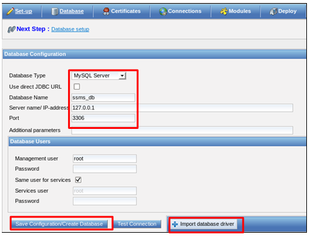  

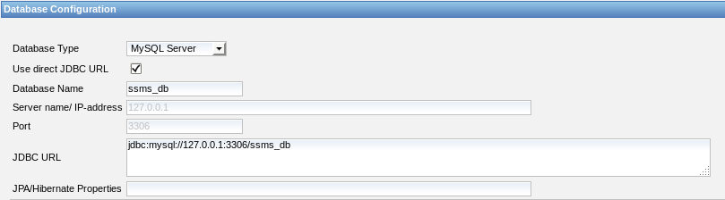  

### Database driver  

In order to create the database and the tables after the selection of MSSQL, MySQL or Oracle Database, you additionally need the corresponding database connector (JDBC). The connector is delivered with installation for MSSQL and Oracle and may not be imported additionally. For MySQL the import is required and can be carried out via the button “Import database driver”. You can download the appropriate database driver (connectors) for MySQL at the following URL:  

**MYSQL:**
        [mysql-connector-java-8.0.20](./files/mysql-connector-java-8.0.20.jar)

**MSSQL:**
         http://www.microsoft.com/en-us/download/details.aspx?displaylang=en&id=11774  

The MySQL package only contains one connector with the file name “mysql-connector-java-\<version\>-bin.jar”, which is the one to be integrated.

In addition, note the license agreement for the Oracle database JDBC connector. You can find the license agreement in the directory

        \<SSMS_INSTALL\>/doc/licences.

In case you need to substitute the database driver for Oracle and MSSQL, you must copy the correct driver (JAR file) into the following directory:

        opt/KOBIL/SSMS/modules/kernel/mgt

        opt/KOBIL/SSMS/modules/kernel/svc

        opt/KOBIL/SSMS/configutil/WebContent/WEB-INF/lib

 Please note that the names of your database driver classes must correspond to one of the following, according to the database used:

for **MSSQL:**

        com.microsoft.sqlserver.jdbc.SQLServerDriver

for **Oracle:**

        oracle.jdbc.driver.OracleDriver  

### Create Database Tables  

After entering the password, you create the database by clicking on “Create Database”.

If the database was created, you can test the connection to the database by clicking on the next button to the right. You receive the following messages if the creation of the database was successful:  

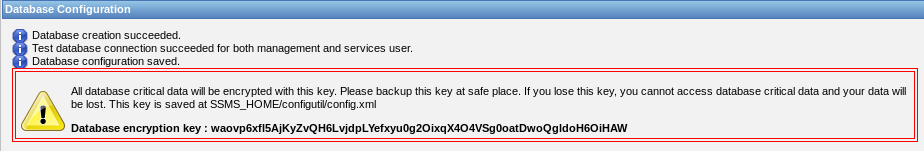  

You must keep the database key "databaseEncryptionKey" in a safe place. The database key is stored both in the database and in the config.xml file. You can back up the database key by copying the config.xml to another data storage device. To export the file, click on "Export configuration" in the "Setup" window.  

:warning: **The databaseEncryptionKey is only generated once and saved in the config.xml file. Therefore, if you install and set up multiple nodes or servers, please export this file in the "Setup" window by clicking on “Export configuration” and import it on every additional node, so that every node contains the same databaseEncryptionKey**  

### Oracle Database with use of an Oracle Client  

In case you want to use an Oracle database with an Oracle Client, for example because you need additional database functions, note the following points:  

1. The Oracle Client must be installed on the same system as the  
2. The SSMS uses the Oracle driver in version 19.3.0.0. The version of the Oracle client, which you can download from the Oracle web site, must be identical to the version of the  
3. In case you need another version of the Oracle Client, you must substitute the driver on the SSMS.  

4. In case you want to let MGT and SVC run on the same, the driver delivered with the SSMS (ojdbc8-19.3.0.0.jar) be moved from these directories

       opt/KOBIL/SSMS/modules/kernel/mgt

       and

       opt/KOBIL/SSMS/modules/kernel/svc

       to this directory

       opt/KOBIL/SSMS/tomcat/lib

:warning: **Please note that KOBIL does not guarantee the correct functioning of other drivers than the ones delivered**  

### Configuration of the Oracle Client in the CU  

In the database view of the Configuration Utility you must select the option “Use Direct JDBC URL”. Additionally change the JDBC-URL according to the JDBC driver used.  In case you use JDBC thin, suggested by Oracle, enter the following URL:  

    Jdbc:oracle:thin:@Service_Name

Additionally you must change the files KOBIL SSMS Configuration Utility.lax and SSMS.lax in the SSMS installation:

**lax.nl.java.option.additional =-Doracle.net.tns_admin=path to the file tnsnames.ora in the installation of the Oracle Client**  

In case you use JBDC OCI, enter the following URL:Jdbc:oracle:oci:@Service_Name  

:warning: **Please note that all the settings described in chapter 3.4.3 are deleted in case you update the SSMS. Therefore, you must repeat all the above steps**  

### SSMS database connection pool settings  

To make SSMS work efficiently with the database, please be careful in the configuration of the database connection pool. The default installation of SSMS is so configured that it works properly in most environments. This means that for the first installation and configuration of an SSMS test environment, you can skip this chapter and directly read chapter 3.6. However in case of installations with a very high load, administrators should monitor the database, the SSMS performance and the amount of used database connections. Please find more information in the chapter Monitoring in the Kernel manual.

The next chapter contains a detailed description of the quantity of database connections of the SSMS and how they are configured.  

### General Information  

SSMS is a request driven system. Every request requires a thread to execute the job. These threads are maintained in 3 pools by different components of SSMS:  

1. Tomcat-Thread-Pool  
1. Cluster-Thread-Pool  
1. SSMS Internal Task Executer  

A request can be one of the following:  

1. An ASM device sends data to SSMS    
    - A thread from the amount of Tomcat threads is used  

2. The portal calls a SOAP Method  
    - A thread from the amount of Tomcat threads is used  

3. An SSMS node calls another SSMS node  
    - A thread from the amount of cluster threads is used  

4. Background tasks  
    - A thread from the amount of SSMS internal task executer thread pool is used  

Almost all requests require a database connection to read data from or write data to the database. These connections are taken from the database connection pool and returned to the pool when the requests terminates.  

#### Database Connection Pool  

A connection pool is a cache of database connections, used for requests. If a new connection would be created for every request, this would cost too much effort and resources. Instead, an existing connection is used from the connection pool. Connection pools improve the speed of the request and reduce the resources used.  

#### Database connection pool settings  

SSMS uses the open source framework c3p0 for database pooling. Please find detailed information about this framework on the web site. This chapter only contains information about the settings of the database pool.

In the config.xml file, you can adjust the database settings for every SSMS node of a cluster. The default directory where to find the file after the installation is:

         \<SSMS_HOME\>/configutil  

The settings of the data connection pool require for the management and services nodes different resources. While the management node requires less connection resources, the services nodes require more resources and another configuration of the connection pooling. The following table describes the default settings for every node.  

|Setting                                  |                  Description                          |  
|:---------------------------------------:|:-----------------------------------------------------|  
|**databasePoolMinimum**   c3p0= minPoolSize|On startup the SSMS will establish an amount of “databasePoolMinimum” connections to the database for SSMS requests. If more connections   are necessary, the amount of actual connections will be increased to the configured maximum. The value must be smaller or as small as databasePoolMaximum.     Default values are:  
|                                         |MGT=10,                        SVC=20                  |
|**databasePoolMaximum**   c3p0 = „maxPoolSize“|This value defines the maximum amount of databaseconnections SSMS will establish to the database.    In case of a high load this value limits the communication of SSMS to the database. It is important that the database must also be configured to be able to handle this amount of connections. Please also note other SSMS in the cluster as well as other applications using this database.       **Note**: Since SSMS 2.6.9 the value databasePoolMaximum is not defined anymore via the scalability factor, but can be directly configured over the GUI of the CU. This must be configured separately for management and services. The value must be bigger or as big as databasePoolMinimum.     Default values are:|
|                                        |MGT=20,                        SVC=200 |
|**databasePoolTimeout**   c3p0 = „maxIdleTime“|This setting will close all idle database connections of the pool,     i.e. after this timeout, in order to avoid having connections in the pool that do not operate anymore. These closed connections are opened again only if the number of the active connections is under the minimum value.  In case **maxIdleTimeExcessConnections** is configured, then this is valid only when <= minimum number of connections in the pool is available.    The default value for both nodes is 21600 seconds (6 Hours).    **Note**: The default value until SSMS version 2.6.2 (and older) was 600 seconds (10 minutes). This had the drawback that the connections were being re-connected too often.   If you are updating SSMS from previous versions to 2.6.3 (and above) you might want to correct this value “manually”, because the SSMS installer will not modify any settings of existing installations.  |
|**maxIdleTimeExcessConnections**|The idle database connections above the minimum pool settings (see databasePoolMinimum) are ended when this time elapses. This setting is available since SSMS 2.6.3 and is used when a greater number than the configured minimum of poll connections is available.   With this setting, you can avoid establishing and destroying database connections too often, for example if SSMS reaches a request peek the connections will remain for this time and will not be disconnected and reconnected for every request.     The default value is for both nodes 1200 seconds (20 minutes)    **Note**: Until SSMS 2.6.2 “maxIdleTimeExcessConnections” was always set to zero. This had the drawback, that database connections were too often established and destroyed.|  
|**databasePoolCheckConnectionInterval**   c3p0 = idleConnectionTestPeriod|After this time interval every database connection will be validated by sending a “keep alive” to the database. This is necessary to verify any interrupted connections.     The default value is for both nodes 600 seconds (10 Minutes).    **Note**: This corresponds to the C3p0 setting "idle_test_period".|
|**checkoutTimeout**|This is the time SSMS will wait to get a database connection until it will reject the request with failure.This might happen for example if the database is not reachable or the pool maximum is reached.    § The default value is for both nodes 10 seconds|
|**acquireIncrement**|In case the pool requires another database connection it will request the configured number of connection (until the maximum) from the database all at once.    Default value:|
||MGT=2, SVC=5|
|**acquireRetryAttempts**|The parameter defines how often the pool tries to request a new connection from the database.    Default value is for both nodes 10 milliseconds|  
|**acquireRetryDelay**|The parameter defines the waiting time between an unsuccessful connection request and the next trial.    Default value is for both nodes 1000 milliseconds|
|**maxStatements**|Defines the number of the database statements that the pool takes for all connections before running them, in order to prepare them.    Default value is for both nodes 50|
|**helperThreads**|Number of threads in pool for slow JDBC operations. C3p0 uses these Helper Threads in order to accelerate slow JDBC operations.     Default value:|
||MGT = 5, SVC = 50|  

The settings in the Database Connection Pool are changed in the CU and stored in the config.xml. The file contains two fields, which stand for the settings for the services and for the management-node. When starting the CU, a basic configuration is available in the config.xml and is overwritten during the CU process. Settings for the services nodes are written in the field svcConPoolConfig and the settings for the management nodes in the mgtConPoolConfig field of the config.xml.  

:warning: **Please be sure that the server is stopped before changing the CU**

In the view Node settings you have the possibility to carry out the configuration of the desired nodes. In case of settings for both nodes, for management as well as for services, both fields must be checked:  

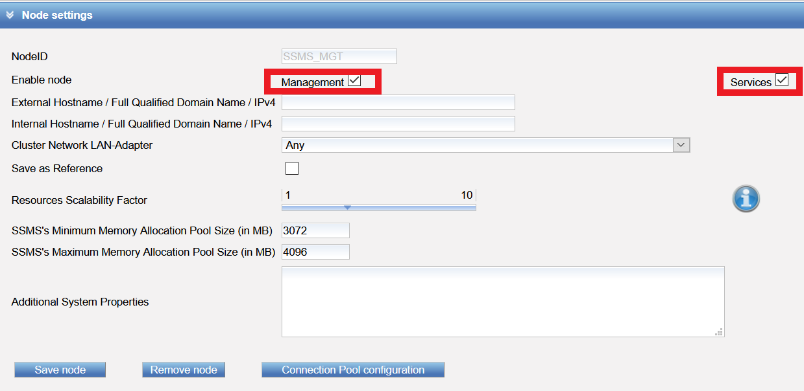  

A dialog box pops up where the required Database Connection Pool settings for both nodes can be configured:  

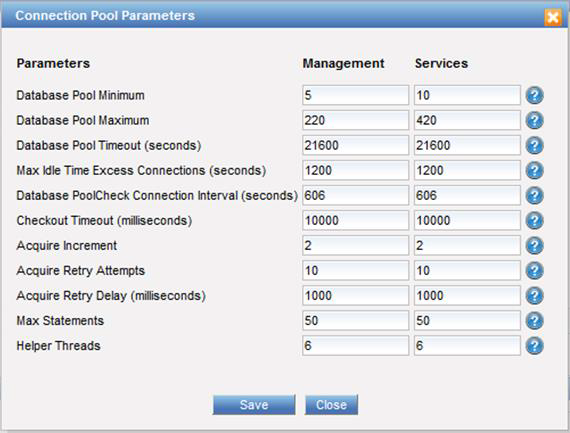  

In case only the management node must be configured with the Database Connection Pool settings, please select only the management node.  

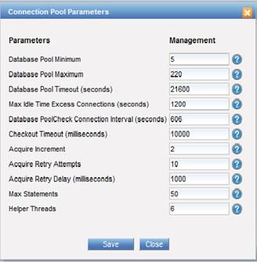  

In case only the services node is selected, the dialog box for setting the Database Connection Pool of the services node.  

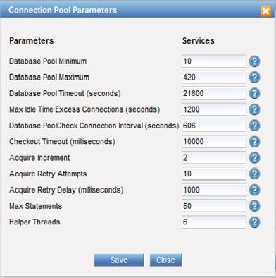  

:warning: **After a migration / update please check the connection settings of the Database Connection Pool. The existing configuration is migrated during the start of the CU into the new form. Not configured values receive default values. Therefore a verification of the Database Connection Pool necessary!**

## Certificates  

After successfully creating the database, you can click the next step of the open issues to go to the certificates view. In the certificates view, you can create and manage the SSMS certificates as well as secure the SSMS with SSL. You have to request a certificate by clicking on “Create” if you want to configure the server for the routine use. The certificate request must be signed by KOBIL and you received then the required CA and x509 certificate in order to continue with the installation.

Otherwise, you can carry out a test installation of the server. The test installation creates test certificates. This installation is not for the routine use. In this latter case you have to install the SSMS again.  

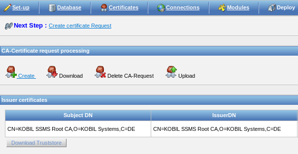  

### Test Installation  

Read this chapter only if you would like to test the system and its functionalities with a test installation. If you would like to install the system for the routine use, skip this chapter.  

:warning: **You may not install the system with test certificates for the routine use. Once you want to routinely use the system, you must install the SSMS once again**  

To test the system, you can create a test certificate by clicking on “Create test certificate” on the top-right of the certificates window. Doing this, you receive a test system for all modules with a time limited license:  

* 50 AST devices  
* 10 SecOVID devices  
* 50 SecOPTIC devices  
* 4 portal connections  

but you do not have to request and to upload the certificates signed by KOBIL. The CA password that you need later is 123456.  

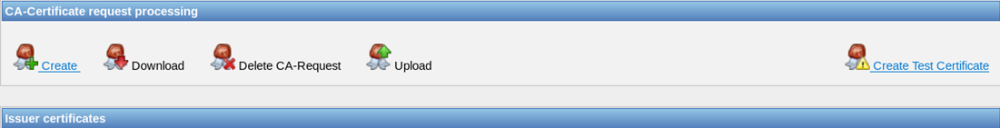  

### Create the Certificate / License Request  

You need the following input values to create the certificate request:  
* **Common name**: Name of the CA certificate (e.g. KOBIL SSMS CA)  
* **Organization**: Your company name (e.g. KOBIL Systems GmbH)  
* **Country code**: DE for Germany, EN for England  
* **CA key passphrase**: Password of the CA certificate; will be required later for additional certificates!  

After entering all the values, go to "Create CA Request Certificate" to save the input data and to create the certificate request.  

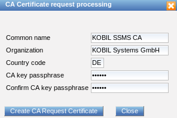  

Finally, you save the certificate as DER encoded certificate (ssms-ca.p10) with the option “Download” in the certificates view and send it to KOBIL for its signature.  

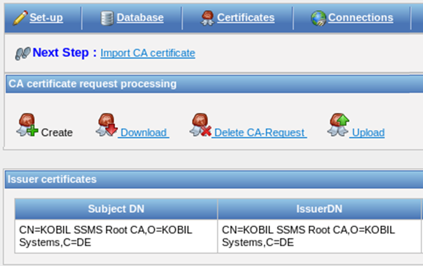  

After KOBIL issues the CA certificate based on the request (ssms-ca.p10), you then receive the required CA- and x509 certificates from KOBIL. You must then integrate both certificates into the database, by uploading the ZIP file that contains them.  

:warning: **As a general rule, it is the responsibility of each administrator to ensure of certificate- and license validity**

###  Integrate CA Certificates / License upload  

You can integrate the certificates delivered by KOBIL as a ZIP file, by clicking on “Upload” at the top-right of the certificates view.  

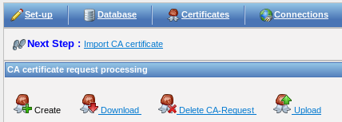  

A window pops up and you are asked to import the certificates (CA x509 and CV CA) as a zip file, by clicking on the corresponding button.  

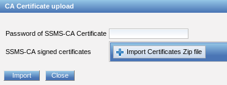  

After clicking on “Import Certificates Zip file”, select the file and type in the certificate password (chapter 3.6.1). Afterwards, confirm the action by clicking on “Upload” and close the window by clicking on “Import“.  

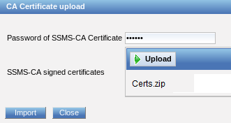  

You receive the following message as a confirmation that you could successfully upload and import the certificates:  

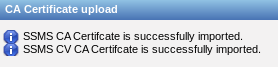  

### The SSMS Super Administrator Certificate  

The option and the button to generate the SSMS Super Administrator SSL Client Certificate are shown to you only after you integrated the two CA certificates.  

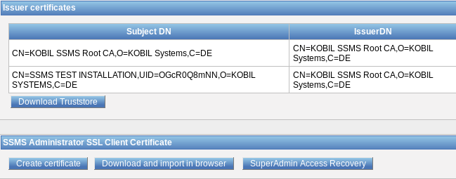  

The super administrator needs an SSMS Administrator SSL Client Certificate (super administrator certificate) to manage the SSMS. You can use the "Create certificate" button to enter the data required for the key and the (super) administrator certificate and then save them with "Generate". The key and the certificate are generated as DER-encoded PKCS12 format. You will need this certificate later to access the graphical user interface of the SSMS.  

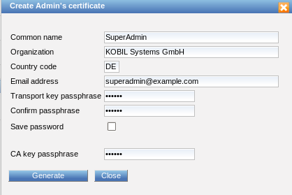  

Enter the common name, the organization, the country code (DE, FR, GB, US, etc.) and the email address under which the super administrator can be reached. You are also required to enter the password assigned to the CA key (see CA key password) for the certificate request in step 3.6.1  

:warning: **During the generation of the super administrator certificate, you have the option to save the password of the superadministrator (keystore password) as well as that of the truststore in the configuration file portalLib.xml, contained in the directory \<SSMS_HOME\>. To do so, check the box “Save Password”. Find more information about this file in the integration manual**

You then receive the message that a certificate has been successfully generated:  

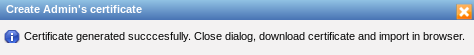  

You can now download the Administrator SSL Client Certificate (super administrator certificate) in the certificates overview page and then import it in the administrator's browser.  

  

With the option "Download and import in browser", you can only download the super administrator certificate, but not import it in the browser. Please carry out this step separately.  

### SuperAdmin Access Recovery  

In case you change the super administrator permissions in the SSMS GUI and you do not have access to the SSMS anymore, you also can reactivate the Super Administrator role in the CU, by clicking “SuperAdmin Access Recovery”. With this action, the default permissions of the super administrator and the access to the SSMS Kernel module are restored.  

### Certificates Required to Start the SSMS  

You require three certificates to start and access the graphical interface of the SSMS via the browser: the SSMS Administrator SSL client certificate (also referred to as the super administrator certificate), which you created in Chapter 3.6.4, and both the two issuer certificates which you can download to integrate them into the super administrator browser:  

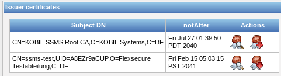  

### Update CA Certificates  

It is possible to update both the Root CA and your SSMS-CA certificates. This becomes necessary for recertification, including other cryptographic algorithms upon signature creation, and certificate renewal use cases.  

### Recreation of CA Request  

Analogously to chapter 3.6.2, you can create a CA certificate request based exactly on the same data that was used for the initial certification process.  

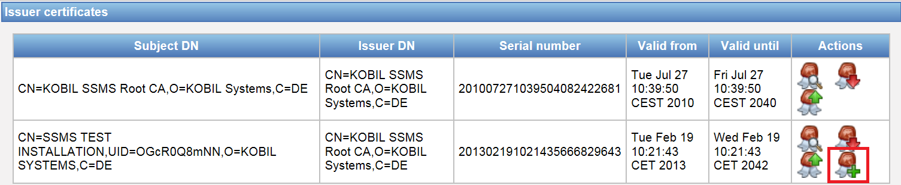  

In the upcoming dialog the CA passphrase must be provided for signing the request. Finally, you save the DER encoded certificate request file (ssms-ca.p10) using button “Download” which you can then send to KOBIL.  

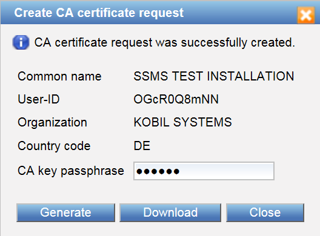  

KOBIL will issue a new CA certificate based on the received request and send it back to you. The integration of the renewed certificate is described in chapter 3.6.7.  
* Replace CA certificates  

For recertification of renewal of the Root CA or SSMS-CA certificate use cases, you can replace existing certificates in your SSMS database.  

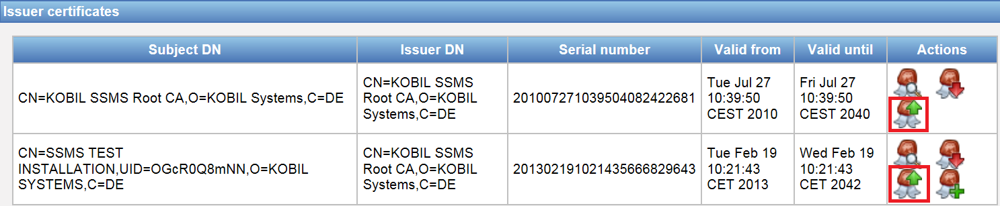  

In the according dialog, you see base data of the current certificate as it is stored in the database. Corresponding data of your replacement certificate is shown upon uploading the certificate file from filesystem. After having verified the correctness, you can replace the current certificate with the uploaded one by using button “Save”. Closing the dialog without saving does not replace nor change any data.  

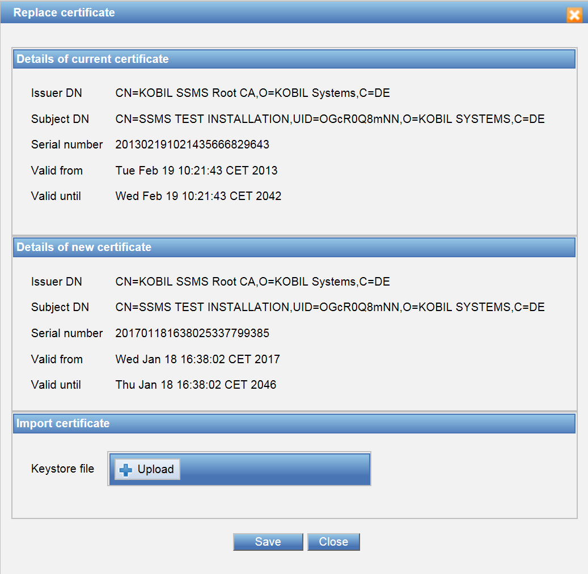  

## Connections  

You can set up the nodes and configure the various SSMS connections in this view. Some of the connections that you configure are used by the SSMS itself and some others by additional services (application or web servers). In this window, you can configure the following areas:  

* Node settings  
* Tomcat  
* Management  
* Services  
* External services  

You must adjust the preconfigured connections according to your SSMS installation or to the already installed services. Default values are those defined in Figure 45.  

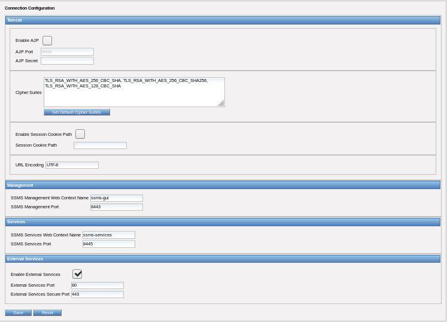  

### Node Settings  

First, you must define the node name (Node ID), which is the unique name under which the node can be reached. You must also define its node type: Management (MGT), Services (SVC) or both.  

Afterwards, you are required to define external and internal SSMS domain names or IP addresses in IPv4 format, under which the SSMS will later be accessed by the respective services. Follow the instructions on the SSMS structure in chapter 1.3.3 and in table 4. Depending on the node type, the SSMS DNS names are used as follows:  

|**Node type**|**SSMS DNS name/ IP**|**Use**|
|:-----------:|:-------------------:|:-----:|
|MGT and SVC|External SSMS DNS name/ IP|Communication between AST devices and the SSMS|  
||Internal SSMS DNS name/ IP|Access to the SOAP interface / cluster communication|
|Only MGT|External SSMS DNS name/ IP|No use|
||Internal SSMS DNS name/ IP|Access to the SOAP interface / cluster communication|
|Only SVC|External SSMS DNS Name/ IP|Communication between AST devices and the SSMS|
||Internal SSMS DNS Name/ IP|Access to the SOAP interface / cluster communication|  

The generation and verification of the sdk_config (see administrator manual) as well as the communication between the apps and the SSMS occurs via the external DNS or the external IP address. The following figure shows possible input parameters of the node settings.  

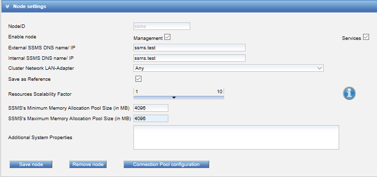  

The SSMS Minimum Memory Allocation Pool Size is the same as the parameter Xms, which is initial Java heap size allocated in MB. The SSMS Maximum Memory Allocation Pool Size is the same as the parameter Xmx, which is maximum Java heap size allocated in MB. Tomcat can occupy this predefined size of memory.  

You can enter additional system properties (e.g.: -Dkey1=value1 -Dkey2=value2) to the according input area. These properties will be added to the SSMS.lax file during deployment.  

In case you saved the node as a reference, you also can change the scalability factor of the SSMS configuration parameters for the reference node. This function is only possible in relation with a reference node because the values of all cluster nodes must be identical. Default value is 5, which you can change moving the slider from a minimum of 1 to a maximum of 10. You can check the values you set by clicking on the information icon on the right. In addition, the values you set are also stored in the config.xml (SSMS/configutil). The maximum values are saved in a property file (SSMS_HOME/maxConfigValues.properties) generated during the installation and which can be changed by a user with permissions. In case the file is not present or one or more parameters are not valid, the default maximum values are taken. During the cluster communication large UDP packets are also sent (> 40kB), which fragmented at the IP level. Routers must allow this.  

:warning: **Some parameters are dependent on other parameters**  

“Save as reference” is to signal, that this node will operate as a reference when setting additional nodes. When you set up another node, the version installed on the reference node is checked, because in the case of a cluster installation (see chapter 4), all nodes must have the same SSMS version installed. Finally, confirm the node settings by clicking on “Save node”. After you saved the node settings, you receive the message that you successfully saved the settings. Then you can continue the configuration.  

:warning: **When you delete a node, you also eliminate all information referring to it. If the deletion occurs during running operations, it will lead to loss of data. Be sure that you stopped the SSMS on the node to delete**  

#### maxConfigValues.Properties  

This file contains properties in order to configure the maximum configuration values for the SSMS parameters. This file is in \<SSMS_HOME\>.  

:warning: **Please note that the configuration values are configured on the basis of the scalability factor in the Configuration Utility**  

||**Parameters**|**Description**|
|:--:|:--:|:--:|
|**Tomcat**|Tomcat.maxThreads=1200|Maximum value Tomcat Threads (pro Connector)|
||Tomcat.acceptCount=200|Maximum length of the queue of the incoming connections while all connections are busy. All received requests are denied when the maximum length is reached.|
|**Datenbank**|Database.poolSize=1400|Maximum size of the database pool|
|**JGroup**|cluster.timerThreads=35|Maximum size of the jGroup Timer Threads. Please make sure that this value is higher than the minimal value of the **timer.min_threads** (in the file communication.xml) as SSMS would not be able to start.|
||cluster.threadPoolSize=100|Maximum size of the jGroup Thread Pool. Please make sure that this value is higher than the minimal value **thread_pool.min_threads** (in the file communication.xml) as SSMS would not be able to start.|
||cluster.oob.threadPoolSize=250|Maximum size of the jGroup OOB Thread Pool. Please make sure that this value is higher than the minimal value **oob_thread_pool.min_threads** (in the file communication.xml) as SSMS would not be able to start.|
|**SSMS**|kernelTaskExecuter.threadPoolSize=400|Maximum value of the Kernel Task Executer Thread Pool.|

### Tomcat  

The SSMS server uses the open source software Apache Tomcat as Java Servlet Container, which contains a number of configuration possibilities. Please find more information about these configurations on the corresponding web pages. However, you can change some important settings here.

If you want to run the Apache Tomcat, you generally require a connector plug-in (for example mod_jk), which directs the queries to Tomcat. For this purpose, the plug-in implements the Apache JServ Protocol (AJP) with the preconfigured port 8009. Optionally you can set AJP protocol authentication credentials.

However, you can optionally deactivate AJP if you do not plan to run a web server.

The ciphers are configured for every connector in the server.xml to encrypt information. In this CU view you can confirm the default ciphers or define other ciphers. In case the SSMS does not support the values you entered, an error message is generated when saving the configuration.

The following dialog shows the standard ciphers:  

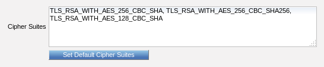  

For more information about the supported ciphers, take a look at: http://docs.oracle.com/javase/8/docs/technotes/guides/security/SunProviders.html  

#### Session Cookie Path  

Within the Tomcat configuration you can enable a session cookie path. The session cookie path is a tomcat setting of the file \<SSMS_INSTALL>\tomcat\conf\context.xml with the name sessionCookiePath. This parameter defines the URL path for which the Tomcat sends back its session cookies to HTTP requests. This setting is required in case there are additional proxies in front of the SSMS, which process the URL path of the SSMS. Please put a checkmark and enter the path into the input field “Session Cookie Path” in order to activate this option.  

#### URL encoding  

This option sets the encoding format for the connectors in the server.xml file. During the deployment, the encoding is stored within the server.xml for all five connectors. The most commonly used encodings here would be the UTF-8, UTF-16 and UTF-32. SSMS default use UTF-8 (which is different from the usual standard of ISO- 8859-1). The encoding also affects AJP in case it is activated.  

### Management  

The management contains the configuration of the context name and the port of the SSMS management node. The web context name for SSMS management is part of the URL, under which the management node is reachable later (Management GUI and SOAP).

Standard port is 8443.  

### Services  

Services include the different services of the services node.

The web context name for SSMS services is part of the URL, under which the services node is reachable later.

The standard port of the services node is 8445 and is only used for the SOAP services.  

### External Services  

External services refer particularly to the App Security Technology, which communicates with the SSMS via the following default ports. Port 80 is for external services and port 443 for a secure connection of the external services. It is possible to deactivate port 80 for external services, in this case the complete communication is done via external services secure port 443.  

#### Save Settings  

After you have configured and adjusted all the settings, please confirm them with "Save" before continuing with the modules view.  

#### Reset  

The button “Reset” resets all settings on the SSMS to the default values of the SSMS.  

## Modules  

The module view displays the available modules. Both the management and the services nodes contain a kernel module. Additionally, you can install other modules on the management node. Every desired module should be installed on the management node. The SSMS components (Management with GUI and Services) and the kernel module represent the basis of the system, but you can extend its functionalities by installing additional modules. The delivered system contains the modules Kernel, App Security Management Module (ASM), Signature Verification Module (SVM), as well as the modules, SecOVID and Password Authentication (PAM).

The state "INSTALLED" only means that the module is located on the hard drive in the module directory and is not yet deployed, not copied into the servlet container. To deploy the modules, check the boxes next to "INSTALLED" for the module you want to install and click on "Save".

You can install the modules independently from each other, but check the dependencies before doing that.  

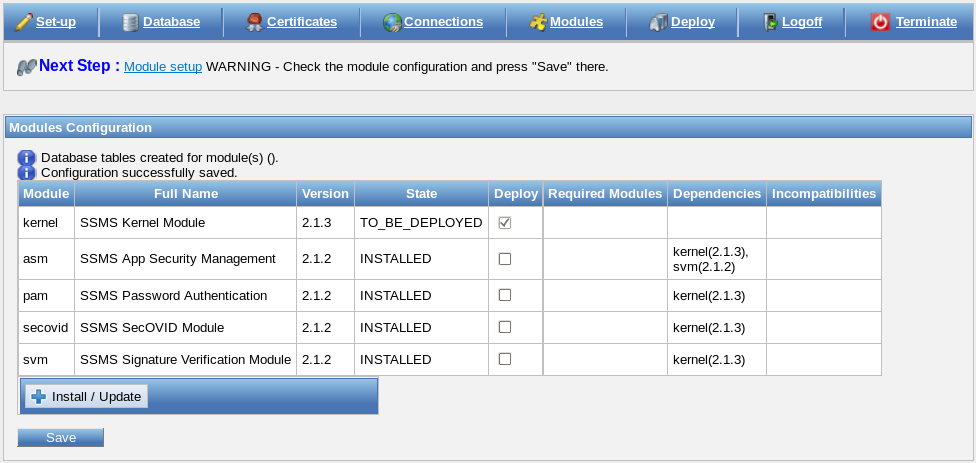  

By confirming the procedure with “Save”, you create the module-specific database tables.

Finally, you must deploy the web application, as suggested by the notification under the navigation menu “Next step”.  

### Install and Update Additional Modules  

With the option “Install/Update”, you can add new modules or update the version of the already existing modules.

You receive the required module files in MIF format with the ending .mif. Import the module file by clicking on

the button “Install/Update”; the module on the hard disk is then updated.  

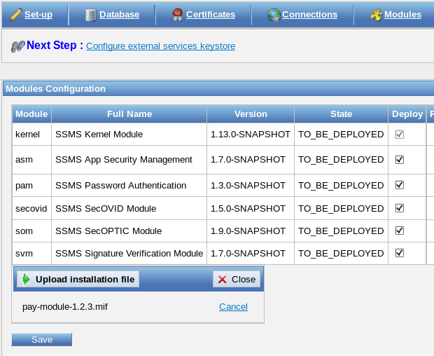  

To install the module, please check the box of the module to update, and click on “Save”.  

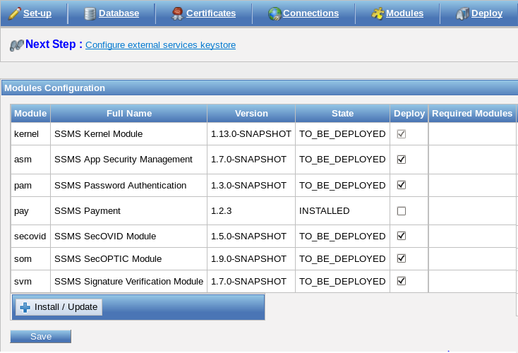  

To use the new web application, you must deploy it again. Now, you can start the SSMS with the new modules.  

### Deploy  

Finally, you can deploy the modules in the Tomcat via the Deploy view.

This view is divided into Keystores and Deployment. Before you can deploy your settings, you must generate the required keystores. Afterwards, you can deploy the modules.

If all the configuration steps are completed, you can start and stop the SSMS in this view.  

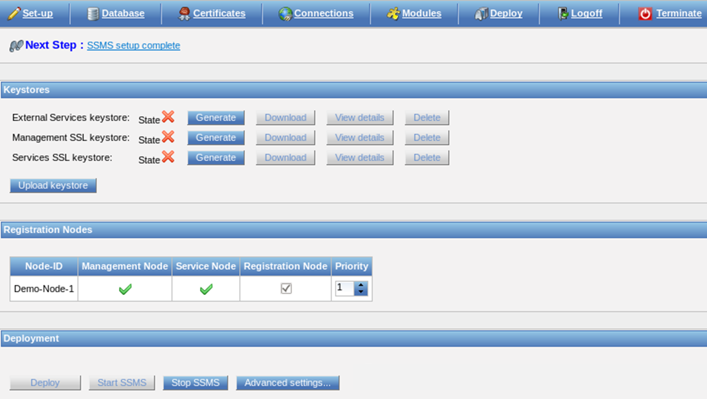  

## Keystores  

The keystore files are required for the various SSMS services and must therefore be generated before the "Deploy" process. You can upload a keystore; however, the generation with the configuration utility is the preferred solution.  

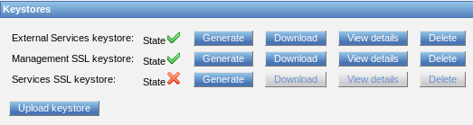  

In addition, you can download, view details about the keystores and delete them. The keystores are provided in PKCS#12 format and are located in the following directory:  

      \<SSMS_HOME\>/

If you set up multiple nodes, then you must generate the keystores again on every system because they are generated including the host name of the respective node.

Please generate the certificate exclusively with the configuration utility. However, if you require the keystore of another CA, you can upload the keystore in PKCS#12 format.  

:warning: **SSMS does not support Elliptic Curve based keys**  

### External Services Keystore  

The External Services keystore is the server certificate for the secure SSL connection of the mIDentity Apps with the SSMS. This certificate is derived from the SSMS-CA and from the KOBIL_ROOT certificate. The following is the illustration of the certificate chain:

- KOBIL_ROOT certificate

- SSMS_CA certificate

- External Services Keystore

This certificate chain will be the truststore for the App Configuration bundle, thus, it will be written to the SDK_config.xml.  

:warning: **Be sure that the host name is the same as the "External SSMS DNS name"!  If you run a reverse proxy between the SSMS and mIDentity App, which terminates the SSL, you must give it a trust chain. The trust chain corresponds to the certificates stored in the External Services Keystore. If you generated the keystore in the configuration utility, the trust chain consists of the certificates KOBIL_ROOT and SSMS-CA**  

### Management SSL Keystore  

The management SSL keystore is the SSMS server certificate for the Management GUI and the management SOAP connection. This certificate is derived from the SSMS-CA and the KOBIL_ROOT certificate.  

### Services SSL Keystore  

The services SSL keystore is the SSMS server certificate for the Services SOAP-API connection. This certificate is derived from the SSMS-CA and the KOBIL_ROOT certificate.  

## Registration Nodes  

The registration node is the management node where new nodes of the cluster are registered, so that they can be integrated into the cluster. You should install and use at least two management nodes, because if a management node does not work, the other can register and manage other nodes. When you install additional nodes, the node ID and type (management or services) will be added to the list; then, you can arrange the list according to the priority of each node.  

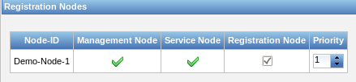  

Please note the ports for the node registration and the cluster communication in the following chapter.  

### Advanced Settings  

By clicking on the button “Advanced Settings”, a window pops up for the definition of various settings and options of the SSMS.

Either you adjust the settings and the options in the configuration utility or you set the values in the option

“Advanced Settings” in the SSMS Administration view.  

|||
|:-----|:-------|
|Log Level|Setting of the log mode (WARN, INFO, DEBUG and TRACE). Loggers forward ERROR, WARNING and INFO logs to the chosen logging system. Default value is INFO.|  
|Rows Per Page|The maximum number of rows per page. Default value is 25.|  
|Table Maximum Length|The maximum number of table rows that are loaded simultaneously. Default value is 4000.|
|Additional Loggers|With this option, you can specify additional loggers.|  
|Server Time Zone|Information about the currently used date and time format. If you leave the field empty, the SSMS use the system default settings.|  
|Cluster Registration Port|The port at which to register the cluster node on the management node. If the configured port is already occupied by another application, SSMS will try to open the next higher port number. Default port is 12001.|  
|Cluster Communication Port|The port range for the communication of the cluster nodes. Default start value is 7600 until 7610.|  
|Cluster Name|The Cluster Name for all the nodes. Default value is „KOBIL_SSMS_CLUSTER“.|  
|Cluster Response Timeout|Timeout setting in milliseconds for the response of the cluster. Default value is 5000.|  
|Cluster Startup Retry Delay|After a cluster communication is failed, the next start-up retry will be delayed by this time given in seconds. Default value is 120.|  
|Allow to change User ID|Possibility to change user ID if setting is checked. Default value is unchecked.|  
|Maximum Users in Auto Group|The maximum number of users in an auto group. Default value is 5000.|  
|Http Proxy Host|The host name of your http proxy in case you use a http proxy. Default value is empty.|  
|Http Proxy Port|The port of your http proxy in case you use a http proxy.|
|Http Non Proxy Hosts|Access to matching IP addresses or host names defined in this setting will bypass a configured http proxy for https and http protocol. The default value is "localhost|127.*|[::1]". You can use "*" as a wildcard for parts of the IP address or host name.|  
|Rest Session Default Timeout|The inactivity timeout of a REST session in seconds. An inactive REST session expires after this time. Default value is 300.|  
|Monitoring Statistic Interval|Time interval in minutes for the creation of monitoring files in the database. The value 0 deactivates the monitoring function. Default value is 1.|  
|Monitoring History|Hours that the monitoring records should be kept in the database. Default value is 168 hours.|  
|Diagnostics Max File Size|Maximum file size when creating diagnostics (in MB). If a file is larger than this value, it will be truncated. Default value is 250MB.|  
|Special Variables|Special parameters to fill in only if advised to do so by KOBIL.|  
|Banner Text|Title displayed in the page header|  
|Banner Color|Color of the text in the page header|  
|Username For RESTServices|Basic-Authentication credentials for REST-Services. Default value is empty.|  
|Password For RESTServices|Basic-Authentication credentials for REST-Services. Default value is empty.|  
|Enable Operator Credential Authentification|Operator can login to SSMS-GUI or call SOAP-MGT-methods with operator name and password (HttpBasicAuthentication). Default value is checked.|  
|Enable SSL Session Verification|During login to SSMS-GUI or for a SOAP-MGT-call SSMS validates the SSL session ID in addition to the ID of the current HTTP session. Default value is unchecked|  
|Client Inactivity Timeout|The inactivity time out for management GUI client users defined in seconds. The management GUI client user will be logged off automatically after this time of inactivity in the GUI. The session expired page will be displayed. The user needs to authenticate himself again to re-enter the management GUI. Default: 15 minutes (900 seconds).        Minimum: 60 seconds, Maximum: 5400 seconds|  
|SOAP Session Inactivity Timeout|The SOAP session (management only) will be automatically discarded after this inactivity timeout (in minutes). Default value is 10 minutes.|  
|Audit Filter|Filter for audit actions (separated by \|) that shall be ignored (means: those actions are not stored in database). Format: 'ACTION\|ACTION\|...'. Example: 'SSMSLOGIN\|SSMSLOGIN_SOAP'. Default value is empty.         Note: If the format of an action is invalid or the action is unknown actions will be ignored.|  
|Urls Address Book Servers|Comma-separated list (maximum 2 entries!) of URLs to address book servers.  For example, 'http://server:1234/rest/v1/'|  
|Address Book Eco Identifier|The Eco Identifier is part of the URL of an Address Book server and is required to access certain methods of the Address Book server. If nothing is defined, the node ID of the SSMS server is used.|  
|Address Book User Name|The username for Basic authentication of Address Book server.|  
|Address Book Password|The password for Basic authentication of Address Book server.|  
|Address Book Timeout Connect|Period in seconds, how long the SSMS waits until a connection to the Address Book server can be established. 0 means unlimited.|  
|Address Book Timeout Read|Period in seconds, how long the SSMS waits for a response from the Address Book server. 0 means unlimited.|  
|Address Book Certificate Ignore|If this parameter is enabled, the certificate server is ignored when establishing an SSL connection to the Address Book server.|  
|Address Book Task Handlers|Maximum number of processing threads that are handled to communicate with the Address Book server.|  
|Address Book Task Accept Count|Maximum number of messages for the Address Book server that are buffered by the SSMS when all the processing threads are busy in the SSMS. If the number is exceeded, each additional message is not sent to the Address Book server but stored in a file until processing threads are available again.|  
|Address Book Idle Connection Timeout In Pool|Address Book Server: Timespan in seconds indicates how long connection stays idle in an Address Book Connection Pool.|  
|Trace Exporter|Export traces to chosen Trace Exporter (Default: None). This denotes the backend for the collected trace data.         The setting 'None' implies turning off the tracing feature at all. In particular, messages sent from SSMS to external components will not carry any span context information.|  
|Trace Sampler|Process/Export trace span based on chosen sampling method (Default: Never).        This setting has an effect only in the case when SSMS initiates a root span, and thus a new trace. In all other cases, SSMS will export or drop spans as given in the context of the foregoing (remote) parent span.        Note: External component may override the sampling flag of spans inside an ongoing trace during their processing. SSMS does not do this.        Note: Opting for 'Never' sampling in combination with the 'Trace Exporter' set to something other than 'None', will keep internal processing of traces, spans and their contexts activated. In particular, messages sent from SSMS to external components will carry span context information.|  
|Trace Exporter Url|URL for Trace Exporter. The URL must be complete, containing the IP/DNS name, port, and path.|  
|Probability|Probability for probability-based sampling. E.g. With probability 0.1, approximately 1 in 10 traces will be sampled.      (Default: 0.0).       This setting has an effect only in the case when the ‘Trace Sampler’ is set to ‘Probabilistic’. See the ‘Trace Sampler’ description for more details.|  
|Trace Auditing|If this flag is activated, auditing data will be placed to distributing tracing. Default value is unchecked.|  

Click on **Save** to save the settings.  

## Deploy  

“Deploy” means installing the previously defined modules and node types in the Tomcat. Before you click on **Deploy**, be sure that the SSMS is stopped if it has been started previously.

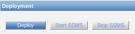  

If the deployment process was successful, you receive the following message and can then start the SSMS:  

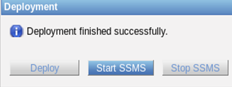  

You can then access the SSMS graphical interface, provided that you defined a URL and imported the required certificates (see Chapter 3.6) in the browser.

After the deploy process the access permissions are stored in the ssms_configuration_util.log file.

### Advanced configuration possibilities for connections Deploy  

The connections (connectors) that make the SSMS reachable from the outside, are usually defined in the Configuration Utility and activated for the SSMS during the deploy process.

In the deploy process a Template is read **(SSMS HOME/configutil/server.xml.template)** where the defined values in the Configuration Utility are inserted. Afterwards the file “server.xml” required for the integrated Tomcat is created and stored.

Specific configurations to the connections can, if necessary, be changed in the Template. These are activated for the SSMS during the Deploy process.

The settings in the Configuration Utility to be verified are represented in the template through a placeholder. This placeholder is then substituted during the deploy process. The placeholder has the form **$\{<name\>\}**

The name of a placeholder is structured as the following:
**<Prefix\>\.<Parameter\>\.<Prefix\>** has one of the following five values:  

* **mgt**:  SOAP access to UI and MGT  
* **svc**:  SOAP access to SVC and REST  
* **ext**:  Used for the communication with the devices (normal communication)  
* **extSecure**:  Used for the secure communication with the devices (AppStartup / AppRegistration)  
* **ajp**:  The ajp connector, used for example by an apache that is put in front of the SSMS  

For example the placeholder ${mgt.port} is substituted by the selected value in the Configuration Utility for the Management Port.

Additionally there is a placeholder, which starts with **$\{connector\.<prefix\>\.start\}** und end with
**$\{connector\.<prefix\>\.end\}**.
These limit the definition of a connector in the template. In case a connector is not configured, these placeholders are substituted by corresponding comment symbols. In case an SSMS node is configured only as services node and not as management node, the management connector is not used. Correspondingly the following substitutions are carried out during the deploy process:  

* ${connector.mgt.start} receives the value „<!--"
* ${connector.mgt.end} receives the value „-->“  

The connector is thus commented out and is not activated in the SSMS.  

:warning: **Please note in case you changed the Template, you must deploy these in the Configuration Utility in order to be effective**  

## Uninstallation  

The configuration utility can also be completely uninstalled with all its files, settings and services. For this purpose, close the configuration utility and proceed to the uninstallation.

Please note that the certificates imported in the browser and the database are not affected by the installation; thus, they must be manually deleted.

The following figure illustrates the option to choose if you want to retain all changed files.  

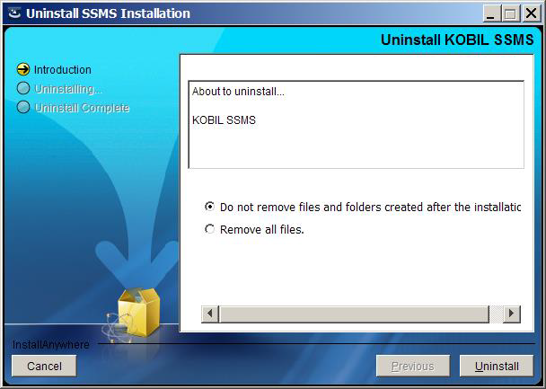  

### Uninstallation on Windows

On Windows, you can uninstall all the program components by going to "Programs and features" in the control panel. Select "KOBIL SSMS" and click "uninstall".
You can also run the program “Uninstall SSMS Installation.exe” in the directory
><SSMS_INSTALL>/_SSMS_installation.

### Uninstallation on Linux
On Linux, you can uninstall all the program components by running the file "Uninstall SSMS Installation" in the folder.    

You can also run the program “Uninstall SSMS Installation.exe” in the directory.  

>\<SSMS_INSTALL\>/_SSMS_installation/.  
