# Installation

Start the installation program for Windows or Linux and follow the instructions below:

### Windows

Start set up.exe by double clicking with the left mouse button.

### Linux

After the download, open the terminal. Here, switch to the directory containing the installation program.  
Type in the command:
    sh./setup.bin.  

## The Installation Process

The following figures illustrate the complete installation process on Windows, but the graphics on Linux are mainly identical. On Linux, the figures about creating shortcuts deviate from Windows, because on Linux, you can create shortcuts to the configuration utility and to the browser in the home directory of the current user. In addition, Linux create a user with the name "ssmsuser". The system starts the SSMS with this restricted user permissions for security reasons.  

### Permissions

Please carry out the installation with administrator rights on Windows and as root user on Linux.

### Introduction

The introduction provides a brief overview of the possible options during the installation and general information a bout the installation program.

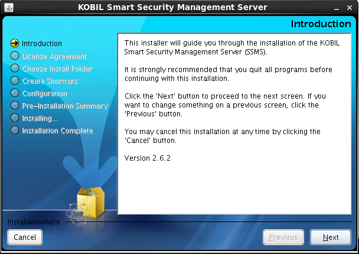  

Click "Next" to continue or "Cancel" to terminate the process. In the further steps, click "Previous" to return to the previous step of the installation.  

### License Agreement  

Please accept the license agreement before installing the SSMS:  

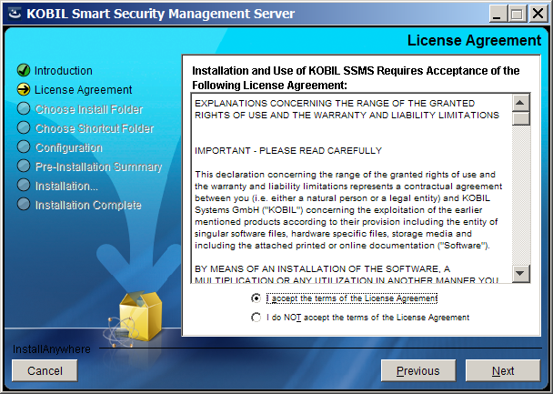  

### Selecting the Installation Path  

You can change the default installation paths described below:
* Windows:

          C:\ Program Files\KOBIL Systems\SSMS  

* Linux:

          /opt/KOBIL/SSMS  

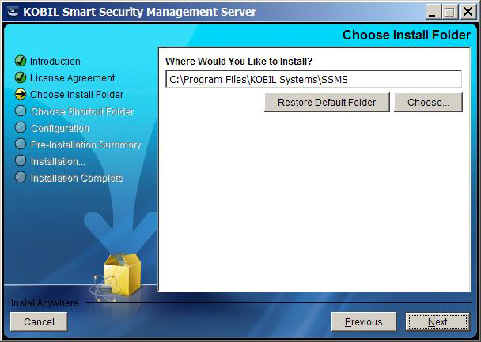  

### Creating the Shortcuts  

The following illustrates the options to create shortcuts on Windows. On Linux, you can create shortcuts to the configuration utility and to the browser in the home directory of the current user.  

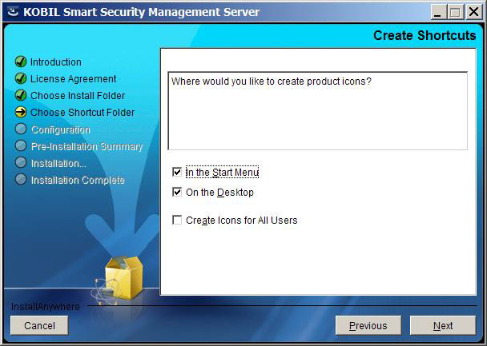  

## Configuration  

At Windows it is possible to specify the user which is used to start the SSMS service.

**:warning: This user requires the permission "Log on as a service”.**

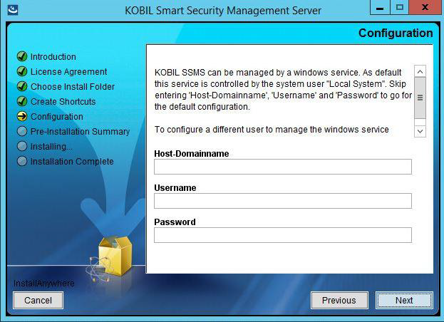  

The configuration utility requires a port to access its user interface. Default setting is port 9000.  

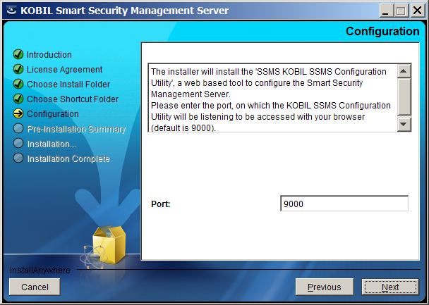  

### Information concerning the Linux installation  

On Linux, you can let the system run at start-up.  

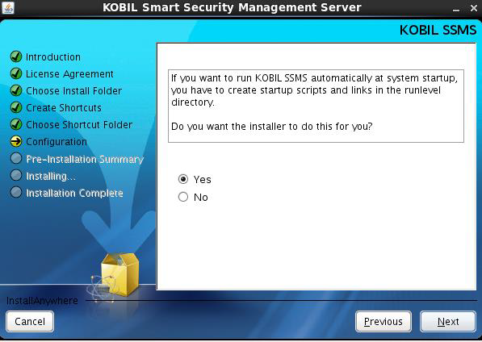  

On Linux, the SSMS runs with the privileges of a specific user, the SSMS user, who has restricted permissions in comparison to the root user. Even if you do not configure a user, an SSMS user account will automatically be created.  

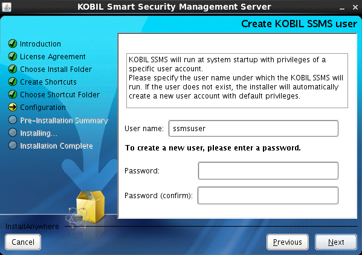  

### Creating password for the Configuration Utility  

The access to the Configuration Utility is only possible with a password. Please set the password for the Configuration Utility. The password must contain 4 to 20 characters. Initially, the plain text password is transferred to CU. Once CU has been started this password becomes encrypted and stored in the configuration file. This password prevents unauthorized access to the settings you have configured.  

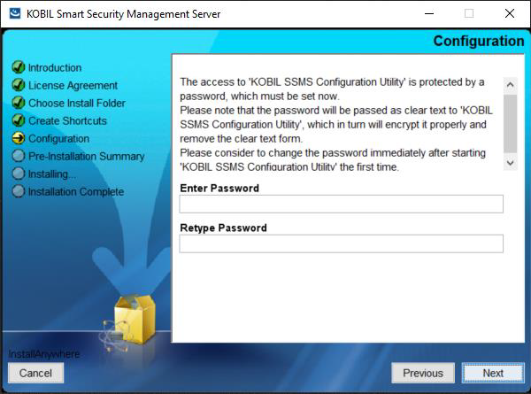  

## Summary of the Settings  

 Before completing the installation, you receive a summary of the settings configured so far. You can confirm them by clicking on "Install":  

 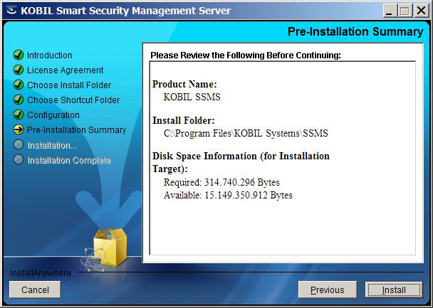  

## Completing the Installation  

In conclusion, you receive a summary of the installation process with information about the directory path where you can find the respective log file. Click on "Done" to end the installation program.  

  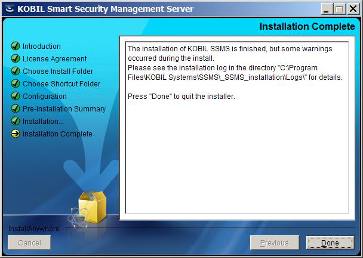  

Once you have completed the installation, the program starts automatically the configuration utility with its web interface for the SSMS configuration.  

## Installation with the Terminal  

You can also start the installation program and install the SSMS in the terminal with the required options. Run the following command on Linux:  
- **Linux**

           ./setup.bin -i console  

- **Windows**

            setup.exe -i  console  

You will then be prompted to give the values of all the parameters. Press Enter to accept the default values or enter your own values to change the installation.  
