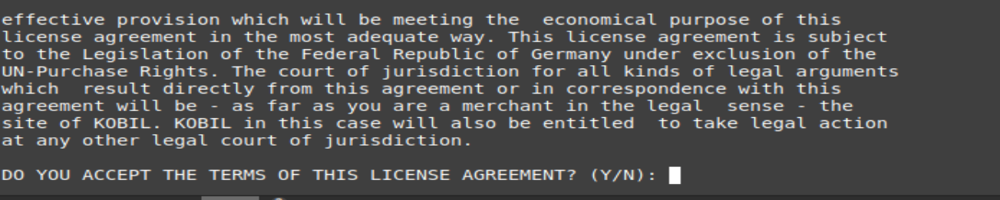

# Installation

The following provides the complete installation process on Windows and Linux. In Linux, a user is created with the name "ssmsuser". The system starts the SSMS with this restricted user permissions for security reasons.  

## Permissions

Please carry out the installation with administrator rights on Windows and as root user on Linux.

## Windows based Installation

Start setup.exe by double clicking with the left mouse button or by running this command on terminal : setup.exe -i  console  

The possible options during the installation and general information about the installation program.

  

Click "Next" to continue or "Cancel" to terminate the process. In the further steps, click "Previous" to return to the previous step of the installation.  

### License Agreement  

Please accept the license agreement before installing the SSMS:  

  

### Selecting the Installation Path  

You can change the default installation paths described below:
* Windows:

          C:\ Program Files\KOBIL Systems\SSMS  

  

### Creating the Shortcuts  

The following illustrates the options to create shortcuts on Windows.

  

### Configuration  

At Windows it is possible to specify the user which is used to start the SSMS service.

**:warning: This user requires the permission "Log on as a service”.**

  

The configuration utility requires a port to access its user interface. Default setting is port 9000.  

  

### Creating password for the Configuration Utility  

The access to the Configuration Utility is only possible with a password. Please set the password for the Configuration Utility. The password must contain 4 to 20 characters. Initially, the plain text password is transferred to CU. Once CU has been started this password becomes encrypted and stored in the configuration file. This password prevents unauthorized access to the settings you have configured.  

  

### Summary of the Settings  

 Before completing the installation, you receive a summary of the settings configured so far. You can confirm them by clicking on "Install":  

   

### Completing the Installation  

In conclusion, you receive a summary of the installation process with information about the directory path where you can find the respective log file. Click on "Done" to end the installation program.  

    

Once you have completed the installation, the program starts automatically the configuration utility with its web interface for the SSMS configuration.  

## Linux based Installation

Run the following command on terminal in Linux:

     ./setup.bin -i console  

You will be prompted to accept the instructions, terms and conditions etc. Simply accept those by pressing Enter.

  

### License Agreement   

  

  and so on.
  Simply accept it by typing 'Y'

  

### Selecting the Installation Path  

  After this installation starts, please click Enter to accept the default settings prompted or enter your own values to change the installation.

  

### Choose Link Location  

  

### Configuration  

  

### Creating password for the Configuration Utility  

  

### Create Startup Scripts  

  

### Summary of the Settings

  

  

### Completing the Installation

  Once all the steps are completed, you should now see that installation is successful.

  
