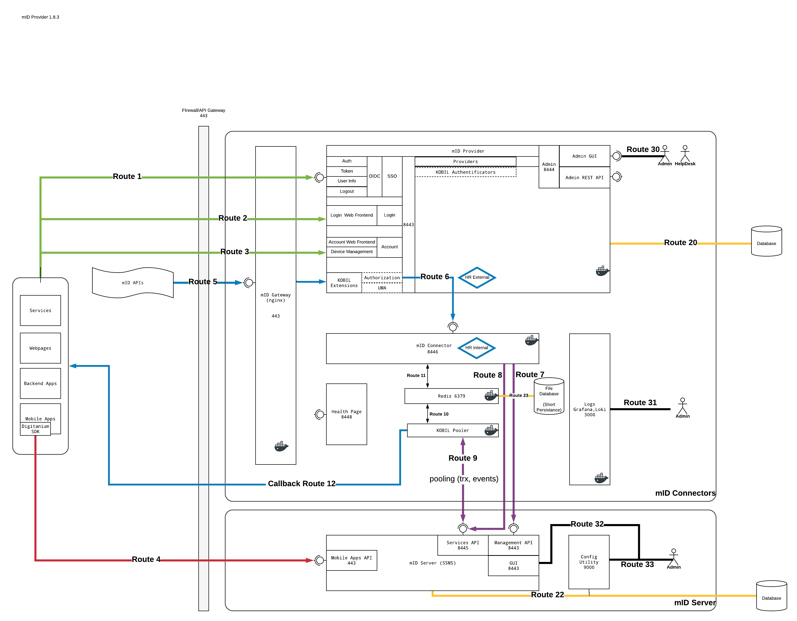

# Network Architecture

## Network Overview with IDP

### Routes

| Route Name | From → To                                                |
|------------|----------------------------------------------------------|
| Route 1    | Apps/Services → mID Provider/OIDC                       |
| Route 2    | Apps/Services → mID Provider/Login Web Frontend         |
| Route 3    | Apps/Services → mID Provider/Account                    |
| Route 4    | KOBIL SDK → mID Server/Digitanium Channel               |
| Route 5    | Apps/Services → mID API                                 |
| Route 6    | IdP/UMA → mID Connector                                 |
| Route 7    | mID Connector → mID Server Management                   |
| Route 8    | mID Connector → mID Server Services                     |
| Route 9    | KOBIL Pooler → mID Server Services                      |
| Route 10   | Redis ↔ Pooler                                           |
| Route 11   | mID Connector ↔ Redis                                    |
| Route 12   | Pooler Callback via IdP extension                        |
| Route 20   | mID Provider → Database                                 |
| Route 22   | mID Server → Database                                   |
| Route 23   | Redis → File database                                    |
| Route 30   | Admin(Browser) → mID Provider Admin dashboard           |
| Route 31   | Admin(Browser) → Grafana Dashboard                       |
| Route 32   | Admin(Browser) → mID Server Admin dashboard             |
| Route 33   | Admin(Browser) → mID Server Admin Configuration utility |

## Endpoints and Ports

### Consolidated Endpoints

| Endpoint Name                 | Component                         | URI                                                                                                                                                                                                                                                   |
|-------------------------------|-----------------------------------|-------------------------------------------------------------------------------------------------------------------------------------------------------------------------------------------------------------------------------------------------------|
| Well Known Configuration      | mID Provider(IAM)/OIDC            | https://{baseurl}:8443/auth/realms/{realm}/.well-known/openid-configuration   https://{baseurl}:8443/digitanium/v2/.well-known/openid-configuration    Note: all digitanium/v2/.well-known goes via via nginx, suggestion way of using by KOBIL |
| Authorization Endpoint        | mID Provider(IAM)/OIDC            | https://{baseurl}:8443/auth/realms/{realm}/protocol/openid-connect/auth   https://{baseurl}:8443/digitanium/v2/auth                                                                                                                                  |
| Token Endpoint                | mID Provider(IAM)/OIDC            | https://{baseurl}:8443/auth/realms/{realm}/protocol/openid-connect/token   https://{baseurl}:8443/digitanium/v2/login                                                                                                                                |
| Token introspection Endpoint  | mID Provider(IAM)/OIDC            | https://{baseurl}:8443/auth/realms/{realm}/protocol/openid-connect/token/introspect   https://{baseurl}:8443/digitanium/v2/token/introspect                                                                                                          |
| Userinfo Endpoint             | mID Provider(IAM)/OIDC            | https://{baseurl}:8443/auth/realms/{realm}/protocol/openid-connect/userinfo   https://{baseurl}:8443/digitanium/v2/userinfo                                                                                                                          |
| Logout Endpoint               | mID Provider(IAM)/OIDC            | https://{baseurl}:8443/auth/realms/{realm}/protocol/openid-connect/logout   https://{baseurl}:8443/digitanium/v2/logout                                                                                                                              |
| JWKS URI                      | mID Provider(IAM)/OIDC            | https://{baseurl}:8443/auth/realms/{realm}/protocol/openid-connect/certs   https://{baseurl}:8443/digitanium/v2/certs                                                                                                                                |
| Check Session Iframe          | mID Provider(IAM)/OIDC            | https://{baseurl}:8443/auth/realms/{realm}/protocol/openid-connect/login-status-iframe.html   https://{baseurl}:8443/digitanium/v2/login-status-iframe.html                                                                                          |
| Client Registration           | mID Provider(IAM)/OIDC            | https://{baseurl}:8443/auth/realms/{realm}/clients-registrations/openid-connect   https://{baseurl}:8443/digitanium/v2/clients-registrations/openid-connect                                                                                          |
| Master Admin Dashboard        | mID Provider(IAM)/Admin Dashboard | https://{baseurl}:8444/auth/admin/                                                                                                                                                                                                                    |
| Tenant Admin Dashboard        | mID Provider(IAM)/Admin Dashboard | https://{baseurl}:8444/auth/admin/{realm-name}/console                                                                                                                                                                                                |
| mID API                       | mID Provider APIs                 | https://{baseurl}:443/digitanium/v2                                                                                                                                                                                                                   |
| Log/Metrics Dashboard         | Grafana                           | https://{baseurl}:3000                                                                                                                                                                                                                                |
| mID Server SOAP management    | SSMS                              | https://{baseurl-maschine2}:8443/ssms-gui/soap/mgt/asm/AsmManagementWs                                                                                                                                                                                |
| mID Server/Digitanium Channel | SSMS                              | https://{baseurl-maschine2}:443/ssms-services/asm/rest/device                                                                                                                                                                                         |
| mID Server SOAP Services      | SSMS                              | https://{baseurl-maschine2}:8445/ssms-services/soap/svc/asm/AsmServicesWs                                                                                                                                                                             |
| mID Server Config Utility     | SSMS                              | https://{baseurl-maschine2}:9000                                                                                                                                                                                                                      |
| Health Page                   | Health                            | https://{baseurl}:8448                                                                                                                                                                                                                                |

### Consolidated Inbound Ports

#### Public

| Port                       | Transport Layer | Application Layer | Component                 | Relation                                   |
|----------------------------|-----------------|-------------------|---------------------------|--------------------------------------------|
| 8443 or   443 (via nginx) | TCP             | HTTPS             | mID Provider(IAM)/OIDC    | from Application to mID Provider(IAM) OIDC |
| 443                        | TCP             | HTTPS             | mID Server (machine SSMS) | from mID SDK to SSMS                       |
| 8445/443 (via nginx)       | TCP             | HTTPS             | mID API (machine IdP)     | from Application to mID API                |

#### Private

| Port        | Transport Layer | Application Layer | Component                         | Relation                                                                                         |
|-------------|-----------------|-------------------|-----------------------------------|--------------------------------------------------------------------------------------------------|
| 8444        | TCP             | HTTPS             | mID Provider(IAM)/Admin Dashboard | Admin from browser to Admin Dashboard                                                            |
| 8446        | TCP             | HTTPS             | mID Connector API                 | from mID Provider(IAM) to mID Connector                                                          |
| 3000        | TCP             | HTTP              | Grafana , Loki                    | Collect Docker Container Logs and metrics                                                        |
| 45688       | UDP             |                   | JGROUP Cluster                    | Transport between mID Provider(IAM) nodes to exchange cache information with Infinispan´s nodes. |
| 8445        | TCP             | HTTPS             | mID Server Services               | SOAP Operation Tasks                                                                             |
| 8443        | TCP             | HTTPS             | mID Server Management             | SOAP Management Tasks                                                                            |
| 9000        | TCP             | HTTP              | mID Server Config Utility         | Configuration Tool                                                                               |
| 7600-7610   | UDP             |                   | mID Server - JGROUP Cluster       | Transport between SSMS nodes to exchange information.                                            |
| 12001-12010 | TCP             | HTTPS             | mID Server - GOSSIP Server        | Initial Membership Discovery of SSMS nodes                                                       |
| 8448        | TCP             | HTTPS             | mIDentity Health                  | Shows Operational Status of mID Provider(IAM), Connector Endpoints                               |

#### Local

| Port  | Transport Layer | Application Layer | Component  | Relation                                                                              |
|-------|-----------------|-------------------|------------|---------------------------------------------------------------------------------------|
| 6769  | TCP             | HTTP              | Redis      | mID Connector and mID Pooler use Redis for storing/accessing transaction related data |
| N/A   | N/A             | N/A               | mID Pooler | Pooling all device events                                                             |

### Consolidated Outbound Ports

| Port  | Transport Layer | Application Layer | Component                                                 | Relation                                                |
|-------|-----------------|-------------------|-----------------------------------------------------------|---------------------------------------------------------|
| 2197  | TCP             | HTTPS             | SSMS Push Notification/Apple api.push.apple.com           | from SSMS to Apple Push                                 |
| 443   | TCP             | HTTPS             | SSMS Push Notification/Google fcm.googleapis.com/fcm/send | from SSMS to Google FCM                                 |
| 443   | TCP             | HTTPS             | Callback endpoint                                         | from Pooler/Connector to Callback URL delivered by API. |

## Required Ports and blocked Ports for SSMS

Depending on the location of your server with the management and the services nodes, you must adjust the firewall. In the table below, all the servers are in the same network. The individual SSMS nodes are connected via UDP ports 7600 until 7609 and the TCP ports 12001 until 12010. These two port ranges must be routed in both directions continuous the network (on firewalls, routers, etc.) During the cluster communication large UDP packets are also sent (> 40kB), which fragmented at the IP level. Routers must allow this.

|  Port 	|                 Description                	| External 	|    Internal 	|
|:-----:	|:------------------------------------------:	|:--------:	|:-----------:	|
| 80    	| User access to the web pages of the Portal 	| allow    	| allow       	|
| 443   	| App access to the SSMS via the SSL         	| allow    	| allow       	|
| 8009  	| AJP access                                 	| block    	| allow       	|
| 8443  	| Access to the management terminal / GUI    	| block    	| allow       	|
| 8445  	| External access to the services nodes      	| block    	| allow       	|
| 9000  	| Access to the configuration utility        	| block    	| allow       	|
| 7600  	| Cluster communication via UDP              	| block    	| allow       	|
| 12001 	| Node registration in the cluster via TCP   	| block    	| allow       	|
